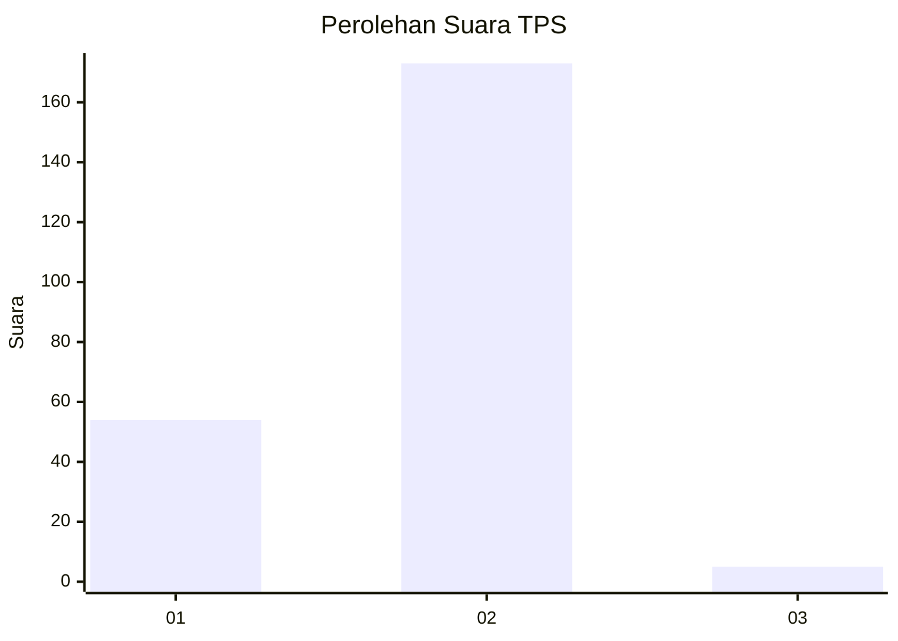
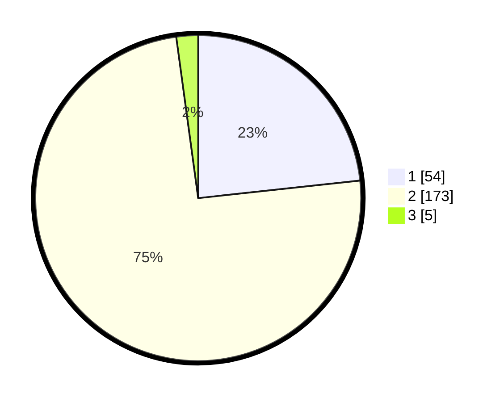

# Hasil

## Grafik

## Tabel

| No. | Nama Paslon    | Suara | Suara (raw) | Persentase |
|:--- |:-------------- | -----:| -----------:| ----------:|
| 1   | ANIES MUHAIMIN | 54    | [54][p-1]   | 23,28      |
| 2   | PRABOWO GIBRAN | 173   | [173][p-2]  | 74,57      |
| 3   | GANJAR MAHFUD  | 5     | [5][p-3]    | 2,16       |

[p-1]: https://github.com/gigit-pemilu/pemilu-2024-71-sulawesi-utara/blob/main/pilpres/hitung-suara/sub/71-sulawesi-utara/sub/01-bolaang-mongondow/sub/05-sang-tombolang/sub/2001-ayong/sub/001-tps/sub/paslon-1.txt
[p-2]: https://github.com/gigit-pemilu/pemilu-2024-71-sulawesi-utara/blob/main/pilpres/hitung-suara/sub/71-sulawesi-utara/sub/01-bolaang-mongondow/sub/05-sang-tombolang/sub/2001-ayong/sub/001-tps/sub/paslon-2.txt
[p-3]: https://github.com/gigit-pemilu/pemilu-2024-71-sulawesi-utara/blob/main/pilpres/hitung-suara/sub/71-sulawesi-utara/sub/01-bolaang-mongondow/sub/05-sang-tombolang/sub/2001-ayong/sub/001-tps/sub/paslon-3.txt

## Foto C Plano

https://sirekap-obj-formc.kpu.go.id/70c0/pemilu/ppwp/71/01/05/20/01/7101052001001-20240215-081137--40d3480e-a18e-4ea9-9623-3047661bad07.jpg

https://sirekap-obj-formc.kpu.go.id/70c0/pemilu/ppwp/71/01/05/20/01/7101052001001-20240215-081210--f9bc8e09-3958-407b-947d-c5c9a44666fd.jpg

https://sirekap-obj-formc.kpu.go.id/70c0/pemilu/ppwp/71/01/05/20/01/7101052001001-20240215-081233--59c24213-b21b-4237-b69f-ad04383f074a.jpg

## Metadata

| Key        | Value               |
| ---------- | ------------------- |
| Time Stamp | 2024-02-16 02:30:27 |

## DATA PEMILIH TETAP

Jumlah pemilih dalam DPT: **265**.
 * L: **136**.
 * P: **129**.

## DATA PENGGUNA HAK PILIH

Jumlah pengguna hak pilih dalam DPT: **237**.
 * L: **118**.
 * P: **119**.

Jumlah pengguna hak pilih dalam DPTb: **1**.
 * L: **1**.
 * P: **0**.

Jumlah pengguna hak pilih dalam DPK: **1**.
 * L: **1**.
 * P: **0**.

Jumlah pengguna hak pilih: **239**.
 * L: **120**.
 * P: **119**.

## JUMLAH SUARA SAH DAN TIDAK SAH

JUMLAH SELURUH SUARA SAH: **232**.

JUMLAH SUARA TIDAK SAH: **7**.

JUMLAH SELURUH SUARA SAH DAN SUARA TIDAK SAH: **239**.

