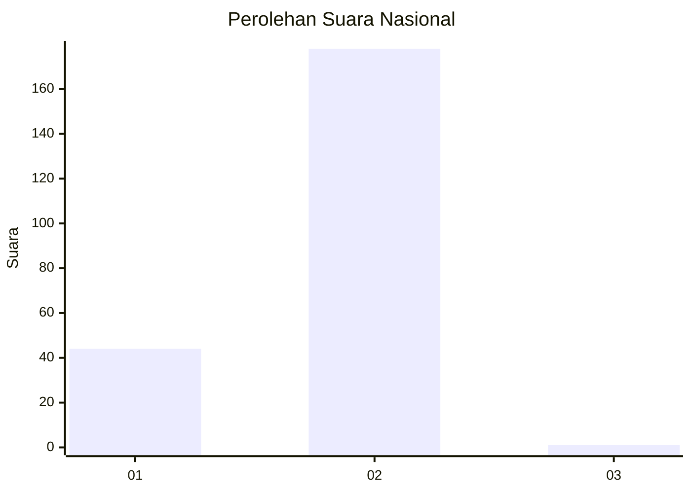
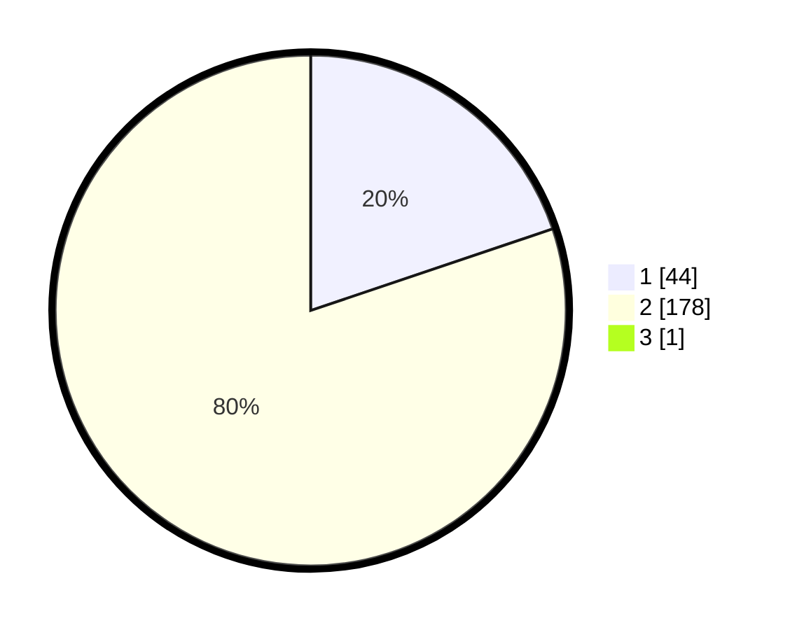

# Hasil

## Grafik

## Tabel

| No. | Nama Paslon    | Suara | Suara (raw) | Persentase |
|:--- |:-------------- | -----:| -----------:| ----------:|
| 1   | ANIES MUHAIMIN | 44    | [44][p-1]   | 19,73      |
| 2   | PRABOWO GIBRAN | 178   | [178][p-2]  | 79,82      |
| 3   | GANJAR MAHFUD  | 1     | [1][p-3]    | 0,45       |

[p-1]: https://github.com/gigit-pemilu/pemilu-2024/blob/main/pilpres/hitung-suara/sub/71-sulawesi-utara/sub/01-bolaang-mongondow/sub/05-sang-tombolang/sub/2001-ayong/sub/002-tps/sub/paslon-1.txt
[p-2]: https://github.com/gigit-pemilu/pemilu-2024/blob/main/pilpres/hitung-suara/sub/71-sulawesi-utara/sub/01-bolaang-mongondow/sub/05-sang-tombolang/sub/2001-ayong/sub/002-tps/sub/paslon-2.txt
[p-3]: https://github.com/gigit-pemilu/pemilu-2024/blob/main/pilpres/hitung-suara/sub/71-sulawesi-utara/sub/01-bolaang-mongondow/sub/05-sang-tombolang/sub/2001-ayong/sub/002-tps/sub/paslon-3.txt

## Foto C Plano

https://sirekap-obj-formc.kpu.go.id/7321/pemilu/ppwp/71/01/05/20/01/7101052001002-20240214-194332--c1a3d6b4-87a8-4652-97c5-20574c760819.jpg

https://sirekap-obj-formc.kpu.go.id/7321/pemilu/ppwp/71/01/05/20/01/7101052001002-20240214-194343--459934af-304e-4047-8fdd-5262e6784a76.jpg

https://sirekap-obj-formc.kpu.go.id/7321/pemilu/ppwp/71/01/05/20/01/7101052001002-20240214-194400--f92f1c86-ce0b-4789-ad43-88b2a1193ddf.jpg

## Metadata

| Key        | Value               |
| ---------- | ------------------- |
| Time Stamp | 2024-02-15 00:41:44 |

