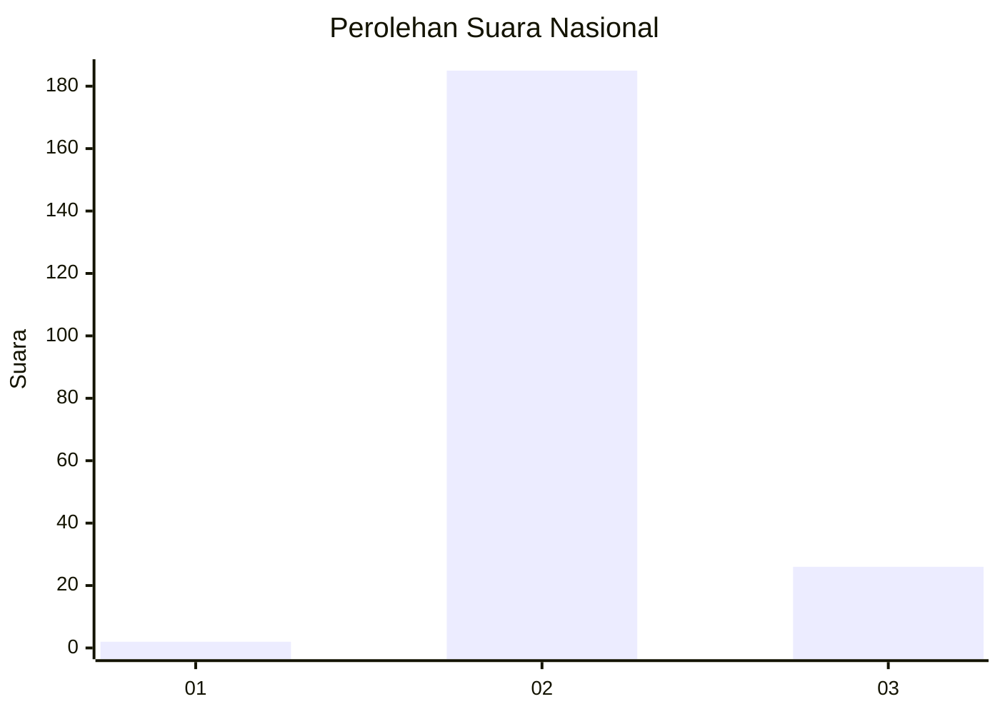
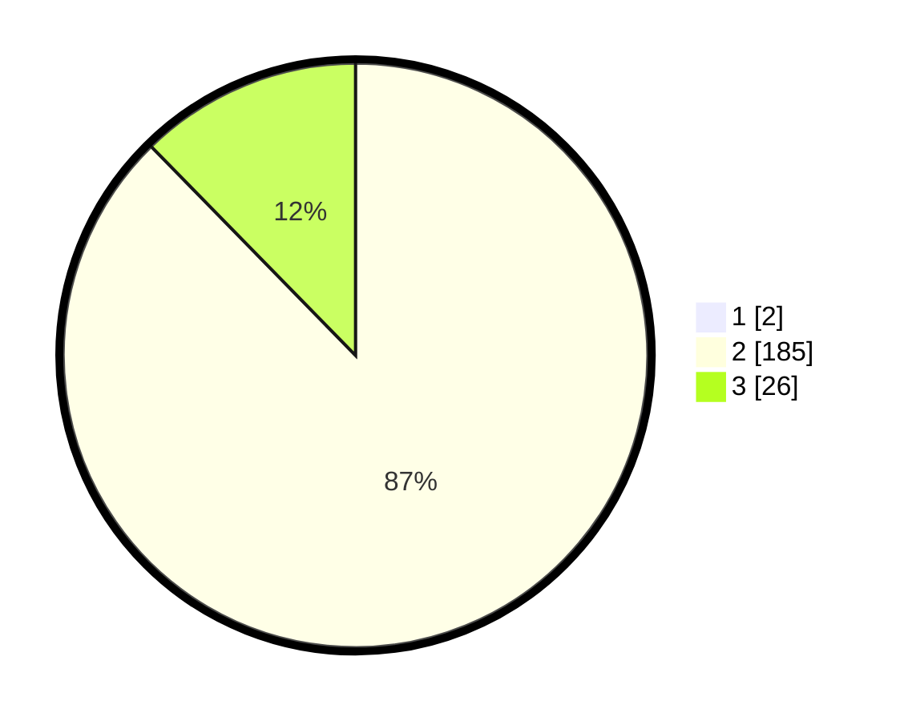

# Hasil

## Grafik

## Tabel

| No. | Nama Paslon    | Suara | Suara (raw) | Persentase |
|:--- |:-------------- | -----:| -----------:| ----------:|
| 1   | ANIES MUHAIMIN | 2     | [2][p-1]    | 0,94       |
| 2   | PRABOWO GIBRAN | 185   | [185][p-2]  | 86,85      |
| 3   | GANJAR MAHFUD  | 26    | [26][p-3]   | 12,21      |

[p-1]: https://github.com/gigit-pemilu/pemilu-2024/blob/main/pilpres/hitung-suara/sub/71-sulawesi-utara/sub/01-bolaang-mongondow/sub/10-dumoga-timur/sub/1003-imandi/sub/001-tps/sub/paslon-1.txt
[p-2]: https://github.com/gigit-pemilu/pemilu-2024/blob/main/pilpres/hitung-suara/sub/71-sulawesi-utara/sub/01-bolaang-mongondow/sub/10-dumoga-timur/sub/1003-imandi/sub/001-tps/sub/paslon-2.txt
[p-3]: https://github.com/gigit-pemilu/pemilu-2024/blob/main/pilpres/hitung-suara/sub/71-sulawesi-utara/sub/01-bolaang-mongondow/sub/10-dumoga-timur/sub/1003-imandi/sub/001-tps/sub/paslon-3.txt

## Foto C Plano

https://sirekap-obj-formc.kpu.go.id/473c/pemilu/ppwp/71/01/10/10/03/7101101003001-20240215-193616--c09ec3db-4e87-4356-9ea5-26c99d1c853f.jpg

https://sirekap-obj-formc.kpu.go.id/473c/pemilu/ppwp/71/01/10/10/03/7101101003001-20240215-194039--849aed18-5d43-4143-9cd5-67b9f29de37c.jpg

https://sirekap-obj-formc.kpu.go.id/473c/pemilu/ppwp/71/01/10/10/03/7101101003001-20240215-053842--df702041-c479-4ea8-a913-1a9bda0bcb6c.jpg

## Metadata

| Key        | Value               |
| ---------- | ------------------- |
| Time Stamp | 2024-02-15 23:29:50 |

