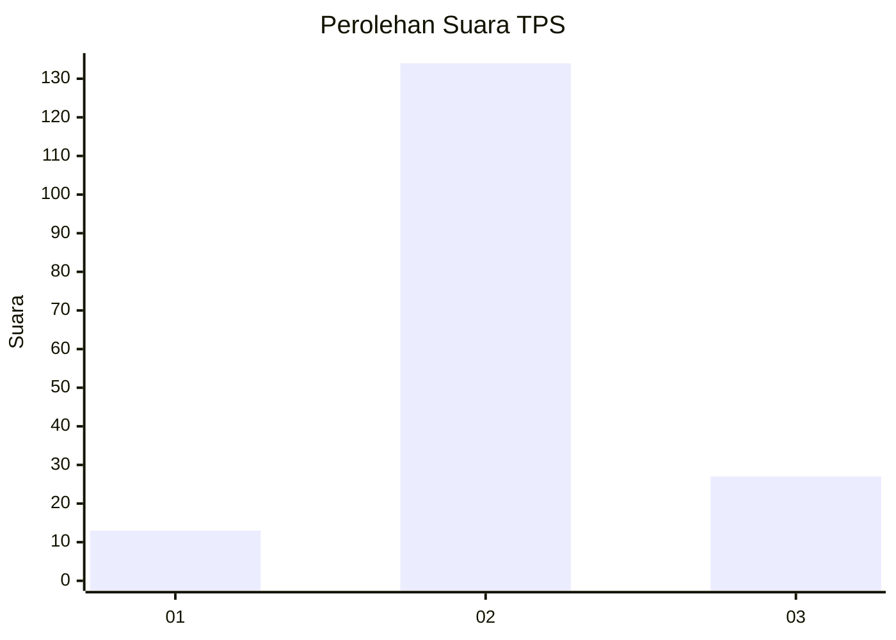

# Hasil

## Grafik

## Tabel

| No. | Nama Paslon    | Suara | Suara (raw) | Persentase |
|:--- |:-------------- | -----:| -----------:| ----------:|
| 1   | ANIES MUHAIMIN | 13    | [13][p-1]   | 7,47       |
| 2   | PRABOWO GIBRAN | 134   | [134][p-2]  | 77,01      |
| 3   | GANJAR MAHFUD  | 27    | [27][p-3]   | 15,52      |

[p-1]: https://github.com/gigit-pemilu/pemilu-2024-71-sulawesi-utara/blob/main/pilpres/hitung-suara/sub/71-sulawesi-utara/sub/01-bolaang-mongondow/sub/11-dumoga-utara/sub/2002-mopugad-utara/sub/001-tps/sub/paslon-1.txt
[p-2]: https://github.com/gigit-pemilu/pemilu-2024-71-sulawesi-utara/blob/main/pilpres/hitung-suara/sub/71-sulawesi-utara/sub/01-bolaang-mongondow/sub/11-dumoga-utara/sub/2002-mopugad-utara/sub/001-tps/sub/paslon-2.txt
[p-3]: https://github.com/gigit-pemilu/pemilu-2024-71-sulawesi-utara/blob/main/pilpres/hitung-suara/sub/71-sulawesi-utara/sub/01-bolaang-mongondow/sub/11-dumoga-utara/sub/2002-mopugad-utara/sub/001-tps/sub/paslon-3.txt

## Foto C Plano

https://sirekap-obj-formc.kpu.go.id/4cce/pemilu/ppwp/71/01/11/20/02/7101112002001-20240215-133015--3ca5bc5c-707d-4121-9c41-7797c9ee8a84.jpg

https://sirekap-obj-formc.kpu.go.id/4cce/pemilu/ppwp/71/01/11/20/02/7101112002001-20240215-133101--3c45c8ec-ff70-44e7-a963-411fbf2e92d6.jpg

https://sirekap-obj-formc.kpu.go.id/4cce/pemilu/ppwp/71/01/11/20/02/7101112002001-20240215-133126--b6551de8-028c-437a-9c02-bc74c7750d11.jpg

## Metadata

| Key        | Value               |
| ---------- | ------------------- |
| Time Stamp | 2024-02-15 22:40:13 |

