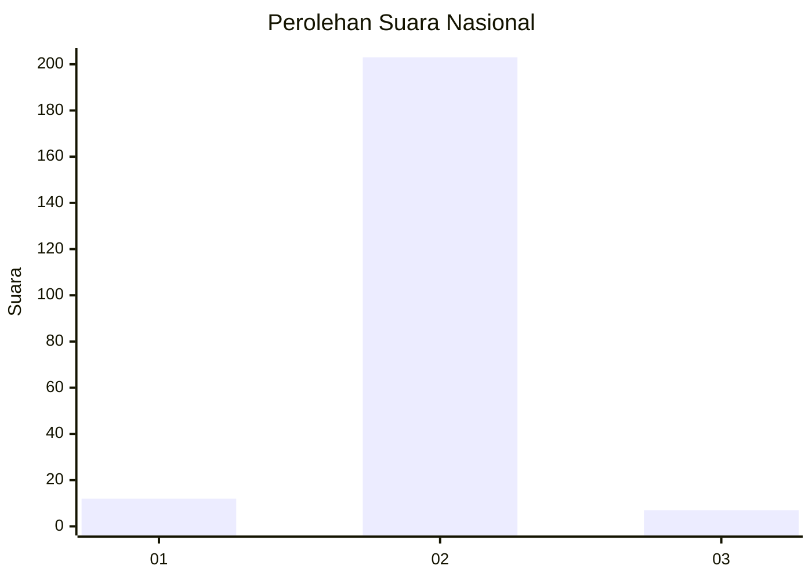
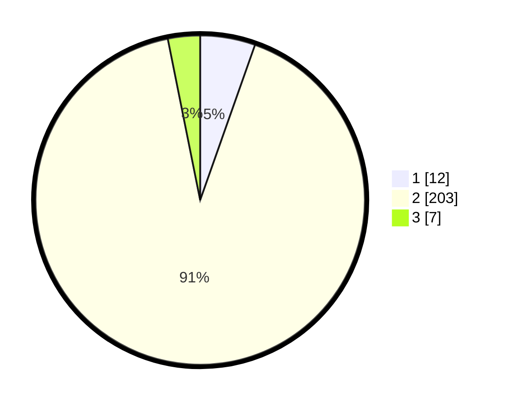

# Hasil

## Grafik

## Tabel

| No. | Nama Paslon    | Suara | Suara (raw) | Persentase |
|:--- |:-------------- | -----:| -----------:| ----------:|
| 1   | ANIES MUHAIMIN | 12    | [12][p-1]   | 5,41       |
| 2   | PRABOWO GIBRAN | 203   | [203][p-2]  | 91,44      |
| 3   | GANJAR MAHFUD  | 7     | [7][p-3]    | 3,15       |

[p-1]: https://github.com/gigit-pemilu/pemilu-2024/blob/main/pilpres/hitung-suara/sub/71-sulawesi-utara/sub/01-bolaang-mongondow/sub/11-dumoga-utara/sub/2019-mopuya-selatan-satu/sub/001-tps/sub/paslon-1.txt
[p-2]: https://github.com/gigit-pemilu/pemilu-2024/blob/main/pilpres/hitung-suara/sub/71-sulawesi-utara/sub/01-bolaang-mongondow/sub/11-dumoga-utara/sub/2019-mopuya-selatan-satu/sub/001-tps/sub/paslon-2.txt
[p-3]: https://github.com/gigit-pemilu/pemilu-2024/blob/main/pilpres/hitung-suara/sub/71-sulawesi-utara/sub/01-bolaang-mongondow/sub/11-dumoga-utara/sub/2019-mopuya-selatan-satu/sub/001-tps/sub/paslon-3.txt

## Foto C Plano

https://sirekap-obj-formc.kpu.go.id/2981/pemilu/ppwp/71/01/11/20/19/7101112019001-20240215-050836--2eaa1d86-baeb-483d-a74d-b1d45f2f8075.jpg

https://sirekap-obj-formc.kpu.go.id/2981/pemilu/ppwp/71/01/11/20/19/7101112019001-20240214-185917--78a8c469-98ee-4e6f-bb3e-40541fc4c16a.jpg

https://sirekap-obj-formc.kpu.go.id/2981/pemilu/ppwp/71/01/11/20/19/7101112019001-20240214-190049--7ea3afc3-58f8-404e-b48b-4dac01e2eb18.jpg

## Metadata

| Key        | Value               |
| ---------- | ------------------- |
| Time Stamp | 2024-02-16 02:30:27 |

