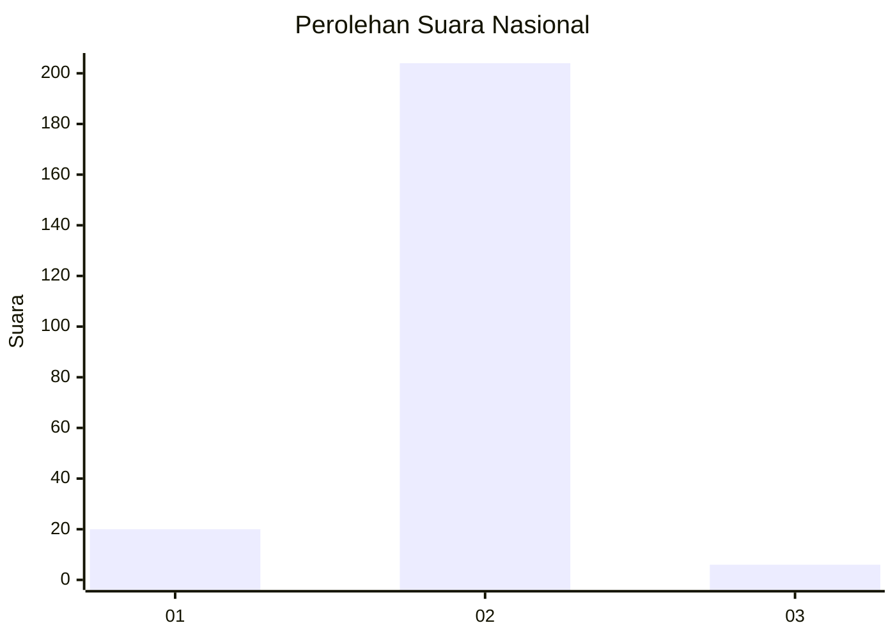
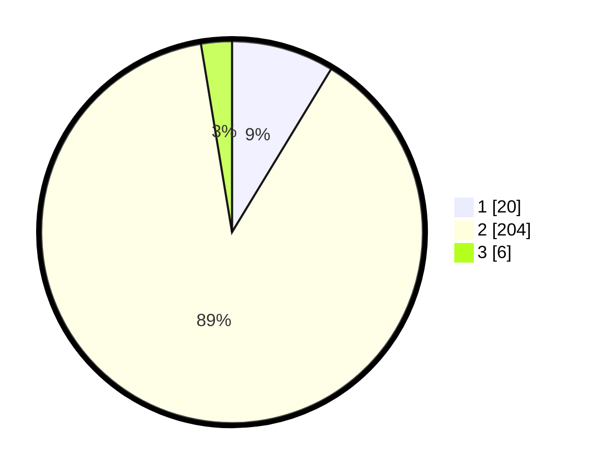

# Hasil

## Grafik

## Tabel

| No. | Nama Paslon    | Suara | Suara (raw) | Persentase |
|:--- |:-------------- | -----:| -----------:| ----------:|
| 1   | ANIES MUHAIMIN | 20    | [20][p-1]   | 8,70       |
| 2   | PRABOWO GIBRAN | 204   | [204][p-2]  | 88,70      |
| 3   | GANJAR MAHFUD  | 6     | [6][p-3]    | 2,61       |

[p-1]: https://github.com/gigit-pemilu/pemilu-2024/blob/main/pilpres/hitung-suara/sub/71-sulawesi-utara/sub/01-bolaang-mongondow/sub/31-bolaang-timur/sub/2001-ambang-i/sub/001-tps/sub/paslon-1.txt
[p-2]: https://github.com/gigit-pemilu/pemilu-2024/blob/main/pilpres/hitung-suara/sub/71-sulawesi-utara/sub/01-bolaang-mongondow/sub/31-bolaang-timur/sub/2001-ambang-i/sub/001-tps/sub/paslon-2.txt
[p-3]: https://github.com/gigit-pemilu/pemilu-2024/blob/main/pilpres/hitung-suara/sub/71-sulawesi-utara/sub/01-bolaang-mongondow/sub/31-bolaang-timur/sub/2001-ambang-i/sub/001-tps/sub/paslon-3.txt

## Foto C Plano

https://sirekap-obj-formc.kpu.go.id/07ce/pemilu/ppwp/71/01/31/20/01/7101312001001-20240215-044241--1597fb96-fa18-4b1b-bb01-accee820f00c.jpg

https://sirekap-obj-formc.kpu.go.id/07ce/pemilu/ppwp/71/01/31/20/01/7101312001001-20240215-155831--00c606cc-e1b3-4f53-b0e9-4594679a6ae8.jpg

https://sirekap-obj-formc.kpu.go.id/07ce/pemilu/ppwp/71/01/31/20/01/7101312001001-20240215-160512--a5a152db-0754-49d4-9843-4332c348b957.jpg

## Metadata

| Key        | Value               |
| ---------- | ------------------- |
| Time Stamp | 2024-02-15 19:30:26 |

