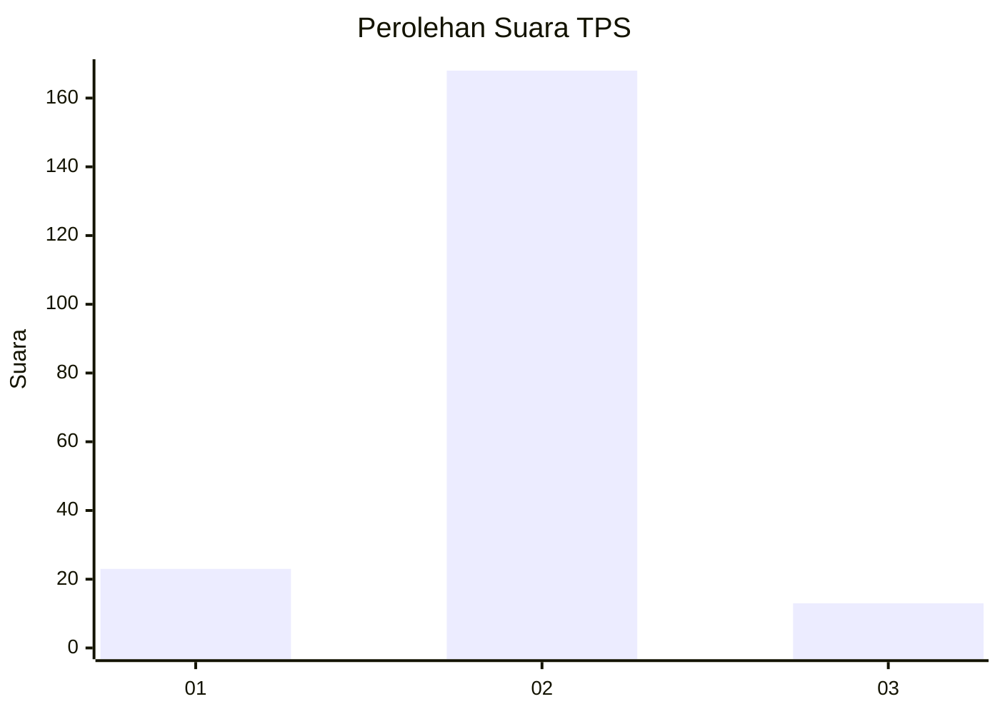
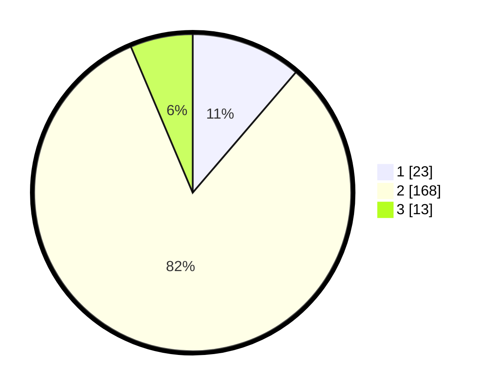

# Hasil

## Grafik

## Tabel

| No. | Nama Paslon    | Suara | Suara (raw) | Persentase |
|:--- |:-------------- | -----:| -----------:| ----------:|
| 1   | ANIES MUHAIMIN | 23    | [23][p-1]   | 11,27      |
| 2   | PRABOWO GIBRAN | 168   | [168][p-2]  | 82,35      |
| 3   | GANJAR MAHFUD  | 13    | [13][p-3]   | 6,37       |

[p-1]: https://github.com/gigit-pemilu/pemilu-2024-71-sulawesi-utara/blob/main/pilpres/hitung-suara/sub/71-sulawesi-utara/sub/01-bolaang-mongondow/sub/31-bolaang-timur/sub/2001-ambang-i/sub/002-tps/sub/paslon-1.txt
[p-2]: https://github.com/gigit-pemilu/pemilu-2024-71-sulawesi-utara/blob/main/pilpres/hitung-suara/sub/71-sulawesi-utara/sub/01-bolaang-mongondow/sub/31-bolaang-timur/sub/2001-ambang-i/sub/002-tps/sub/paslon-2.txt
[p-3]: https://github.com/gigit-pemilu/pemilu-2024-71-sulawesi-utara/blob/main/pilpres/hitung-suara/sub/71-sulawesi-utara/sub/01-bolaang-mongondow/sub/31-bolaang-timur/sub/2001-ambang-i/sub/002-tps/sub/paslon-3.txt

## Foto C Plano

https://sirekap-obj-formc.kpu.go.id/945a/pemilu/ppwp/71/01/31/20/01/7101312001002-20240215-032959--537ea892-584a-44e7-87f2-7fde970bbbcd.jpg

https://sirekap-obj-formc.kpu.go.id/945a/pemilu/ppwp/71/01/31/20/01/7101312001002-20240215-033134--c38838f1-9900-4c01-8f0f-eeb5ff1ed403.jpg

https://sirekap-obj-formc.kpu.go.id/945a/pemilu/ppwp/71/01/31/20/01/7101312001002-20240215-140011--bbb7deab-ee1b-42d0-94c0-ea75c8835544.jpg

## Metadata

| Key        | Value               |
| ---------- | ------------------- |
| Time Stamp | 2024-02-15 15:00:29 |

