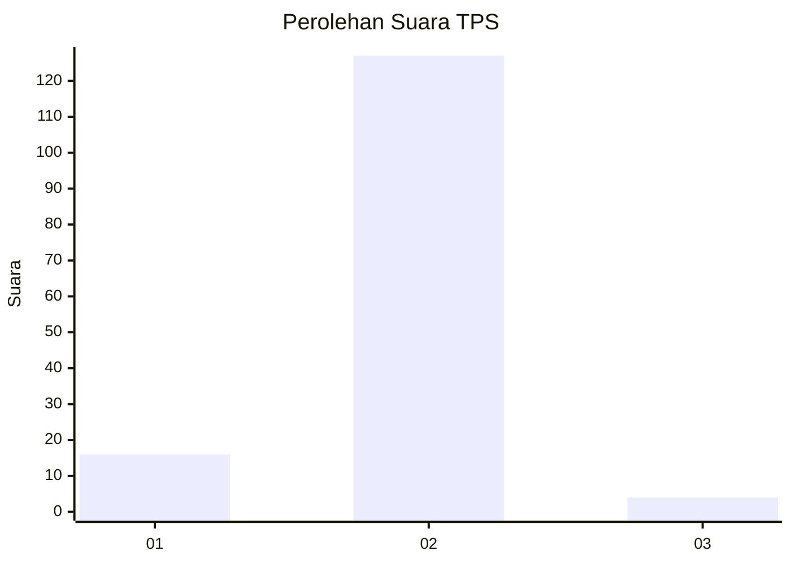
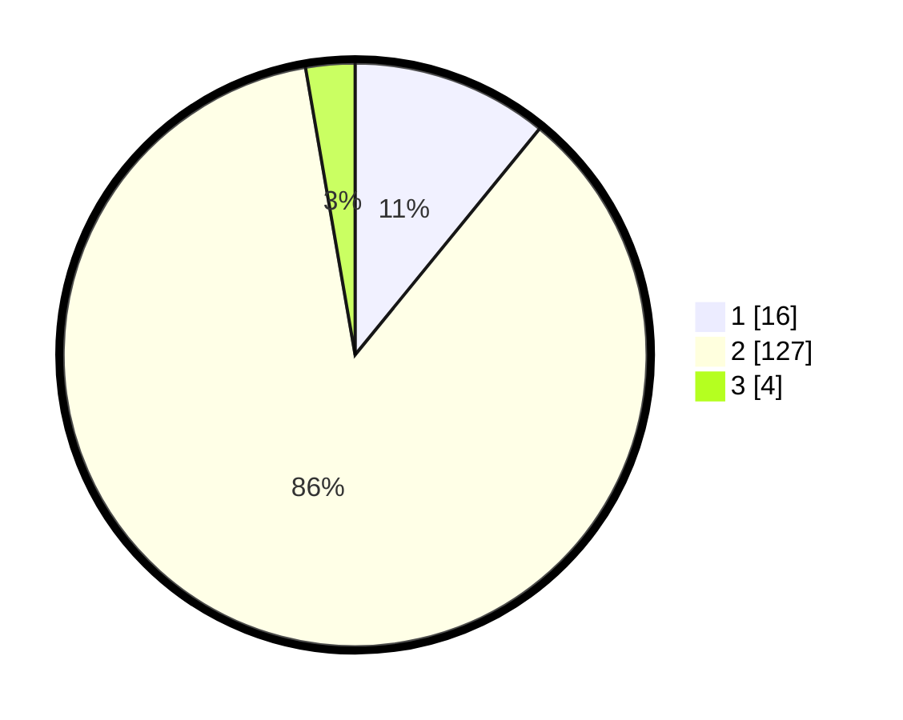

# Hasil

## Grafik

## Tabel

| No. | Nama Paslon    | Suara | Suara (raw) | Persentase |
|:--- |:-------------- | -----:| -----------:| ----------:|
| 1   | ANIES MUHAIMIN | 16    | [16][p-1]   | 10,88      |
| 2   | PRABOWO GIBRAN | 127   | [127][p-2]  | 86,39      |
| 3   | GANJAR MAHFUD  | 4     | [4][p-3]    | 2,72       |

[p-1]: https://github.com/gigit-pemilu/pemilu-2024-71-sulawesi-utara/blob/main/pilpres/hitung-suara/sub/71-sulawesi-utara/sub/01-bolaang-mongondow/sub/32-bilalang/sub/2002-bilalang-iv/sub/002-tps/sub/paslon-1.txt
[p-2]: https://github.com/gigit-pemilu/pemilu-2024-71-sulawesi-utara/blob/main/pilpres/hitung-suara/sub/71-sulawesi-utara/sub/01-bolaang-mongondow/sub/32-bilalang/sub/2002-bilalang-iv/sub/002-tps/sub/paslon-2.txt
[p-3]: https://github.com/gigit-pemilu/pemilu-2024-71-sulawesi-utara/blob/main/pilpres/hitung-suara/sub/71-sulawesi-utara/sub/01-bolaang-mongondow/sub/32-bilalang/sub/2002-bilalang-iv/sub/002-tps/sub/paslon-3.txt

## Foto C Plano

https://sirekap-obj-formc.kpu.go.id/e693/pemilu/ppwp/71/01/32/20/02/7101322002002-20240214-234931--323e8f65-09c2-4258-a598-9bc7c55a9884.jpg

https://sirekap-obj-formc.kpu.go.id/e693/pemilu/ppwp/71/01/32/20/02/7101322002002-20240214-195839--93c3050c-933a-49b0-83bc-f7bd585c140d.jpg

https://sirekap-obj-formc.kpu.go.id/e693/pemilu/ppwp/71/01/32/20/02/7101322002002-20240214-200216--4df1d5ec-ed4c-42f2-a51e-7cbcdfd199cd.jpg

## Metadata

| Key        | Value               |
| ---------- | ------------------- |
| Time Stamp | 2024-02-16 02:00:27 |

