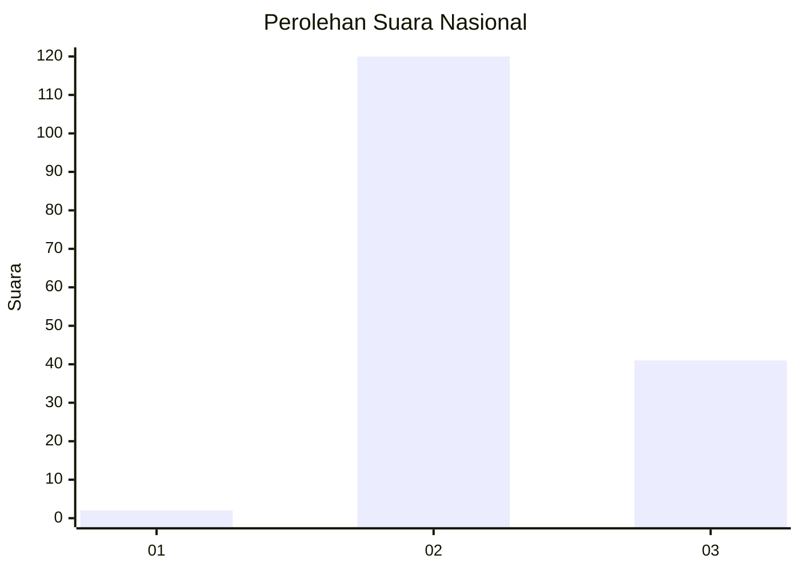
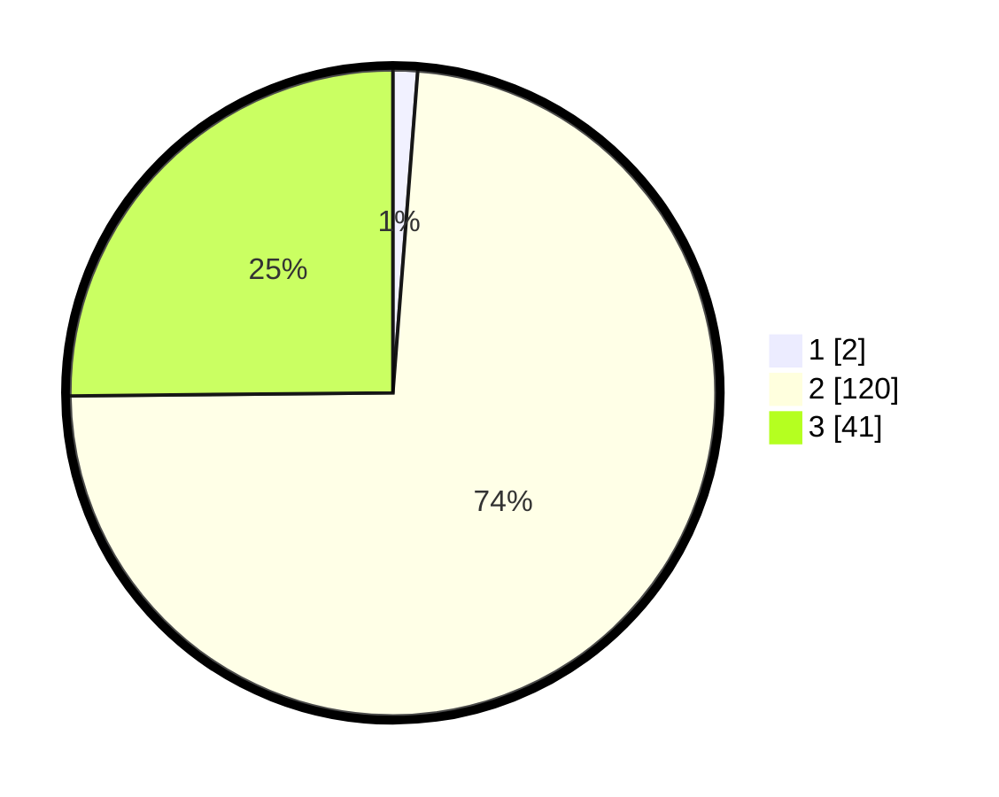

# Hasil

## Grafik

## Tabel

| No. | Nama Paslon    | Suara | Suara (raw) | Persentase |
|:--- |:-------------- | -----:| -----------:| ----------:|
| 1   | ANIES MUHAIMIN | 2     | [2][p-1]    | 1,23       |
| 2   | PRABOWO GIBRAN | 120   | [120][p-2]  | 73,62      |
| 3   | GANJAR MAHFUD  | 41    | [41][p-3]   | 25,15      |

[p-1]: https://github.com/gigit-pemilu/pemilu-2024/blob/main/pilpres/hitung-suara/sub/71-sulawesi-utara/sub/02-minahasa/sub/06-kakas/sub/2004-wineru/sub/002-tps/sub/paslon-1.txt
[p-2]: https://github.com/gigit-pemilu/pemilu-2024/blob/main/pilpres/hitung-suara/sub/71-sulawesi-utara/sub/02-minahasa/sub/06-kakas/sub/2004-wineru/sub/002-tps/sub/paslon-2.txt
[p-3]: https://github.com/gigit-pemilu/pemilu-2024/blob/main/pilpres/hitung-suara/sub/71-sulawesi-utara/sub/02-minahasa/sub/06-kakas/sub/2004-wineru/sub/002-tps/sub/paslon-3.txt

## Foto C Plano

https://sirekap-obj-formc.kpu.go.id/50be/pemilu/ppwp/71/02/06/20/04/7102062004002-20240222-133245--2d3a6460-bace-4b59-addd-777f3fe37756.jpg

https://sirekap-obj-formc.kpu.go.id/50be/pemilu/ppwp/71/02/06/20/04/7102062004002-20240215-040801--865d319b-781b-46a8-8c90-f5223c072f59.jpg

https://sirekap-obj-formc.kpu.go.id/50be/pemilu/ppwp/71/02/06/20/04/7102062004002-20240222-133437--849820c6-a559-4842-9301-30109c33af52.jpg

## Metadata

| Key        | Value               |
| ---------- | ------------------- |
| Time Stamp | 2024-02-24 22:31:28 |

