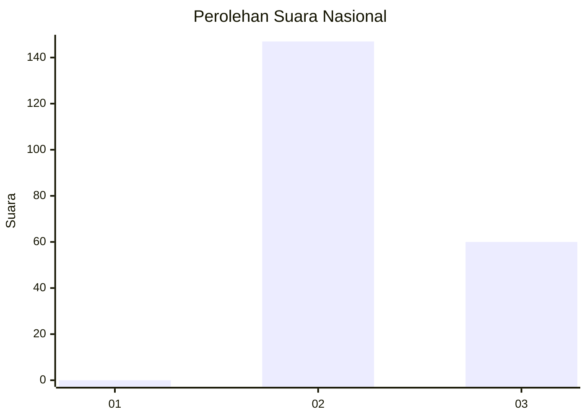
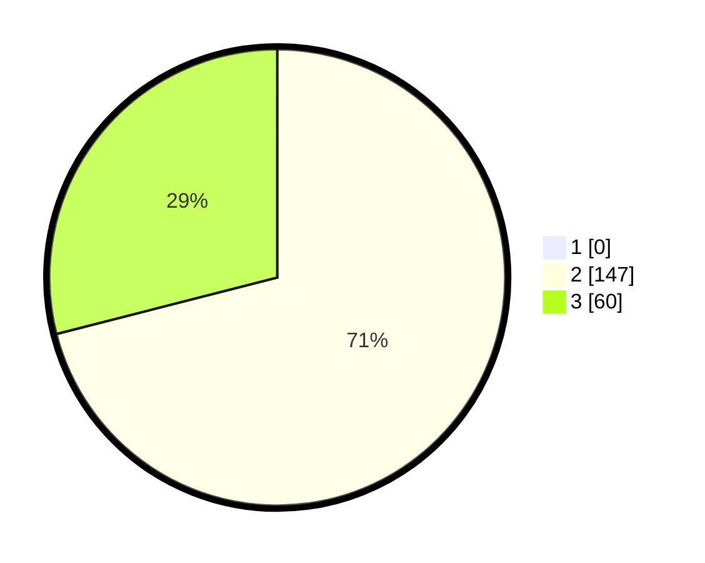

# Hasil

## Grafik

## Tabel

| No. | Nama Paslon    | Suara | Suara (raw) | Persentase |
|:--- |:-------------- | -----:| -----------:| ----------:|
| 1   | ANIES MUHAIMIN | 0     | [0][p-1]    | 0,00       |
| 2   | PRABOWO GIBRAN | 147   | [147][p-2]  | 71,01      |
| 3   | GANJAR MAHFUD  | 60    | [60][p-3]   | 28,99      |

[p-1]: https://github.com/gigit-pemilu/pemilu-2024/blob/main/pilpres/hitung-suara/sub/71-sulawesi-utara/sub/02-minahasa/sub/08-remboken/sub/2001-kasuratan/sub/002-tps/sub/paslon-1.txt
[p-2]: https://github.com/gigit-pemilu/pemilu-2024/blob/main/pilpres/hitung-suara/sub/71-sulawesi-utara/sub/02-minahasa/sub/08-remboken/sub/2001-kasuratan/sub/002-tps/sub/paslon-2.txt
[p-3]: https://github.com/gigit-pemilu/pemilu-2024/blob/main/pilpres/hitung-suara/sub/71-sulawesi-utara/sub/02-minahasa/sub/08-remboken/sub/2001-kasuratan/sub/002-tps/sub/paslon-3.txt

## Foto C Plano

https://sirekap-obj-formc.kpu.go.id/4a2f/pemilu/ppwp/71/02/08/20/01/7102082001002-20240226-141108--cda12e99-d70e-4487-b751-3d4283a64a01.jpg

https://sirekap-obj-formc.kpu.go.id/4a2f/pemilu/ppwp/71/02/08/20/01/7102082001002-20240226-141228--fe550f48-a9bd-40f2-8d74-f9546bea0032.jpg

https://sirekap-obj-formc.kpu.go.id/4a2f/pemilu/ppwp/71/02/08/20/01/7102082001002-20240226-141335--2598c84f-f644-4377-95bd-32c8d603caf5.jpg

## Metadata

| Key        | Value               |
| ---------- | ------------------- |
| Time Stamp | 2024-02-26 17:00:04 |

