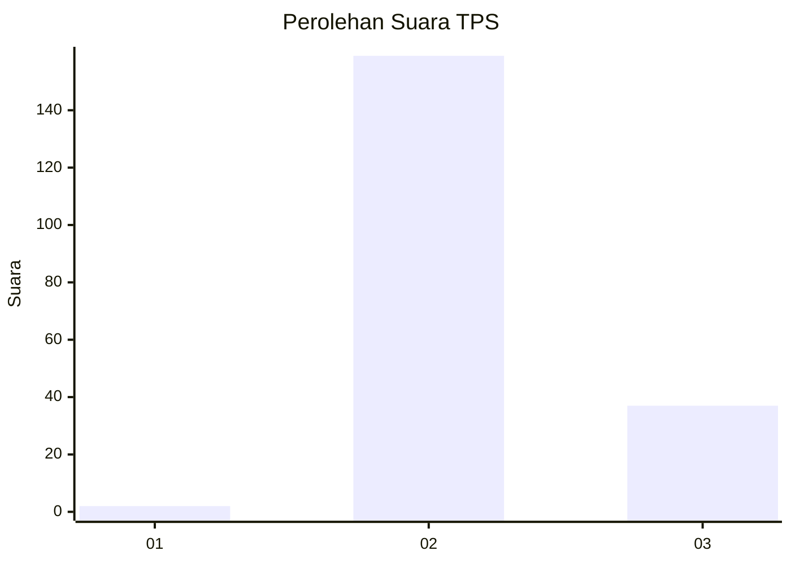
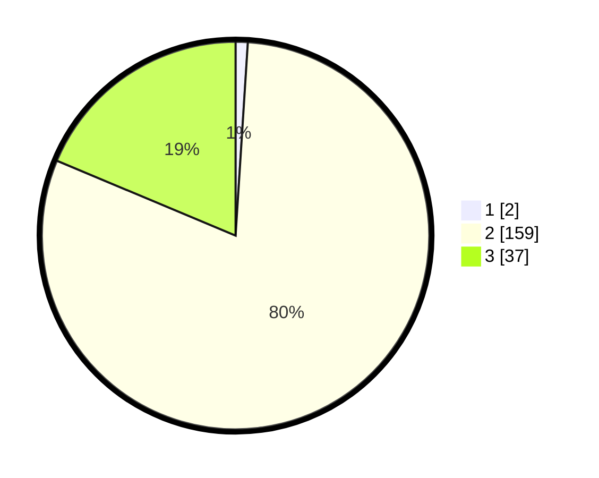

# Hasil

## Grafik

## Tabel

| No. | Nama Paslon    | Suara | Suara (raw) | Persentase |
|:--- |:-------------- | -----:| -----------:| ----------:|
| 1   | ANIES MUHAIMIN | 2     | [2][p-1]    | 1,01       |
| 2   | PRABOWO GIBRAN | 159   | [159][p-2]  | 80,30      |
| 3   | GANJAR MAHFUD  | 37    | [37][p-3]   | 18,69      |

[p-1]: https://github.com/gigit-pemilu/pemilu-2024-71-sulawesi-utara/blob/main/pilpres/hitung-suara/sub/71-sulawesi-utara/sub/02-minahasa/sub/08-remboken/sub/2001-kasuratan/sub/005-tps/sub/paslon-1.txt
[p-2]: https://github.com/gigit-pemilu/pemilu-2024-71-sulawesi-utara/blob/main/pilpres/hitung-suara/sub/71-sulawesi-utara/sub/02-minahasa/sub/08-remboken/sub/2001-kasuratan/sub/005-tps/sub/paslon-2.txt
[p-3]: https://github.com/gigit-pemilu/pemilu-2024-71-sulawesi-utara/blob/main/pilpres/hitung-suara/sub/71-sulawesi-utara/sub/02-minahasa/sub/08-remboken/sub/2001-kasuratan/sub/005-tps/sub/paslon-3.txt

## Foto C Plano

https://sirekap-obj-formc.kpu.go.id/e426/pemilu/ppwp/71/02/08/20/01/7102082001005-20240226-140155--084b3f01-13bf-4d28-b994-173f17f8dfda.jpg

https://sirekap-obj-formc.kpu.go.id/e426/pemilu/ppwp/71/02/08/20/01/7102082001005-20240226-140328--3f649b8b-6f38-409d-89b6-a4b088b24937.jpg

https://sirekap-obj-formc.kpu.go.id/e426/pemilu/ppwp/71/02/08/20/01/7102082001005-20240226-140450--a3dff701-c277-4501-a51b-82bc90e1c264.jpg

## Metadata

| Key        | Value               |
| ---------- | ------------------- |
| Time Stamp | 2024-02-26 17:00:04 |

