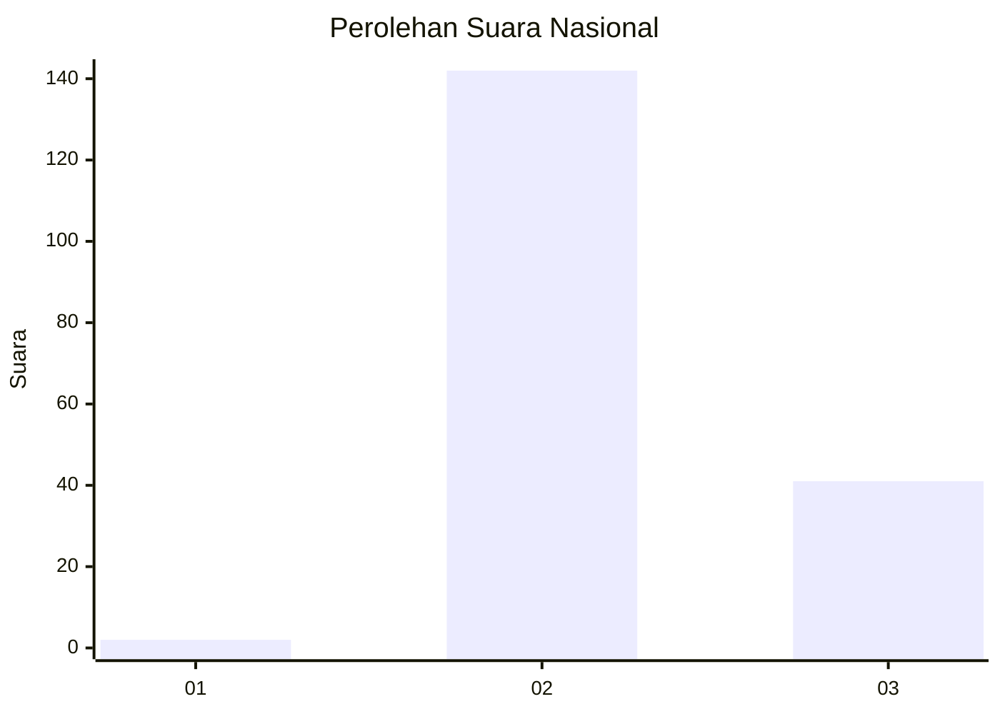
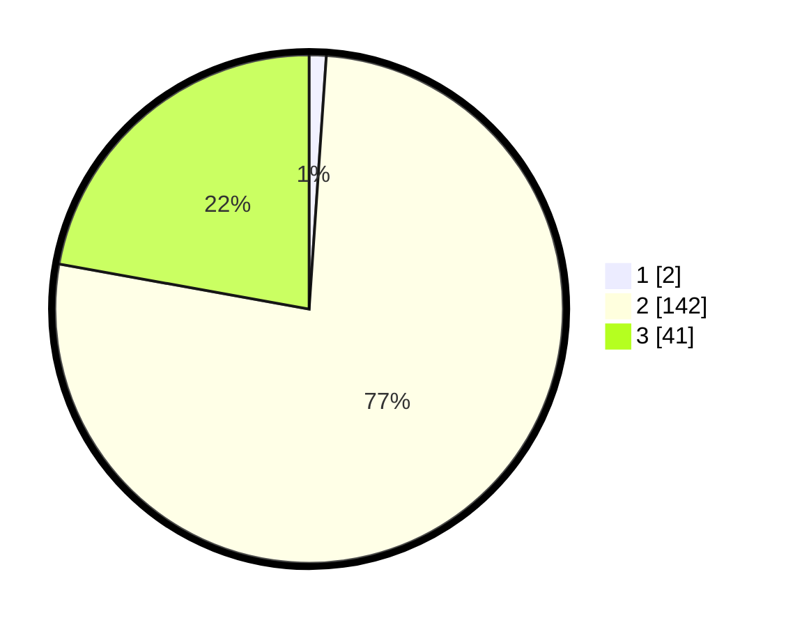

# Hasil

## Grafik

## Tabel

| No. | Nama Paslon    | Suara | Suara (raw) | Persentase |
|:--- |:-------------- | -----:| -----------:| ----------:|
| 1   | ANIES MUHAIMIN | 2     | [2][p-1]    | 1,08       |
| 2   | PRABOWO GIBRAN | 142   | [142][p-2]  | 76,76      |
| 3   | GANJAR MAHFUD  | 41    | [41][p-3]   | 22,16      |

[p-1]: https://github.com/gigit-pemilu/pemilu-2024/blob/main/pilpres/hitung-suara/sub/71-sulawesi-utara/sub/02-minahasa/sub/15-tombariri/sub/2001-kumu/sub/001-tps/sub/paslon-1.txt
[p-2]: https://github.com/gigit-pemilu/pemilu-2024/blob/main/pilpres/hitung-suara/sub/71-sulawesi-utara/sub/02-minahasa/sub/15-tombariri/sub/2001-kumu/sub/001-tps/sub/paslon-2.txt
[p-3]: https://github.com/gigit-pemilu/pemilu-2024/blob/main/pilpres/hitung-suara/sub/71-sulawesi-utara/sub/02-minahasa/sub/15-tombariri/sub/2001-kumu/sub/001-tps/sub/paslon-3.txt

## Foto C Plano

https://sirekap-obj-formc.kpu.go.id/7e8a/pemilu/ppwp/71/02/15/20/01/7102152001001-20240217-105234--99cc0481-a810-476f-aa1f-08cfc24ce7c5.jpg

https://sirekap-obj-formc.kpu.go.id/7e8a/pemilu/ppwp/71/02/15/20/01/7102152001001-20240217-105335--fbb8dfaf-7cc5-4585-b7fd-a40c1a507051.jpg

https://sirekap-obj-formc.kpu.go.id/7e8a/pemilu/ppwp/71/02/15/20/01/7102152001001-20240215-014259--4893757a-1e9e-406c-9995-f68e1f4e1d4e.jpg

## Metadata

| Key        | Value               |
| ---------- | ------------------- |
| Time Stamp | 2024-02-20 22:00:00 |

