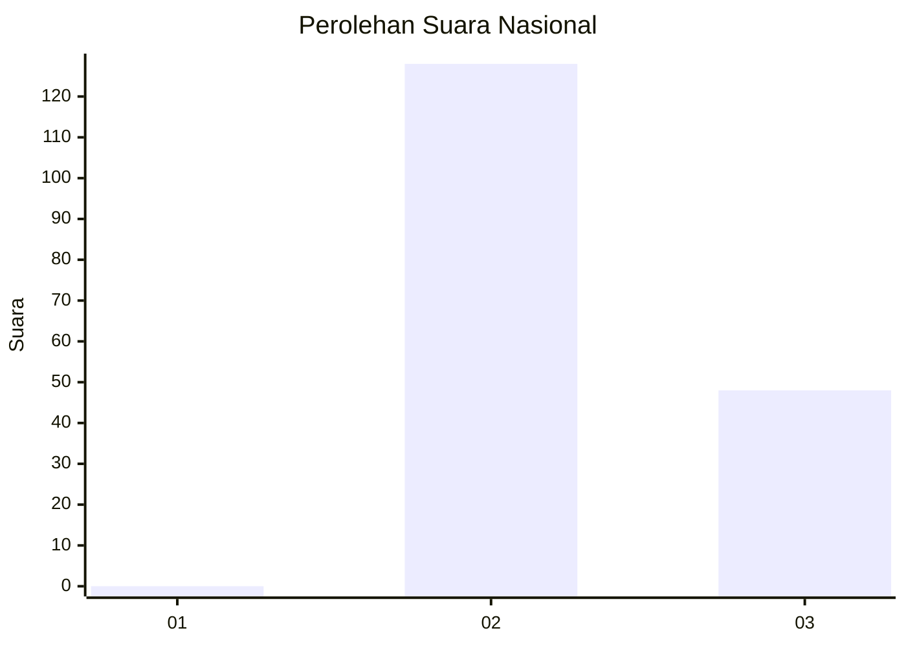
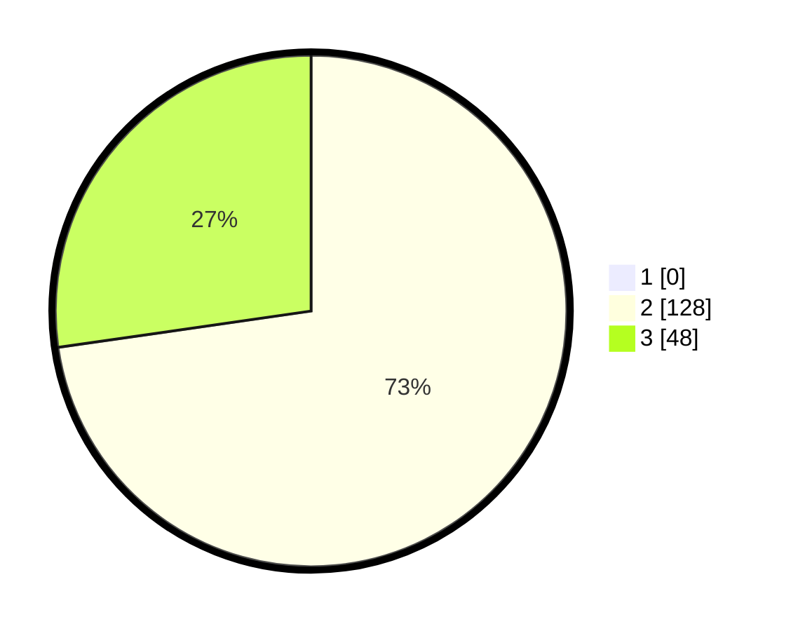

# Hasil

## Grafik

## Tabel

| No. | Nama Paslon    | Suara | Suara (raw) | Persentase |
|:--- |:-------------- | -----:| -----------:| ----------:|
| 1   | ANIES MUHAIMIN | 0     | [0][p-1]    | 0,00       |
| 2   | PRABOWO GIBRAN | 128   | [128][p-2]  | 72,73      |
| 3   | GANJAR MAHFUD  | 48    | [48][p-3]   | 27,27      |

[p-1]: https://github.com/gigit-pemilu/pemilu-2024/blob/main/pilpres/hitung-suara/sub/71-sulawesi-utara/sub/02-minahasa/sub/15-tombariri/sub/2001-kumu/sub/003-tps/sub/paslon-1.txt
[p-2]: https://github.com/gigit-pemilu/pemilu-2024/blob/main/pilpres/hitung-suara/sub/71-sulawesi-utara/sub/02-minahasa/sub/15-tombariri/sub/2001-kumu/sub/003-tps/sub/paslon-2.txt
[p-3]: https://github.com/gigit-pemilu/pemilu-2024/blob/main/pilpres/hitung-suara/sub/71-sulawesi-utara/sub/02-minahasa/sub/15-tombariri/sub/2001-kumu/sub/003-tps/sub/paslon-3.txt

## Foto C Plano

https://sirekap-obj-formc.kpu.go.id/0a61/pemilu/ppwp/71/02/15/20/01/7102152001003-20240304-115738--154e1039-7817-4c0d-adf4-e895df205eb5.jpg

https://sirekap-obj-formc.kpu.go.id/0a61/pemilu/ppwp/71/02/15/20/01/7102152001003-20240304-115604--65b7056f-4eb4-496e-9eea-1dcf8a4f6806.jpg

https://sirekap-obj-formc.kpu.go.id/0a61/pemilu/ppwp/71/02/15/20/01/7102152001003-20240304-115954--63238e1f-63f9-4365-9ada-09902217efe0.jpg

## Metadata

| Key        | Value               |
| ---------- | ------------------- |
| Time Stamp | 2024-03-04 12:00:00 |

