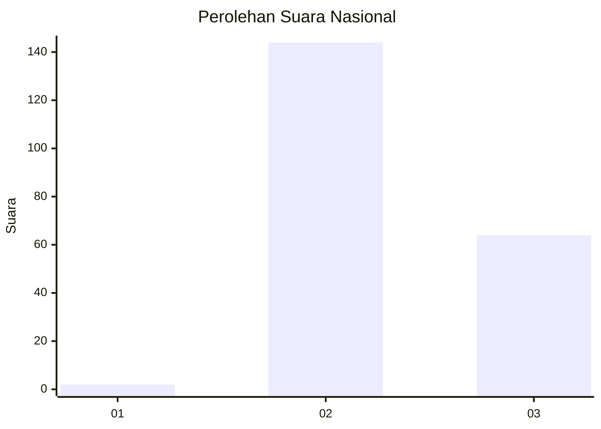
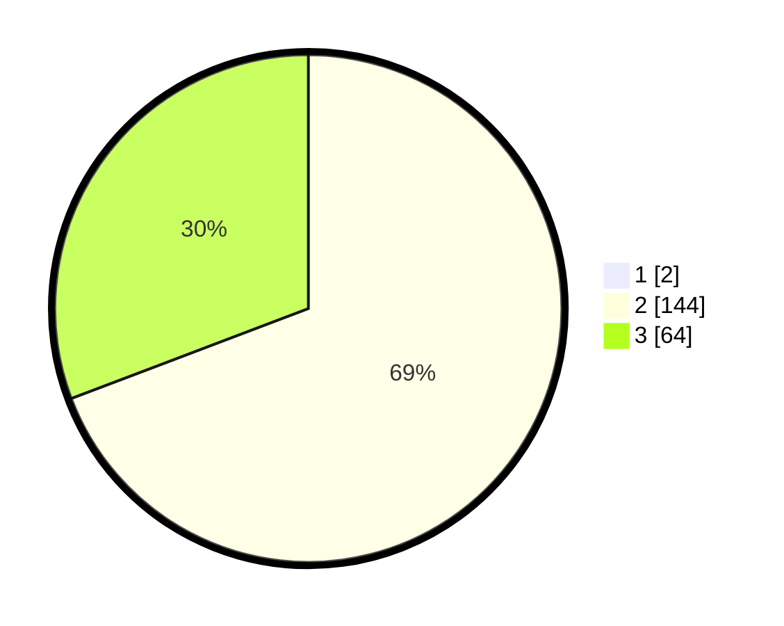

# Hasil

## Grafik

## Tabel

| No. | Nama Paslon    | Suara | Suara (raw) | Persentase |
|:--- |:-------------- | -----:| -----------:| ----------:|
| 1   | ANIES MUHAIMIN | 2     | [2][p-1]    | 0,95       |
| 2   | PRABOWO GIBRAN | 144   | [144][p-2]  | 68,57      |
| 3   | GANJAR MAHFUD  | 64    | [64][p-3]   | 30,48      |

[p-1]: https://github.com/gigit-pemilu/pemilu-2024/blob/main/pilpres/hitung-suara/sub/71-sulawesi-utara/sub/02-minahasa/sub/21-kawangkoan-utara/sub/1002-talikuran-utara/sub/002-tps/sub/paslon-1.txt
[p-2]: https://github.com/gigit-pemilu/pemilu-2024/blob/main/pilpres/hitung-suara/sub/71-sulawesi-utara/sub/02-minahasa/sub/21-kawangkoan-utara/sub/1002-talikuran-utara/sub/002-tps/sub/paslon-2.txt
[p-3]: https://github.com/gigit-pemilu/pemilu-2024/blob/main/pilpres/hitung-suara/sub/71-sulawesi-utara/sub/02-minahasa/sub/21-kawangkoan-utara/sub/1002-talikuran-utara/sub/002-tps/sub/paslon-3.txt

## Foto C Plano

https://sirekap-obj-formc.kpu.go.id/571c/pemilu/ppwp/71/02/21/10/02/7102211002002-20240214-213750--4592449c-bd40-428b-85eb-877a3c5b1b6c.jpg

https://sirekap-obj-formc.kpu.go.id/571c/pemilu/ppwp/71/02/21/10/02/7102211002002-20240214-201437--1065be09-caf0-4e1f-9068-bda57abd8c6d.jpg

https://sirekap-obj-formc.kpu.go.id/571c/pemilu/ppwp/71/02/21/10/02/7102211002002-20240215-083632--7c23ee63-7644-44ac-93b7-cd181d425340.jpg

## Metadata

| Key        | Value               |
| ---------- | ------------------- |
| Time Stamp | 2024-02-15 15:00:29 |

