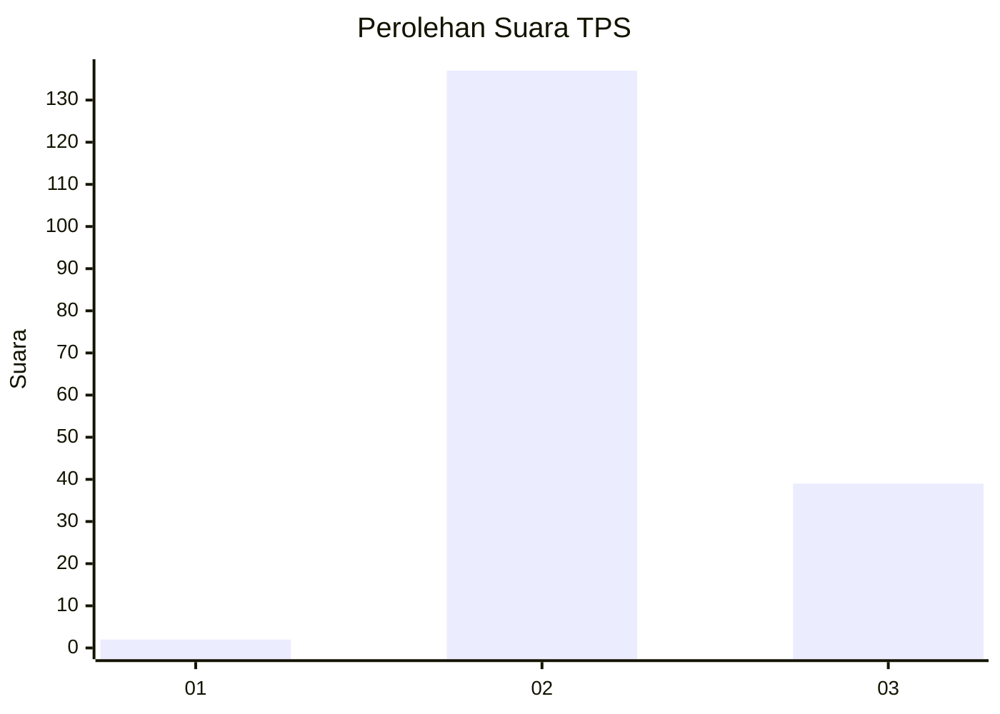
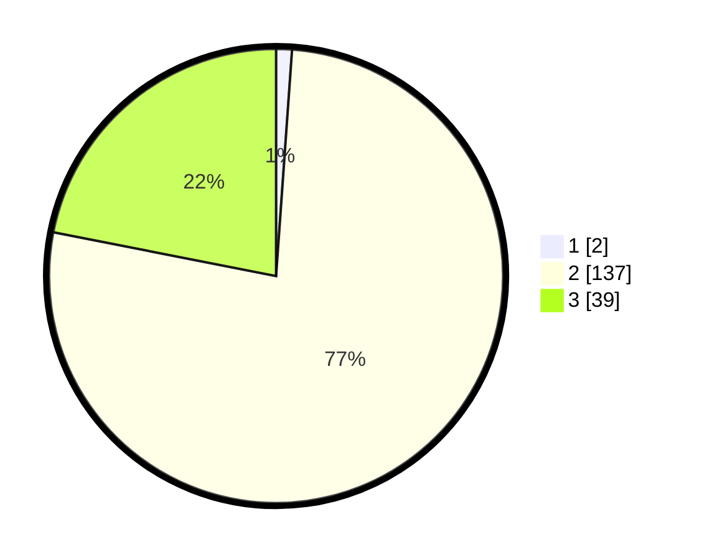

# Hasil

## Grafik

## Tabel

| No. | Nama Paslon    | Suara | Suara (raw) | Persentase |
|:--- |:-------------- | -----:| -----------:| ----------:|
| 1   | ANIES MUHAIMIN | 2     | [2][p-1]    | 1,12       |
| 2   | PRABOWO GIBRAN | 137   | [137][p-2]  | 76,97      |
| 3   | GANJAR MAHFUD  | 39    | [39][p-3]   | 21,91      |

[p-1]: https://github.com/gigit-pemilu/pemilu-2024-71-sulawesi-utara/blob/main/pilpres/hitung-suara/sub/71-sulawesi-utara/sub/03-kepulauan-sangihe/sub/10-manganitu-selatan/sub/2001-kaluwatu/sub/001-tps/sub/paslon-1.txt
[p-2]: https://github.com/gigit-pemilu/pemilu-2024-71-sulawesi-utara/blob/main/pilpres/hitung-suara/sub/71-sulawesi-utara/sub/03-kepulauan-sangihe/sub/10-manganitu-selatan/sub/2001-kaluwatu/sub/001-tps/sub/paslon-2.txt
[p-3]: https://github.com/gigit-pemilu/pemilu-2024-71-sulawesi-utara/blob/main/pilpres/hitung-suara/sub/71-sulawesi-utara/sub/03-kepulauan-sangihe/sub/10-manganitu-selatan/sub/2001-kaluwatu/sub/001-tps/sub/paslon-3.txt

## Foto C Plano

https://sirekap-obj-formc.kpu.go.id/0409/pemilu/ppwp/71/03/10/20/01/7103102001001-20240215-091123--c98bf3cf-2ed5-47bd-9306-cab9763591ac.jpg

https://sirekap-obj-formc.kpu.go.id/0409/pemilu/ppwp/71/03/10/20/01/7103102001001-20240215-091346--36fa7797-6013-4991-bbde-f5666ee86b9a.jpg

https://sirekap-obj-formc.kpu.go.id/0409/pemilu/ppwp/71/03/10/20/01/7103102001001-20240215-091600--3ea8aea2-7f15-4b9c-a205-94ede8ef39aa.jpg

## Metadata

| Key        | Value               |
| ---------- | ------------------- |
| Time Stamp | 2024-02-15 19:30:26 |

