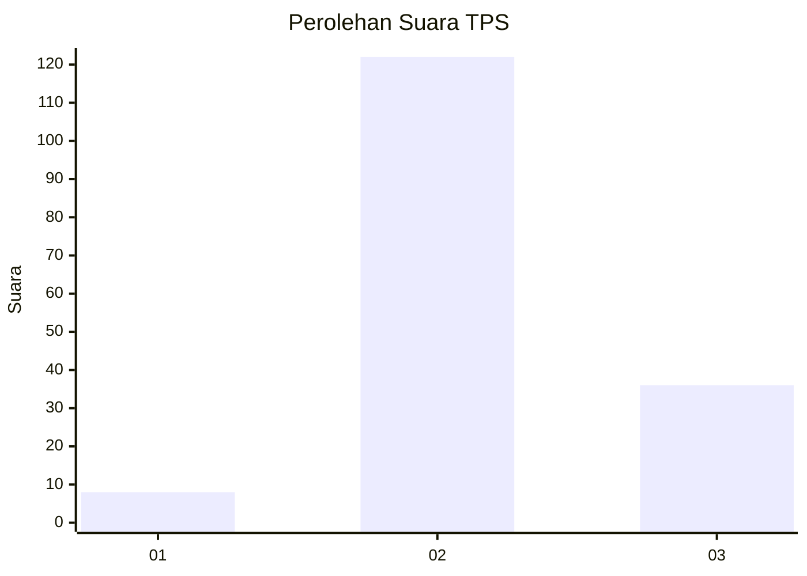

# Hasil

## Grafik

## Tabel

| No. | Nama Paslon    | Suara | Suara (raw) | Persentase |
|:--- |:-------------- | -----:| -----------:| ----------:|
| 1   | ANIES MUHAIMIN | 8     | [8][p-1]    | 4,82       |
| 2   | PRABOWO GIBRAN | 122   | [122][p-2]  | 73,49      |
| 3   | GANJAR MAHFUD  | 36    | [36][p-3]   | 21,69      |

[p-1]: https://github.com/gigit-pemilu/pemilu-2024-71-sulawesi-utara/blob/main/pilpres/hitung-suara/sub/71-sulawesi-utara/sub/03-kepulauan-sangihe/sub/10-manganitu-selatan/sub/2001-kaluwatu/sub/002-tps/sub/paslon-1.txt
[p-2]: https://github.com/gigit-pemilu/pemilu-2024-71-sulawesi-utara/blob/main/pilpres/hitung-suara/sub/71-sulawesi-utara/sub/03-kepulauan-sangihe/sub/10-manganitu-selatan/sub/2001-kaluwatu/sub/002-tps/sub/paslon-2.txt
[p-3]: https://github.com/gigit-pemilu/pemilu-2024-71-sulawesi-utara/blob/main/pilpres/hitung-suara/sub/71-sulawesi-utara/sub/03-kepulauan-sangihe/sub/10-manganitu-selatan/sub/2001-kaluwatu/sub/002-tps/sub/paslon-3.txt

## Foto C Plano

https://sirekap-obj-formc.kpu.go.id/7e3c/pemilu/ppwp/71/03/10/20/01/7103102001002-20240215-111008--caf9f2eb-385a-4f83-bbb3-8bf8f0a882fc.jpg

https://sirekap-obj-formc.kpu.go.id/7e3c/pemilu/ppwp/71/03/10/20/01/7103102001002-20240215-111116--6564bff0-46f2-46ff-b390-7d5029e588f5.jpg

https://sirekap-obj-formc.kpu.go.id/7e3c/pemilu/ppwp/71/03/10/20/01/7103102001002-20240215-111208--0e8d9337-5ade-48c2-a76c-e304a67c2229.jpg

## Metadata

| Key        | Value               |
| ---------- | ------------------- |
| Time Stamp | 2024-02-15 15:00:29 |

