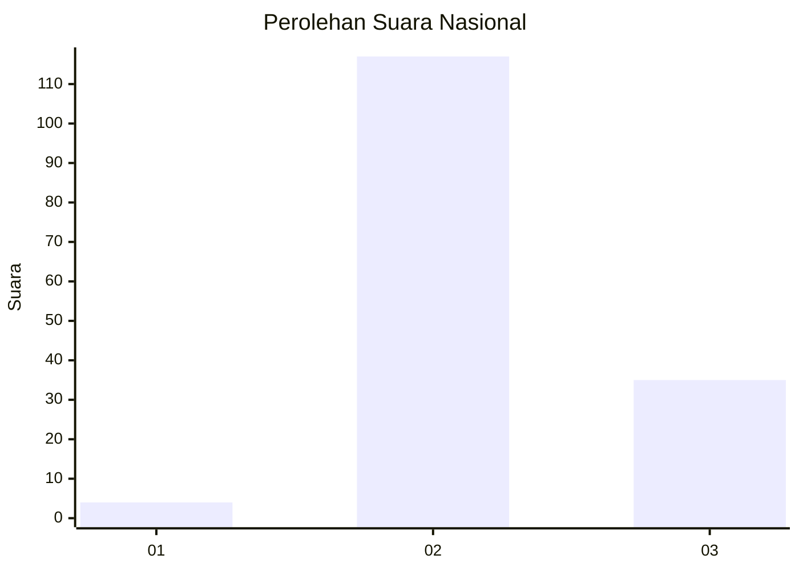
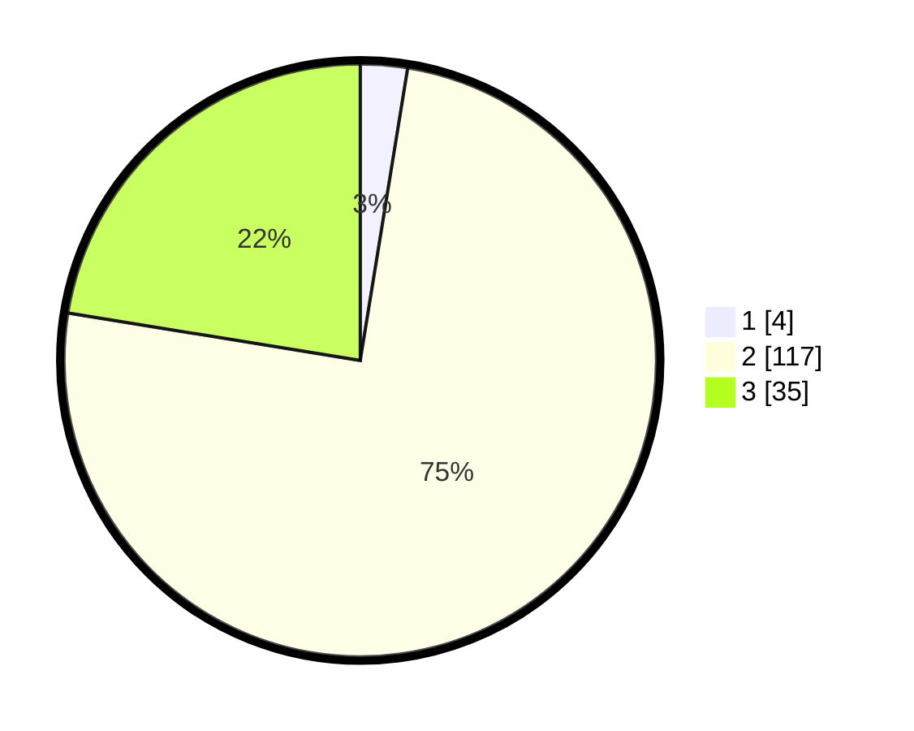

# Hasil

## Grafik

## Tabel

| No. | Nama Paslon    | Suara | Suara (raw) | Persentase |
|:--- |:-------------- | -----:| -----------:| ----------:|
| 1   | ANIES MUHAIMIN | 4     | [4][p-1]    | 2,56       |
| 2   | PRABOWO GIBRAN | 117   | [117][p-2]  | 75,00      |
| 3   | GANJAR MAHFUD  | 35    | [35][p-3]   | 22,44      |

[p-1]: https://github.com/gigit-pemilu/pemilu-2024/blob/main/pilpres/hitung-suara/sub/71-sulawesi-utara/sub/03-kepulauan-sangihe/sub/10-manganitu-selatan/sub/2001-kaluwatu/sub/003-tps/sub/paslon-1.txt
[p-2]: https://github.com/gigit-pemilu/pemilu-2024/blob/main/pilpres/hitung-suara/sub/71-sulawesi-utara/sub/03-kepulauan-sangihe/sub/10-manganitu-selatan/sub/2001-kaluwatu/sub/003-tps/sub/paslon-2.txt
[p-3]: https://github.com/gigit-pemilu/pemilu-2024/blob/main/pilpres/hitung-suara/sub/71-sulawesi-utara/sub/03-kepulauan-sangihe/sub/10-manganitu-selatan/sub/2001-kaluwatu/sub/003-tps/sub/paslon-3.txt

## Foto C Plano

https://sirekap-obj-formc.kpu.go.id/9724/pemilu/ppwp/71/03/10/20/01/7103102001003-20240215-022427--163ff73a-16c1-403e-a4b6-0ee1993195f3.jpg

https://sirekap-obj-formc.kpu.go.id/9724/pemilu/ppwp/71/03/10/20/01/7103102001003-20240215-023137--b72c64fe-7101-4d68-ba18-13ebfd30a1e0.jpg

https://sirekap-obj-formc.kpu.go.id/9724/pemilu/ppwp/71/03/10/20/01/7103102001003-20240215-023409--652a42d9-78eb-45bc-99b8-1b15df08a0ea.jpg

## Metadata

| Key        | Value               |
| ---------- | ------------------- |
| Time Stamp | 2024-02-15 22:30:27 |

