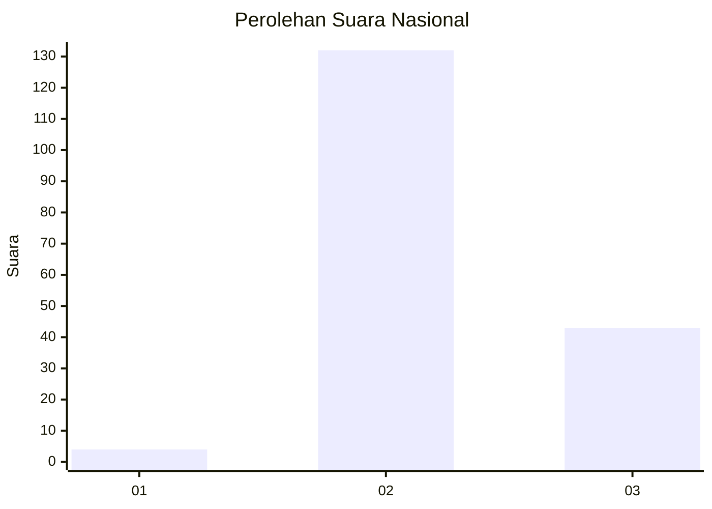
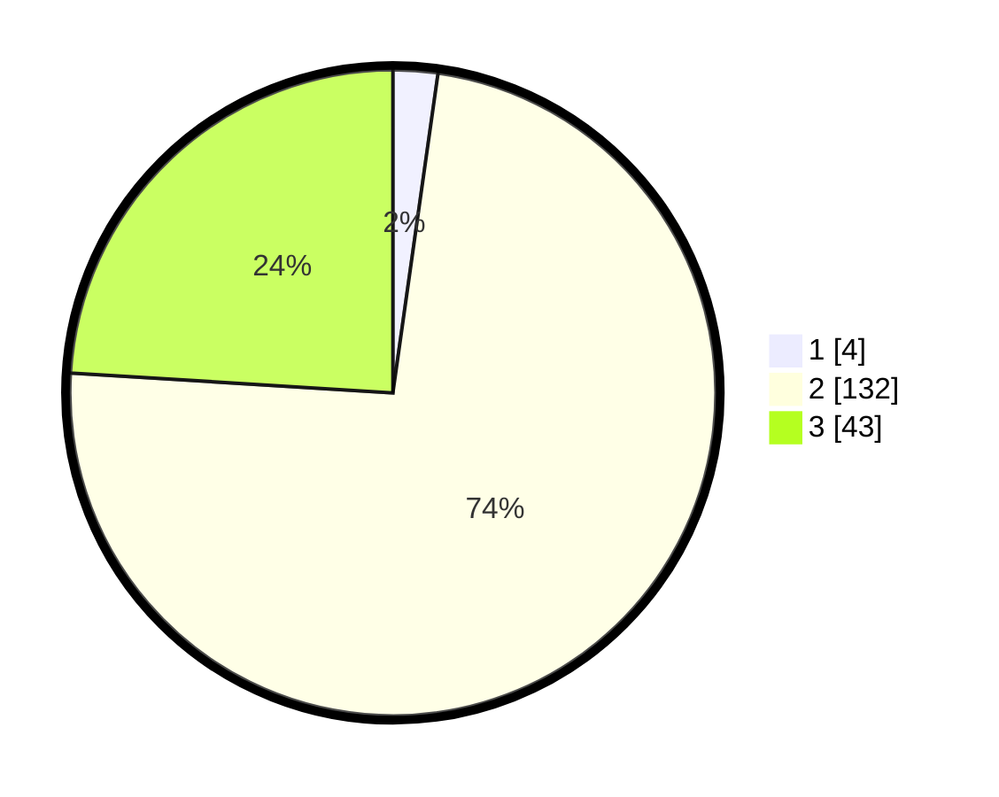

# Hasil

## Grafik

## Tabel

| No. | Nama Paslon    | Suara | Suara (raw) | Persentase |
|:--- |:-------------- | -----:| -----------:| ----------:|
| 1   | ANIES MUHAIMIN | 4     | [4][p-1]    | 2,23       |
| 2   | PRABOWO GIBRAN | 132   | [132][p-2]  | 73,74      |
| 3   | GANJAR MAHFUD  | 43    | [43][p-3]   | 24,02      |

[p-1]: https://github.com/gigit-pemilu/pemilu-2024/blob/main/pilpres/hitung-suara/sub/71-sulawesi-utara/sub/03-kepulauan-sangihe/sub/10-manganitu-selatan/sub/2001-kaluwatu/sub/004-tps/sub/paslon-1.txt
[p-2]: https://github.com/gigit-pemilu/pemilu-2024/blob/main/pilpres/hitung-suara/sub/71-sulawesi-utara/sub/03-kepulauan-sangihe/sub/10-manganitu-selatan/sub/2001-kaluwatu/sub/004-tps/sub/paslon-2.txt
[p-3]: https://github.com/gigit-pemilu/pemilu-2024/blob/main/pilpres/hitung-suara/sub/71-sulawesi-utara/sub/03-kepulauan-sangihe/sub/10-manganitu-selatan/sub/2001-kaluwatu/sub/004-tps/sub/paslon-3.txt

## Foto C Plano

https://sirekap-obj-formc.kpu.go.id/f7a5/pemilu/ppwp/71/03/10/20/01/7103102001004-20240215-071440--cd93709b-1497-4d45-9bba-c0150d37b423.jpg

https://sirekap-obj-formc.kpu.go.id/f7a5/pemilu/ppwp/71/03/10/20/01/7103102001004-20240215-071710--4587a547-86ca-42f4-a552-381959b977ce.jpg

https://sirekap-obj-formc.kpu.go.id/f7a5/pemilu/ppwp/71/03/10/20/01/7103102001004-20240215-072003--53fb96c9-ec1e-4dd6-8fe4-41fd2b5b2e2e.jpg

## Metadata

| Key        | Value               |
| ---------- | ------------------- |
| Time Stamp | 2024-02-15 19:30:26 |

