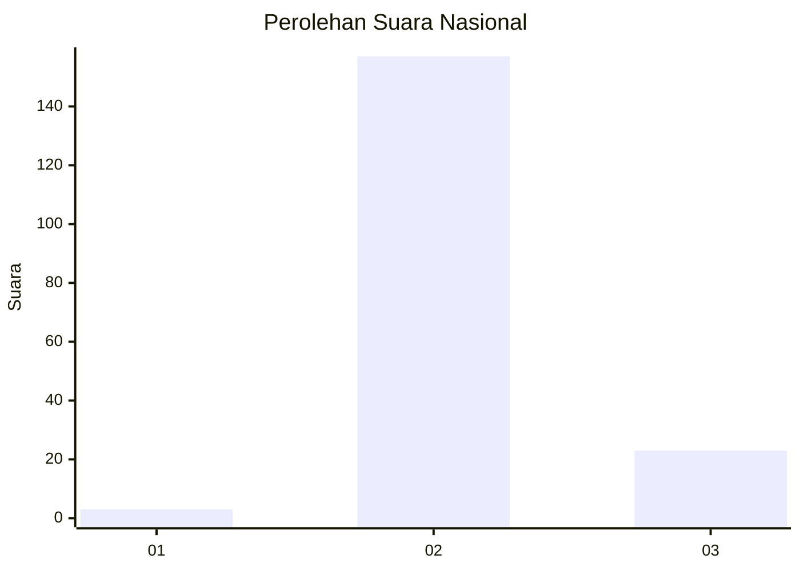
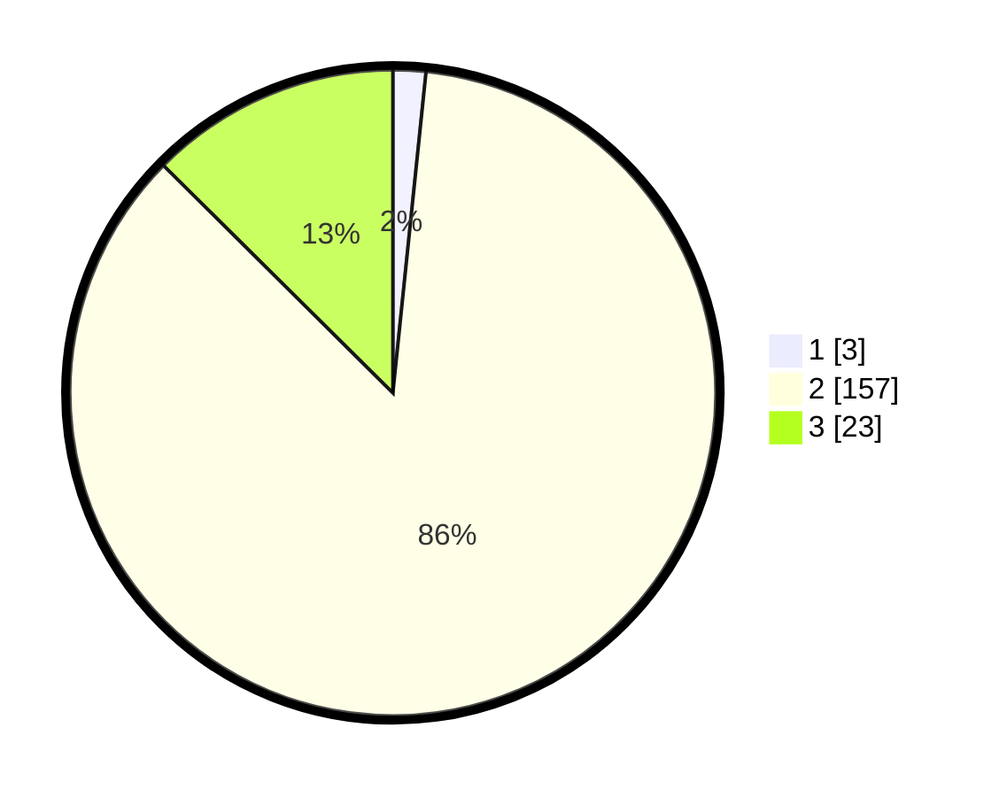

# Hasil

## Grafik

## Tabel

| No. | Nama Paslon    | Suara | Suara (raw) | Persentase |
|:--- |:-------------- | -----:| -----------:| ----------:|
| 1   | ANIES MUHAIMIN | 3     | [3][p-1]    | 1,64       |
| 2   | PRABOWO GIBRAN | 157   | [157][p-2]  | 85,79      |
| 3   | GANJAR MAHFUD  | 23    | [23][p-3]   | 12,57      |

[p-1]: https://github.com/gigit-pemilu/pemilu-2024/blob/main/pilpres/hitung-suara/sub/71-sulawesi-utara/sub/03-kepulauan-sangihe/sub/12-tamako/sub/2002-nagha-ii/sub/001-tps/sub/paslon-1.txt
[p-2]: https://github.com/gigit-pemilu/pemilu-2024/blob/main/pilpres/hitung-suara/sub/71-sulawesi-utara/sub/03-kepulauan-sangihe/sub/12-tamako/sub/2002-nagha-ii/sub/001-tps/sub/paslon-2.txt
[p-3]: https://github.com/gigit-pemilu/pemilu-2024/blob/main/pilpres/hitung-suara/sub/71-sulawesi-utara/sub/03-kepulauan-sangihe/sub/12-tamako/sub/2002-nagha-ii/sub/001-tps/sub/paslon-3.txt

## Foto C Plano

https://sirekap-obj-formc.kpu.go.id/acab/pemilu/ppwp/71/03/12/20/02/7103122002001-20240214-235914--40be6d5e-bb9b-49d1-aec9-68302faa82b1.jpg

https://sirekap-obj-formc.kpu.go.id/acab/pemilu/ppwp/71/03/12/20/02/7103122002001-20240215-000155--37236c7c-68a2-4d4a-a9b6-82f330ec00a3.jpg

https://sirekap-obj-formc.kpu.go.id/acab/pemilu/ppwp/71/03/12/20/02/7103122002001-20240215-000321--00979b82-90f7-4108-9e89-a5da9d4f5c5b.jpg

## Metadata

| Key        | Value               |
| ---------- | ------------------- |
| Time Stamp | 2024-02-15 16:30:25 |

