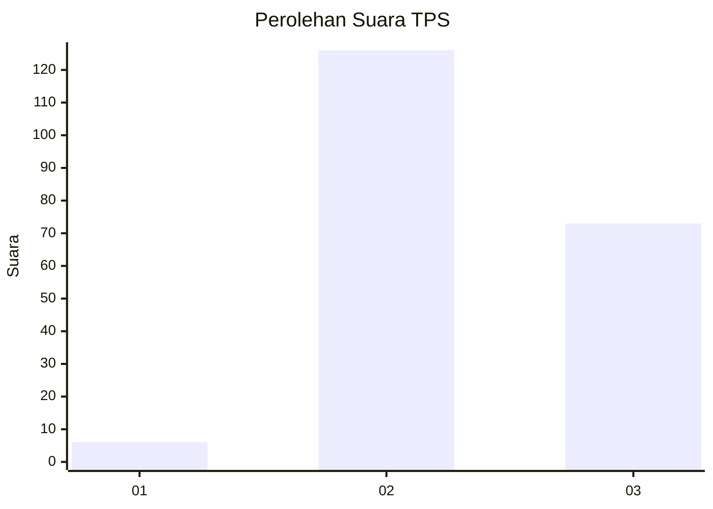
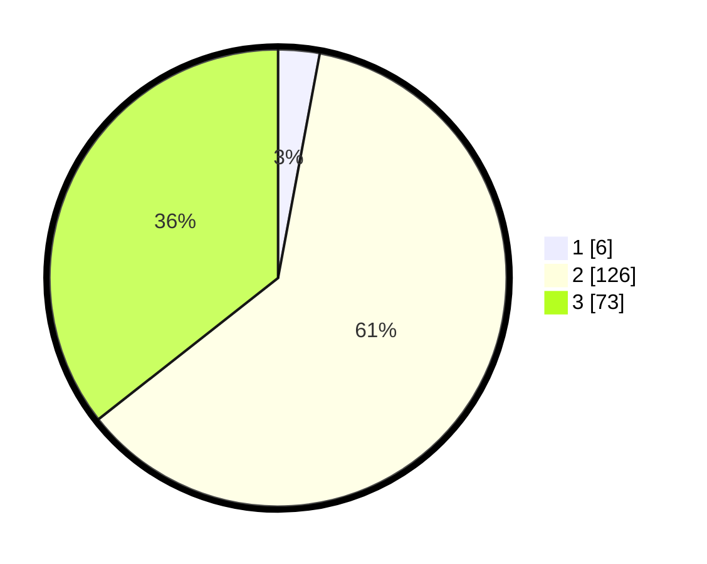

# Hasil

## Grafik

## Tabel

| No. | Nama Paslon    | Suara | Suara (raw) | Persentase |
|:--- |:-------------- | -----:| -----------:| ----------:|
| 1   | ANIES MUHAIMIN | 6     | [6][p-1]    | 2,93       |
| 2   | PRABOWO GIBRAN | 126   | [126][p-2]  | 61,46      |
| 3   | GANJAR MAHFUD  | 73    | [73][p-3]   | 35,61      |

[p-1]: https://github.com/gigit-pemilu/pemilu-2024-71-sulawesi-utara/blob/main/pilpres/hitung-suara/sub/71-sulawesi-utara/sub/03-kepulauan-sangihe/sub/14-tabukan-tengah/sub/2001-bowongkali/sub/002-tps/sub/paslon-1.txt
[p-2]: https://github.com/gigit-pemilu/pemilu-2024-71-sulawesi-utara/blob/main/pilpres/hitung-suara/sub/71-sulawesi-utara/sub/03-kepulauan-sangihe/sub/14-tabukan-tengah/sub/2001-bowongkali/sub/002-tps/sub/paslon-2.txt
[p-3]: https://github.com/gigit-pemilu/pemilu-2024-71-sulawesi-utara/blob/main/pilpres/hitung-suara/sub/71-sulawesi-utara/sub/03-kepulauan-sangihe/sub/14-tabukan-tengah/sub/2001-bowongkali/sub/002-tps/sub/paslon-3.txt

## Foto C Plano

https://sirekap-obj-formc.kpu.go.id/79ae/pemilu/ppwp/71/03/14/20/01/7103142001002-20240216-214518--778ec11d-00ca-433d-867b-794483805063.jpg

https://sirekap-obj-formc.kpu.go.id/79ae/pemilu/ppwp/71/03/14/20/01/7103142001002-20240216-214741--ed65916c-a90b-4317-88ab-31fbb36e7fdb.jpg

https://sirekap-obj-formc.kpu.go.id/79ae/pemilu/ppwp/71/03/14/20/01/7103142001002-20240216-221723--921779d6-84d1-40dc-8ba4-fa4fc0730beb.jpg

## Metadata

| Key        | Value               |
| ---------- | ------------------- |
| Time Stamp | 2024-02-24 22:31:28 |

