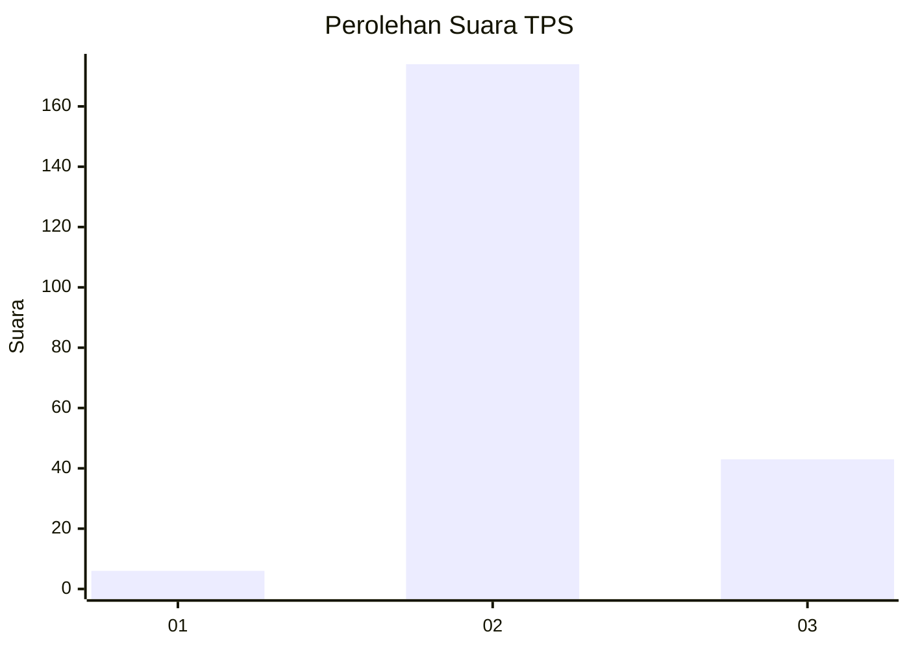
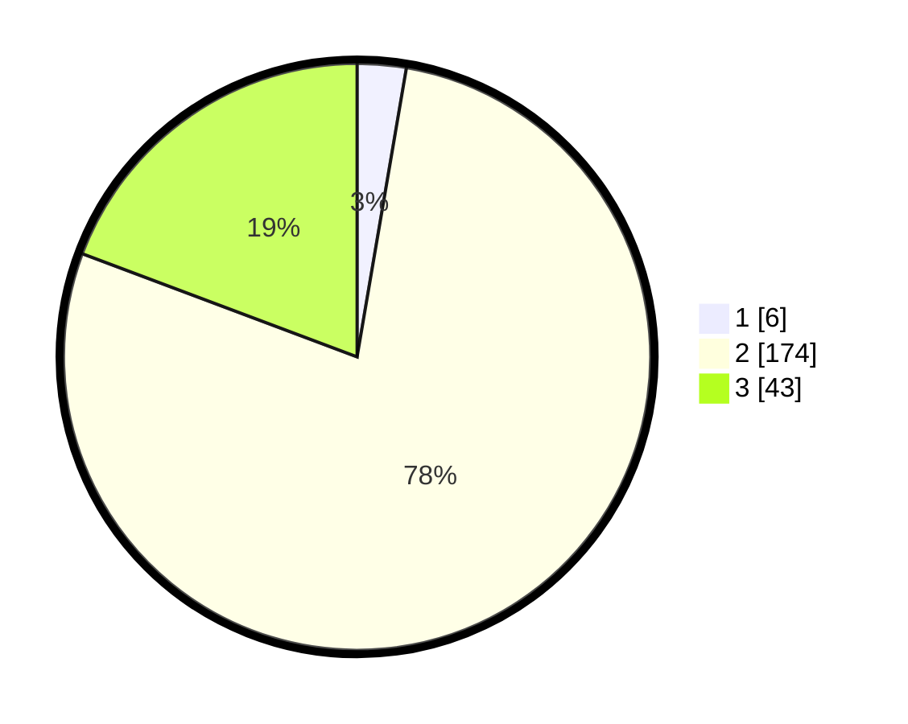

# Hasil

## Grafik

## Tabel

| No. | Nama Paslon    | Suara | Suara (raw) | Persentase |
|:--- |:-------------- | -----:| -----------:| ----------:|
| 1   | ANIES MUHAIMIN | 6     | [6][p-1]    | 2,69       |
| 2   | PRABOWO GIBRAN | 174   | [174][p-2]  | 78,03      |
| 3   | GANJAR MAHFUD  | 43    | [43][p-3]   | 19,28      |

[p-1]: https://github.com/gigit-pemilu/pemilu-2024-71-sulawesi-utara/blob/main/pilpres/hitung-suara/sub/71-sulawesi-utara/sub/03-kepulauan-sangihe/sub/17-tahuna/sub/1006-sawang-bendar/sub/003-tps/sub/paslon-1.txt
[p-2]: https://github.com/gigit-pemilu/pemilu-2024-71-sulawesi-utara/blob/main/pilpres/hitung-suara/sub/71-sulawesi-utara/sub/03-kepulauan-sangihe/sub/17-tahuna/sub/1006-sawang-bendar/sub/003-tps/sub/paslon-2.txt
[p-3]: https://github.com/gigit-pemilu/pemilu-2024-71-sulawesi-utara/blob/main/pilpres/hitung-suara/sub/71-sulawesi-utara/sub/03-kepulauan-sangihe/sub/17-tahuna/sub/1006-sawang-bendar/sub/003-tps/sub/paslon-3.txt

## Foto C Plano

https://sirekap-obj-formc.kpu.go.id/6990/pemilu/ppwp/71/03/17/10/06/7103171006003-20240214-233239--4fd19c6d-4acd-4c9e-bc7c-00d35a3757a7.jpg

https://sirekap-obj-formc.kpu.go.id/6990/pemilu/ppwp/71/03/17/10/06/7103171006003-20240214-233505--df4b940d-de2b-4faf-af7c-e58e5f93d794.jpg

https://sirekap-obj-formc.kpu.go.id/6990/pemilu/ppwp/71/03/17/10/06/7103171006003-20240214-233906--be0cc0fa-1801-45be-a011-6038252e3edf.jpg

## Metadata

| Key        | Value               |
| ---------- | ------------------- |
| Time Stamp | 2024-02-15 12:00:28 |

