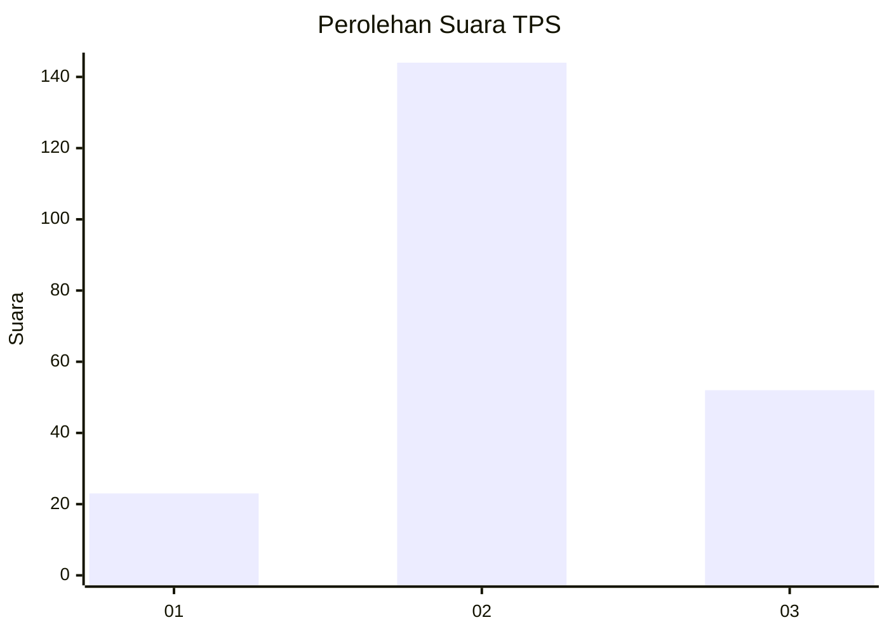
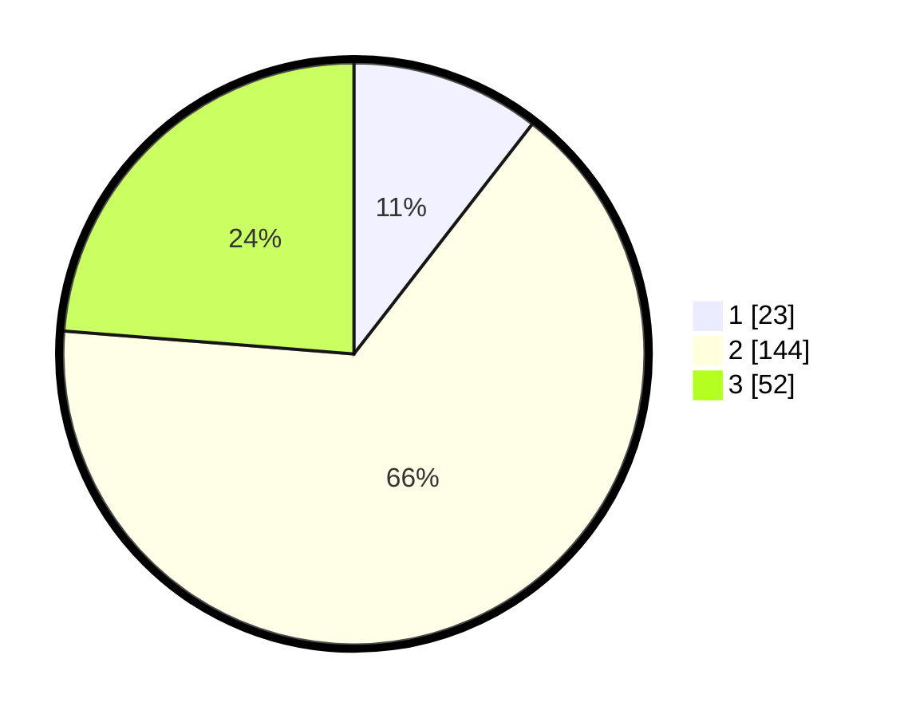

# Hasil

## Grafik

## Tabel

| No. | Nama Paslon    | Suara | Suara (raw) | Persentase |
|:--- |:-------------- | -----:| -----------:| ----------:|
| 1   | ANIES MUHAIMIN | 23    | [23][p-1]   | 10,50      |
| 2   | PRABOWO GIBRAN | 144   | [144][p-2]  | 65,75      |
| 3   | GANJAR MAHFUD  | 52    | [52][p-3]   | 23,74      |

[p-1]: https://github.com/gigit-pemilu/pemilu-2024-71-sulawesi-utara/blob/main/pilpres/hitung-suara/sub/71-sulawesi-utara/sub/03-kepulauan-sangihe/sub/17-tahuna/sub/1006-sawang-bendar/sub/005-tps/sub/paslon-1.txt
[p-2]: https://github.com/gigit-pemilu/pemilu-2024-71-sulawesi-utara/blob/main/pilpres/hitung-suara/sub/71-sulawesi-utara/sub/03-kepulauan-sangihe/sub/17-tahuna/sub/1006-sawang-bendar/sub/005-tps/sub/paslon-2.txt
[p-3]: https://github.com/gigit-pemilu/pemilu-2024-71-sulawesi-utara/blob/main/pilpres/hitung-suara/sub/71-sulawesi-utara/sub/03-kepulauan-sangihe/sub/17-tahuna/sub/1006-sawang-bendar/sub/005-tps/sub/paslon-3.txt

## Foto C Plano

https://sirekap-obj-formc.kpu.go.id/9115/pemilu/ppwp/71/03/17/10/06/7103171006005-20240215-015649--d0f5fd5b-f4cf-40b6-8fec-2d66810114dc.jpg

https://sirekap-obj-formc.kpu.go.id/9115/pemilu/ppwp/71/03/17/10/06/7103171006005-20240215-020806--8d7f4c79-b8be-4f3c-b3b8-5f33f5968542.jpg

https://sirekap-obj-formc.kpu.go.id/9115/pemilu/ppwp/71/03/17/10/06/7103171006005-20240215-015937--c2e40848-5512-453c-a4ca-18f591405eb3.jpg

## Metadata

| Key        | Value               |
| ---------- | ------------------- |
| Time Stamp | 2024-02-15 20:00:44 |

