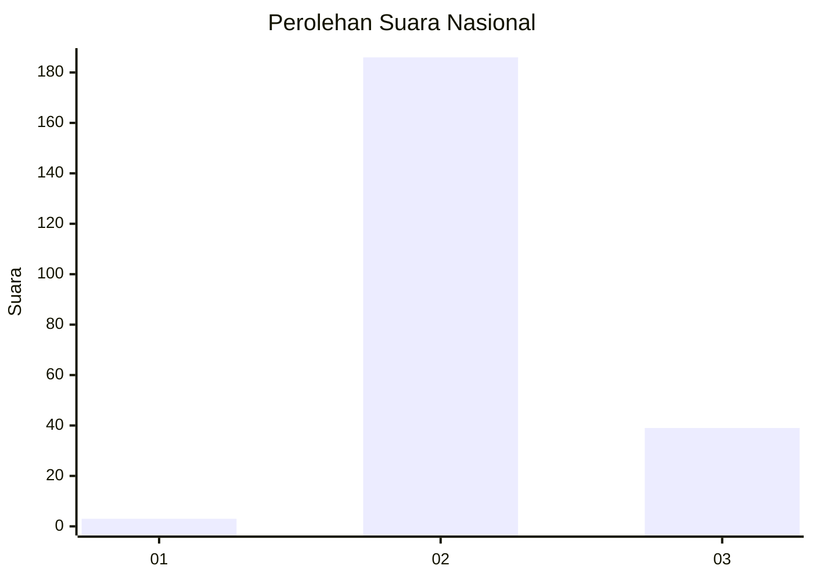
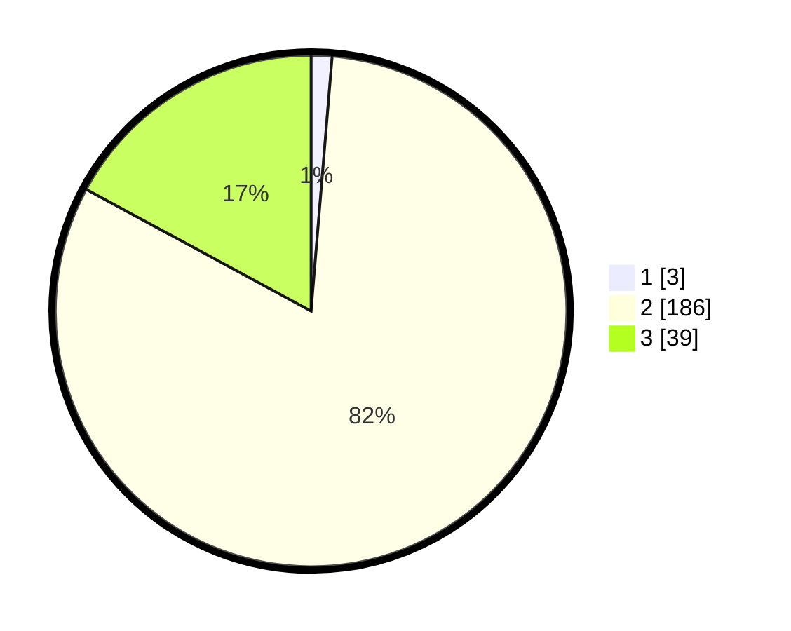

# Hasil

## Grafik

## Tabel

| No. | Nama Paslon    | Suara | Suara (raw) | Persentase |
|:--- |:-------------- | -----:| -----------:| ----------:|
| 1   | ANIES MUHAIMIN | 3     | [3][p-1]    | 1,32       |
| 2   | PRABOWO GIBRAN | 186   | [186][p-2]  | 81,58      |
| 3   | GANJAR MAHFUD  | 39    | [39][p-3]   | 17,11      |

[p-1]: https://github.com/gigit-pemilu/pemilu-2024/blob/main/pilpres/hitung-suara/sub/71-sulawesi-utara/sub/03-kepulauan-sangihe/sub/24-tahuna-timur/sub/1002-enengpahembang/sub/001-tps/sub/paslon-1.txt
[p-2]: https://github.com/gigit-pemilu/pemilu-2024/blob/main/pilpres/hitung-suara/sub/71-sulawesi-utara/sub/03-kepulauan-sangihe/sub/24-tahuna-timur/sub/1002-enengpahembang/sub/001-tps/sub/paslon-2.txt
[p-3]: https://github.com/gigit-pemilu/pemilu-2024/blob/main/pilpres/hitung-suara/sub/71-sulawesi-utara/sub/03-kepulauan-sangihe/sub/24-tahuna-timur/sub/1002-enengpahembang/sub/001-tps/sub/paslon-3.txt

## Foto C Plano

https://sirekap-obj-formc.kpu.go.id/c67e/pemilu/ppwp/71/03/24/10/02/7103241002001-20240215-021201--e4e86848-09be-4b24-9b77-a2ef0af0a3bb.jpg

https://sirekap-obj-formc.kpu.go.id/c67e/pemilu/ppwp/71/03/24/10/02/7103241002001-20240215-043441--b0723b10-e48a-4a79-8d77-6b26e7b75180.jpg

https://sirekap-obj-formc.kpu.go.id/c67e/pemilu/ppwp/71/03/24/10/02/7103241002001-20240215-043508--5520b383-8a00-4586-83f0-488b6124f026.jpg

## Metadata

| Key        | Value               |
| ---------- | ------------------- |
| Time Stamp | 2024-02-15 20:30:46 |

