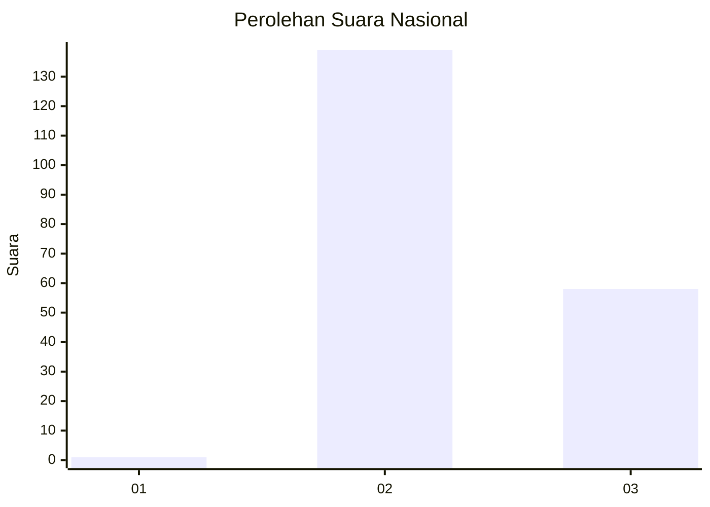
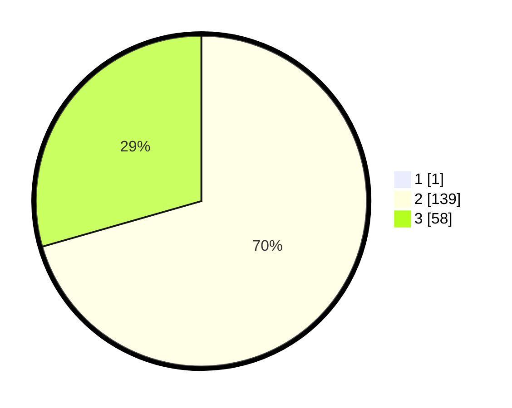

# Hasil

## Grafik

## Tabel

| No. | Nama Paslon    | Suara | Suara (raw) | Persentase |
|:--- |:-------------- | -----:| -----------:| ----------:|
| 1   | ANIES MUHAIMIN | 1     | [1][p-1]    | 0,51       |
| 2   | PRABOWO GIBRAN | 139   | [139][p-2]  | 70,20      |
| 3   | GANJAR MAHFUD  | 58    | [58][p-3]   | 29,29      |

[p-1]: https://github.com/gigit-pemilu/pemilu-2024/blob/main/pilpres/hitung-suara/sub/71-sulawesi-utara/sub/05-minahasa-selatan/sub/02-tompaso-baru/sub/2010-sion/sub/002-tps/sub/paslon-1.txt
[p-2]: https://github.com/gigit-pemilu/pemilu-2024/blob/main/pilpres/hitung-suara/sub/71-sulawesi-utara/sub/05-minahasa-selatan/sub/02-tompaso-baru/sub/2010-sion/sub/002-tps/sub/paslon-2.txt
[p-3]: https://github.com/gigit-pemilu/pemilu-2024/blob/main/pilpres/hitung-suara/sub/71-sulawesi-utara/sub/05-minahasa-selatan/sub/02-tompaso-baru/sub/2010-sion/sub/002-tps/sub/paslon-3.txt

## Foto C Plano

https://sirekap-obj-formc.kpu.go.id/99eb/pemilu/ppwp/71/05/02/20/10/7105022010002-20240217-201124--0edd85b0-4d69-41c3-8479-602053685aea.jpg

https://sirekap-obj-formc.kpu.go.id/99eb/pemilu/ppwp/71/05/02/20/10/7105022010002-20240217-201208--ebef14f5-83fa-496d-a399-111bd7ef8a6f.jpg

https://sirekap-obj-formc.kpu.go.id/99eb/pemilu/ppwp/71/05/02/20/10/7105022010002-20240217-201242--9948558e-167b-47a8-b9a1-c884d6d01afa.jpg

## Metadata

| Key        | Value               |
| ---------- | ------------------- |
| Time Stamp | 2024-02-19 06:16:00 |

