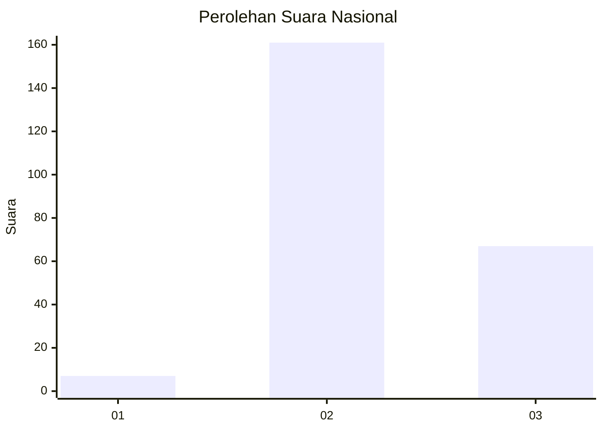
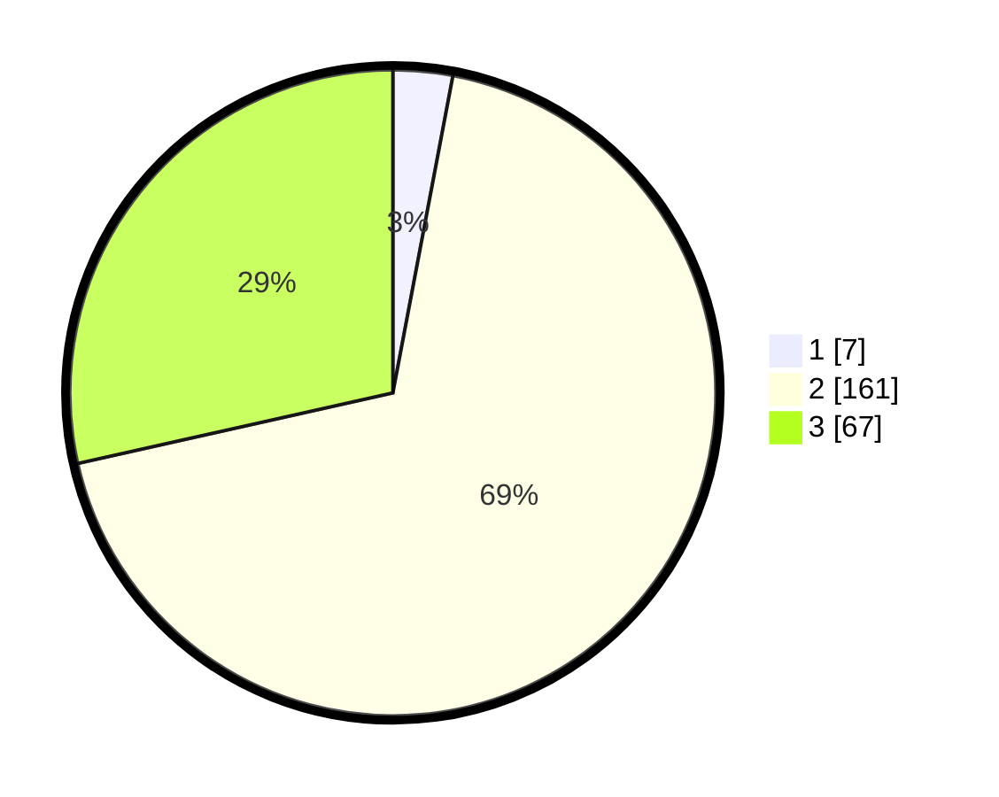

# Hasil

## Grafik

## Tabel

| No. | Nama Paslon    | Suara | Suara (raw) | Persentase |
|:--- |:-------------- | -----:| -----------:| ----------:|
| 1   | ANIES MUHAIMIN | 7     | [7][p-1]    | 2,98       |
| 2   | PRABOWO GIBRAN | 161   | [161][p-2]  | 68,51      |
| 3   | GANJAR MAHFUD  | 67    | [67][p-3]   | 28,51      |

[p-1]: https://github.com/gigit-pemilu/pemilu-2024/blob/main/pilpres/hitung-suara/sub/71-sulawesi-utara/sub/05-minahasa-selatan/sub/08-sinonsayang/sub/2001-blongko/sub/001-tps/sub/paslon-1.txt
[p-2]: https://github.com/gigit-pemilu/pemilu-2024/blob/main/pilpres/hitung-suara/sub/71-sulawesi-utara/sub/05-minahasa-selatan/sub/08-sinonsayang/sub/2001-blongko/sub/001-tps/sub/paslon-2.txt
[p-3]: https://github.com/gigit-pemilu/pemilu-2024/blob/main/pilpres/hitung-suara/sub/71-sulawesi-utara/sub/05-minahasa-selatan/sub/08-sinonsayang/sub/2001-blongko/sub/001-tps/sub/paslon-3.txt

## Foto C Plano

https://sirekap-obj-formc.kpu.go.id/3d9d/pemilu/ppwp/71/05/08/20/01/7105082001001-20240225-192658--12eb894c-fc7a-45ed-a0e1-c8ff061ca332.jpg

https://sirekap-obj-formc.kpu.go.id/3d9d/pemilu/ppwp/71/05/08/20/01/7105082001001-20240225-192851--7bd75ff3-1511-4477-9f73-651821b6d80a.jpg

https://sirekap-obj-formc.kpu.go.id/3d9d/pemilu/ppwp/71/05/08/20/01/7105082001001-20240225-192951--602f15f5-b12a-4966-87ec-fc70361c3270.jpg

## Metadata

| Key        | Value               |
| ---------- | ------------------- |
| Time Stamp | 2024-02-28 21:00:00 |

