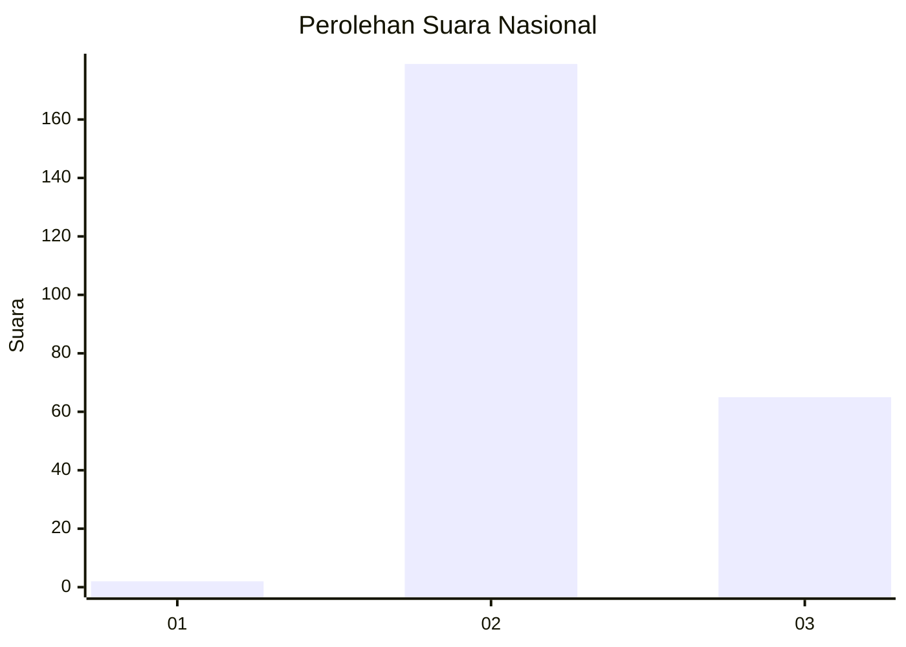
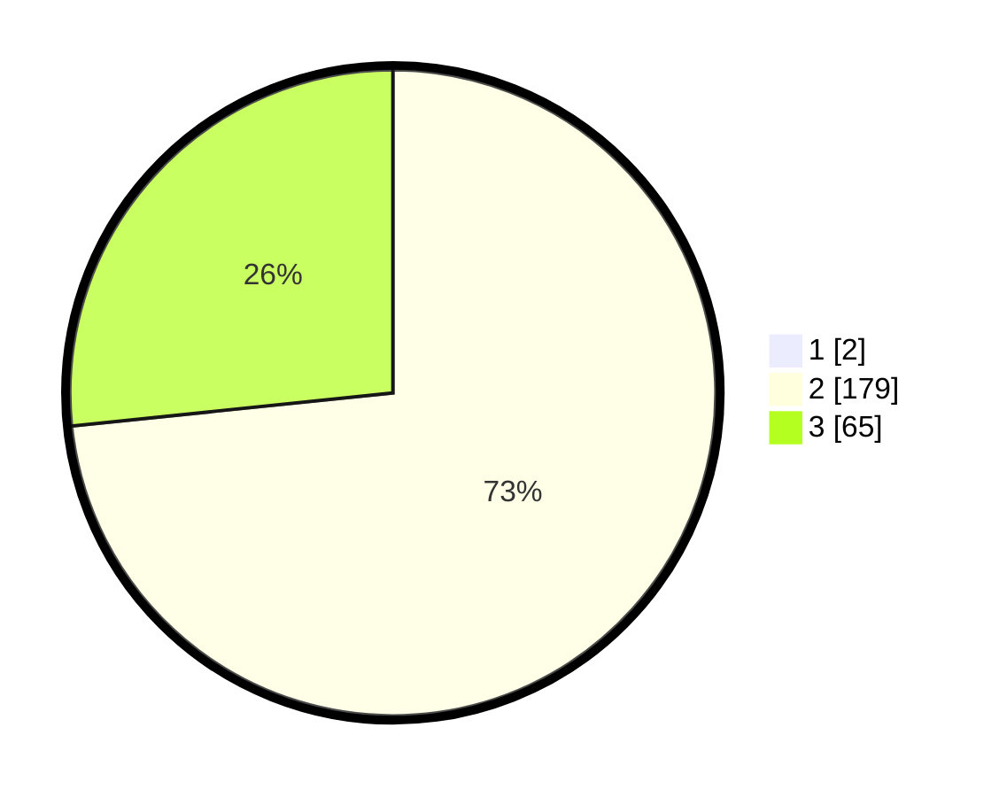

# Hasil

## Grafik

## Tabel

| No. | Nama Paslon    | Suara | Suara (raw) | Persentase |
|:--- |:-------------- | -----:| -----------:| ----------:|
| 1   | ANIES MUHAIMIN | 2     | [2][p-1]    | 0,81       |
| 2   | PRABOWO GIBRAN | 179   | [179][p-2]  | 72,76      |
| 3   | GANJAR MAHFUD  | 65    | [65][p-3]   | 26,42      |

[p-1]: https://github.com/gigit-pemilu/pemilu-2024/blob/main/pilpres/hitung-suara/sub/71-sulawesi-utara/sub/05-minahasa-selatan/sub/08-sinonsayang/sub/2001-blongko/sub/002-tps/sub/paslon-1.txt
[p-2]: https://github.com/gigit-pemilu/pemilu-2024/blob/main/pilpres/hitung-suara/sub/71-sulawesi-utara/sub/05-minahasa-selatan/sub/08-sinonsayang/sub/2001-blongko/sub/002-tps/sub/paslon-2.txt
[p-3]: https://github.com/gigit-pemilu/pemilu-2024/blob/main/pilpres/hitung-suara/sub/71-sulawesi-utara/sub/05-minahasa-selatan/sub/08-sinonsayang/sub/2001-blongko/sub/002-tps/sub/paslon-3.txt

## Foto C Plano

https://sirekap-obj-formc.kpu.go.id/aa33/pemilu/ppwp/71/05/08/20/01/7105082001002-20240225-193140--75a42ec1-49d6-4350-9c05-adf30edc2dda.jpg

https://sirekap-obj-formc.kpu.go.id/aa33/pemilu/ppwp/71/05/08/20/01/7105082001002-20240225-193418--00f8d801-88e7-4ecf-96e4-909f4f9d3066.jpg

https://sirekap-obj-formc.kpu.go.id/aa33/pemilu/ppwp/71/05/08/20/01/7105082001002-20240225-193639--454950c1-d408-4d00-85e0-9574c1df6c49.jpg

## Metadata

| Key        | Value               |
| ---------- | ------------------- |
| Time Stamp | 2024-02-28 19:00:00 |

