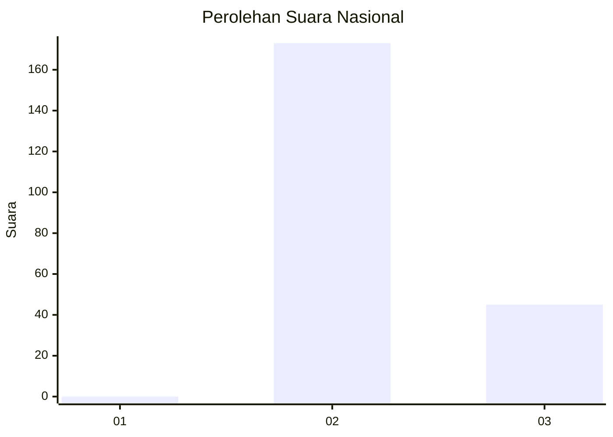
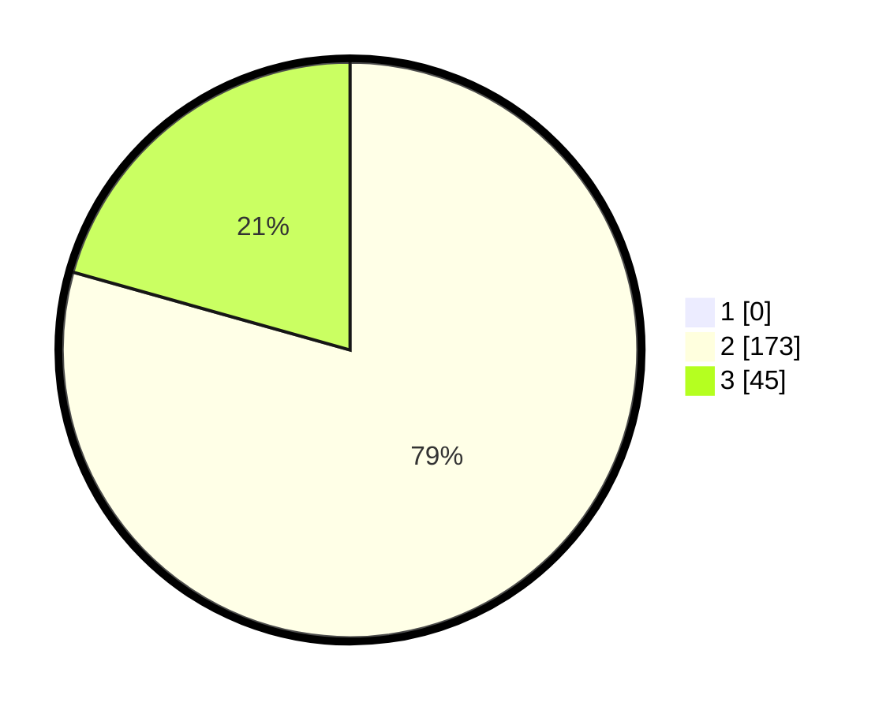

# Hasil

## Grafik

## Tabel

| No. | Nama Paslon    | Suara | Suara (raw) | Persentase |
|:--- |:-------------- | -----:| -----------:| ----------:|
| 1   | ANIES MUHAIMIN | 0     | [0][p-1]    | 0,00       |
| 2   | PRABOWO GIBRAN | 173   | [173][p-2]  | 79,36      |
| 3   | GANJAR MAHFUD  | 45    | [45][p-3]   | 20,64      |

[p-1]: https://github.com/gigit-pemilu/pemilu-2024/blob/main/pilpres/hitung-suara/sub/71-sulawesi-utara/sub/05-minahasa-selatan/sub/08-sinonsayang/sub/2001-blongko/sub/003-tps/sub/paslon-1.txt
[p-2]: https://github.com/gigit-pemilu/pemilu-2024/blob/main/pilpres/hitung-suara/sub/71-sulawesi-utara/sub/05-minahasa-selatan/sub/08-sinonsayang/sub/2001-blongko/sub/003-tps/sub/paslon-2.txt
[p-3]: https://github.com/gigit-pemilu/pemilu-2024/blob/main/pilpres/hitung-suara/sub/71-sulawesi-utara/sub/05-minahasa-selatan/sub/08-sinonsayang/sub/2001-blongko/sub/003-tps/sub/paslon-3.txt

## Foto C Plano

https://sirekap-obj-formc.kpu.go.id/7590/pemilu/ppwp/71/05/08/20/01/7105082001003-20240225-193724--0ee4c2a2-3cd0-4ff8-a910-8f9fe29f6da9.jpg

https://sirekap-obj-formc.kpu.go.id/7590/pemilu/ppwp/71/05/08/20/01/7105082001003-20240225-193852--40f7cad0-d0a4-43be-be34-58f725cda48a.jpg

https://sirekap-obj-formc.kpu.go.id/7590/pemilu/ppwp/71/05/08/20/01/7105082001003-20240225-193951--727cb79b-6502-4acd-ae02-54f95aae1209.jpg

## Metadata

| Key        | Value               |
| ---------- | ------------------- |
| Time Stamp | 2024-02-29 10:00:00 |

