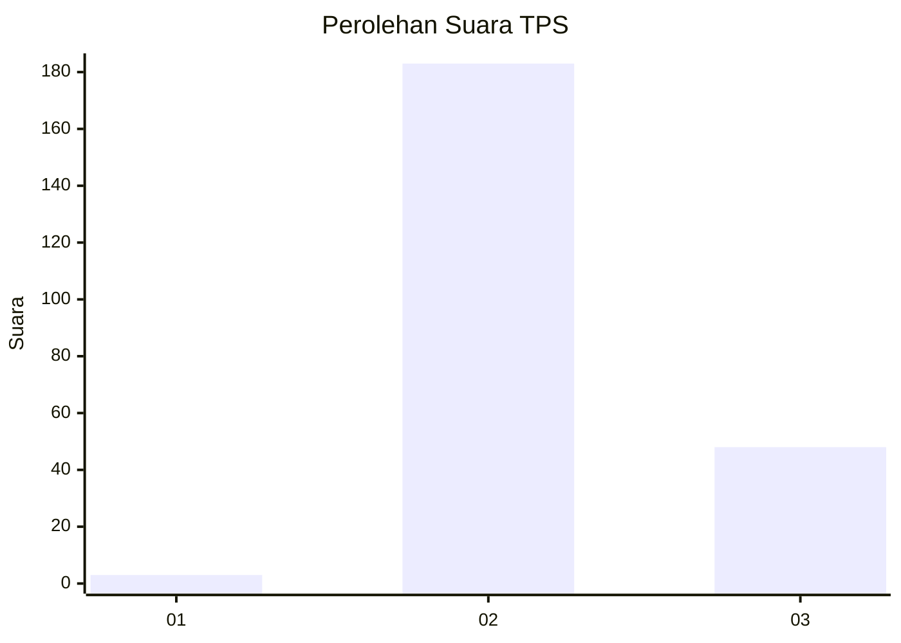

# Hasil

## Grafik

## Tabel

| No. | Nama Paslon    | Suara | Suara (raw) | Persentase |
|:--- |:-------------- | -----:| -----------:| ----------:|
| 1   | ANIES MUHAIMIN | 3     | [3][p-1]    | 1,28       |
| 2   | PRABOWO GIBRAN | 183   | [183][p-2]  | 78,21      |
| 3   | GANJAR MAHFUD  | 48    | [48][p-3]   | 20,51      |

[p-1]: https://github.com/gigit-pemilu/pemilu-2024-71-sulawesi-utara/blob/main/pilpres/hitung-suara/sub/71-sulawesi-utara/sub/05-minahasa-selatan/sub/08-sinonsayang/sub/2001-blongko/sub/004-tps/sub/paslon-1.txt
[p-2]: https://github.com/gigit-pemilu/pemilu-2024-71-sulawesi-utara/blob/main/pilpres/hitung-suara/sub/71-sulawesi-utara/sub/05-minahasa-selatan/sub/08-sinonsayang/sub/2001-blongko/sub/004-tps/sub/paslon-2.txt
[p-3]: https://github.com/gigit-pemilu/pemilu-2024-71-sulawesi-utara/blob/main/pilpres/hitung-suara/sub/71-sulawesi-utara/sub/05-minahasa-selatan/sub/08-sinonsayang/sub/2001-blongko/sub/004-tps/sub/paslon-3.txt

## Foto C Plano

https://sirekap-obj-formc.kpu.go.id/84c5/pemilu/ppwp/71/05/08/20/01/7105082001004-20240225-194228--a293c62b-e01f-4b1d-8ddc-70c9941adfa3.jpg

https://sirekap-obj-formc.kpu.go.id/84c5/pemilu/ppwp/71/05/08/20/01/7105082001004-20240225-194302--2fc9f622-7c36-4d70-b1ac-5c604e398e26.jpg

https://sirekap-obj-formc.kpu.go.id/84c5/pemilu/ppwp/71/05/08/20/01/7105082001004-20240225-194346--f97f13e9-2f8b-45f8-a624-85c163941348.jpg

## Metadata

| Key        | Value               |
| ---------- | ------------------- |
| Time Stamp | 2024-02-28 20:00:00 |

