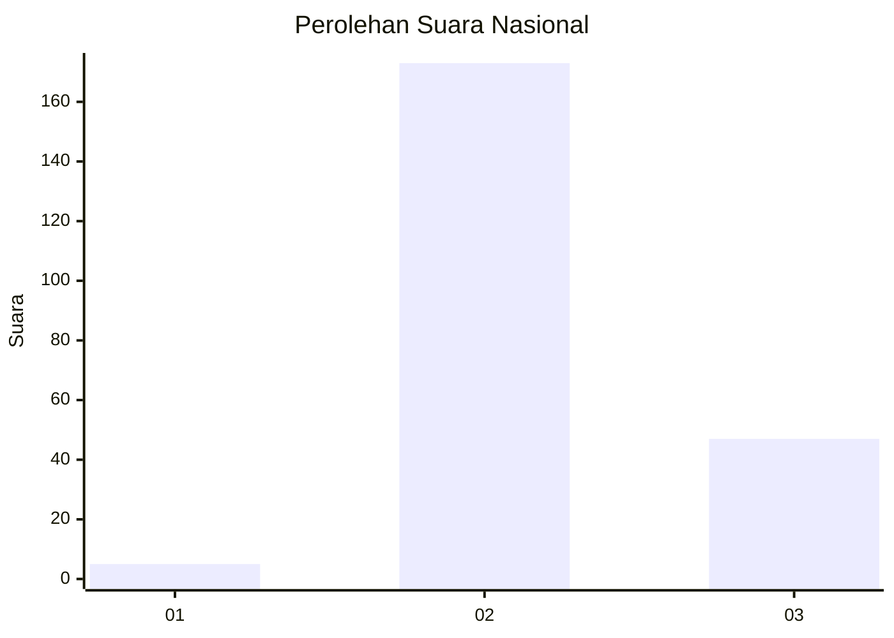

# Hasil

## Grafik

## Tabel

| No. | Nama Paslon    | Suara | Suara (raw) | Persentase |
|:--- |:-------------- | -----:| -----------:| ----------:|
| 1   | ANIES MUHAIMIN | 5     | [5][p-1]    | 2,22       |
| 2   | PRABOWO GIBRAN | 173   | [173][p-2]  | 76,89      |
| 3   | GANJAR MAHFUD  | 47    | [47][p-3]   | 20,89      |

[p-1]: https://github.com/gigit-pemilu/pemilu-2024/blob/main/pilpres/hitung-suara/sub/71-sulawesi-utara/sub/05-minahasa-selatan/sub/08-sinonsayang/sub/2001-blongko/sub/005-tps/sub/paslon-1.txt
[p-2]: https://github.com/gigit-pemilu/pemilu-2024/blob/main/pilpres/hitung-suara/sub/71-sulawesi-utara/sub/05-minahasa-selatan/sub/08-sinonsayang/sub/2001-blongko/sub/005-tps/sub/paslon-2.txt
[p-3]: https://github.com/gigit-pemilu/pemilu-2024/blob/main/pilpres/hitung-suara/sub/71-sulawesi-utara/sub/05-minahasa-selatan/sub/08-sinonsayang/sub/2001-blongko/sub/005-tps/sub/paslon-3.txt

## Foto C Plano

https://sirekap-obj-formc.kpu.go.id/f214/pemilu/ppwp/71/05/08/20/01/7105082001005-20240225-194541--2cbe9918-5632-4b13-a101-3940663b5b02.jpg

https://sirekap-obj-formc.kpu.go.id/f214/pemilu/ppwp/71/05/08/20/01/7105082001005-20240225-194630--a0c18374-70df-4265-942d-7fd27382b5ec.jpg

https://sirekap-obj-formc.kpu.go.id/f214/pemilu/ppwp/71/05/08/20/01/7105082001005-20240225-194714--4c9ce323-86a8-4af0-babd-582c50b1af11.jpg

## Metadata

| Key        | Value               |
| ---------- | ------------------- |
| Time Stamp | 2024-03-02 20:00:00 |

