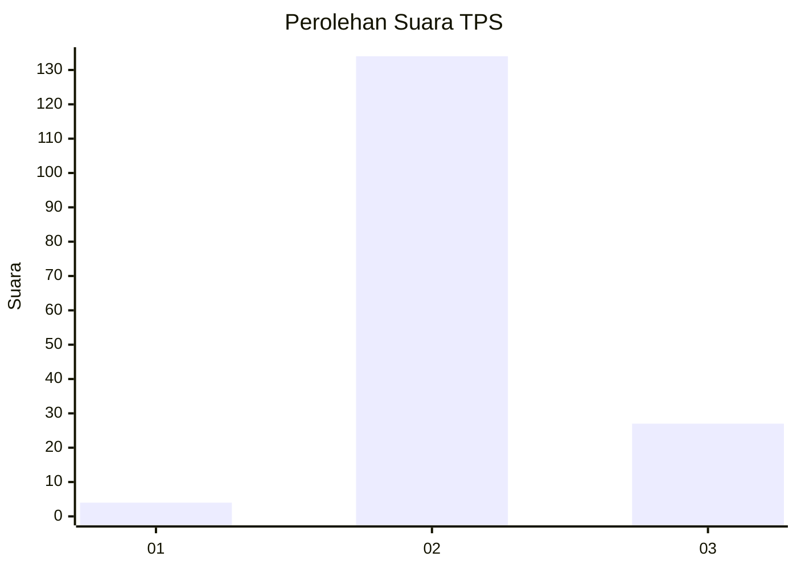
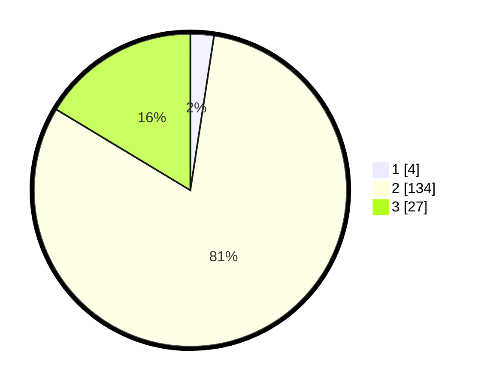

# Hasil

## Grafik

## Tabel

| No. | Nama Paslon    | Suara | Suara (raw) | Persentase |
|:--- |:-------------- | -----:| -----------:| ----------:|
| 1   | ANIES MUHAIMIN | 4     | [4][p-1]    | 2,42       |
| 2   | PRABOWO GIBRAN | 134   | [134][p-2]  | 81,21      |
| 3   | GANJAR MAHFUD  | 27    | [27][p-3]   | 16,36      |

[p-1]: https://github.com/gigit-pemilu/pemilu-2024-71-sulawesi-utara/blob/main/pilpres/hitung-suara/sub/71-sulawesi-utara/sub/05-minahasa-selatan/sub/10-amurang/sub/1004-buyungon/sub/002-tps/sub/paslon-1.txt
[p-2]: https://github.com/gigit-pemilu/pemilu-2024-71-sulawesi-utara/blob/main/pilpres/hitung-suara/sub/71-sulawesi-utara/sub/05-minahasa-selatan/sub/10-amurang/sub/1004-buyungon/sub/002-tps/sub/paslon-2.txt
[p-3]: https://github.com/gigit-pemilu/pemilu-2024-71-sulawesi-utara/blob/main/pilpres/hitung-suara/sub/71-sulawesi-utara/sub/05-minahasa-selatan/sub/10-amurang/sub/1004-buyungon/sub/002-tps/sub/paslon-3.txt

## Foto C Plano

https://sirekap-obj-formc.kpu.go.id/2c3c/pemilu/ppwp/71/05/10/10/04/7105101004002-20240226-104137--9f1c9b25-db77-4598-81f9-da7bc6ef052a.jpg

https://sirekap-obj-formc.kpu.go.id/2c3c/pemilu/ppwp/71/05/10/10/04/7105101004002-20240226-104240--b763129f-3037-4a1b-aadc-a3188982d0fe.jpg

https://sirekap-obj-formc.kpu.go.id/2c3c/pemilu/ppwp/71/05/10/10/04/7105101004002-20240226-104340--1a0d76e6-cffd-4e33-a32f-8a00e6686741.jpg

## Metadata

| Key        | Value               |
| ---------- | ------------------- |
| Time Stamp | 2024-03-02 17:00:00 |

## DATA PEMILIH TETAP

Jumlah pemilih dalam DPT: **230**.
 * L: **114**.
 * P: **116**.

## DATA PENGGUNA HAK PILIH

Jumlah pengguna hak pilih dalam DPT: **167**.
 * L: **882**.
 * P: **887**.

Jumlah pengguna hak pilih dalam DPTb: **808**.
 * L: **880**.
 * P: **8**.

Jumlah pengguna hak pilih dalam DPK: **86**.
 * L: **888**.
 * P: **0**.

Jumlah pengguna hak pilih: **167**.
 * L: **2**.
 * P: **805**.

## JUMLAH SUARA SAH DAN TIDAK SAH

JUMLAH SELURUH SUARA SAH: **165**.

JUMLAH SUARA TIDAK SAH: **2**.

JUMLAH SELURUH SUARA SAH DAN SUARA TIDAK SAH: **167**.

