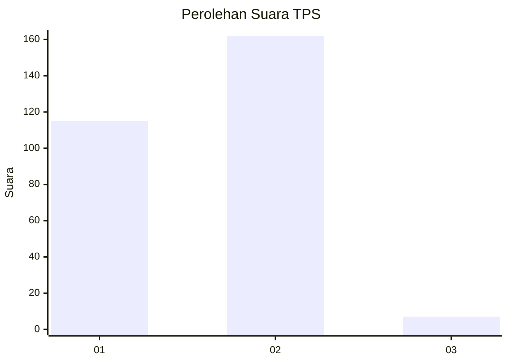
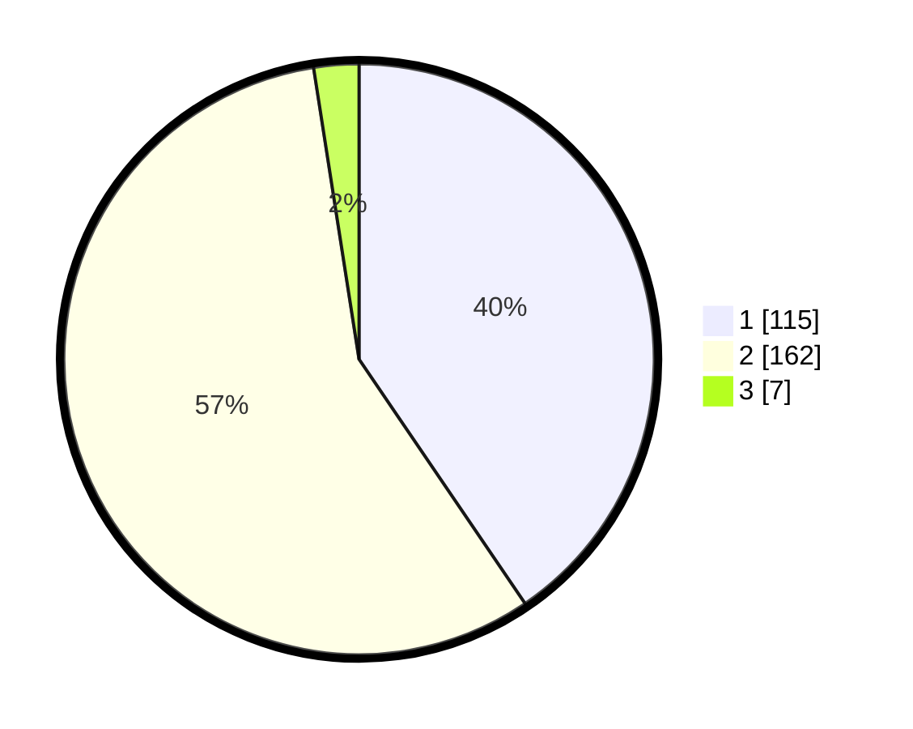

# Hasil

## Grafik

## Tabel

| No. | Nama Paslon    | Suara | Suara (raw) | Persentase |
|:--- |:-------------- | -----:| -----------:| ----------:|
| 1   | ANIES MUHAIMIN | 115   | [115][p-1]  | 40,49      |
| 2   | PRABOWO GIBRAN | 162   | [162][p-2]  | 57,04      |
| 3   | GANJAR MAHFUD  | 7     | [7][p-3]    | 2,46       |

[p-1]: https://github.com/gigit-pemilu/pemilu-2024-71-sulawesi-utara/blob/main/pilpres/hitung-suara/sub/71-sulawesi-utara/sub/05-minahasa-selatan/sub/12-tumpaan/sub/2017-matani-satu/sub/002-tps/sub/paslon-1.txt
[p-2]: https://github.com/gigit-pemilu/pemilu-2024-71-sulawesi-utara/blob/main/pilpres/hitung-suara/sub/71-sulawesi-utara/sub/05-minahasa-selatan/sub/12-tumpaan/sub/2017-matani-satu/sub/002-tps/sub/paslon-2.txt
[p-3]: https://github.com/gigit-pemilu/pemilu-2024-71-sulawesi-utara/blob/main/pilpres/hitung-suara/sub/71-sulawesi-utara/sub/05-minahasa-selatan/sub/12-tumpaan/sub/2017-matani-satu/sub/002-tps/sub/paslon-3.txt

## Foto C Plano

https://sirekap-obj-formc.kpu.go.id/a614/pemilu/ppwp/71/05/12/20/17/7105122017002-20240218-210752--c843d4c7-fc52-4b7b-9cc3-5192457fd03b.jpg

https://sirekap-obj-formc.kpu.go.id/a614/pemilu/ppwp/71/05/12/20/17/7105122017002-20240218-210825--4c7796c9-0da3-4c1c-bc87-753ee1f5cadd.jpg

https://sirekap-obj-formc.kpu.go.id/a614/pemilu/ppwp/71/05/12/20/17/7105122017002-20240218-210857--f26ea6a7-3763-434f-8e9d-918d7923ace5.jpg

## Metadata

| Key        | Value               |
| ---------- | ------------------- |
| Time Stamp | 2024-02-19 06:16:00 |

