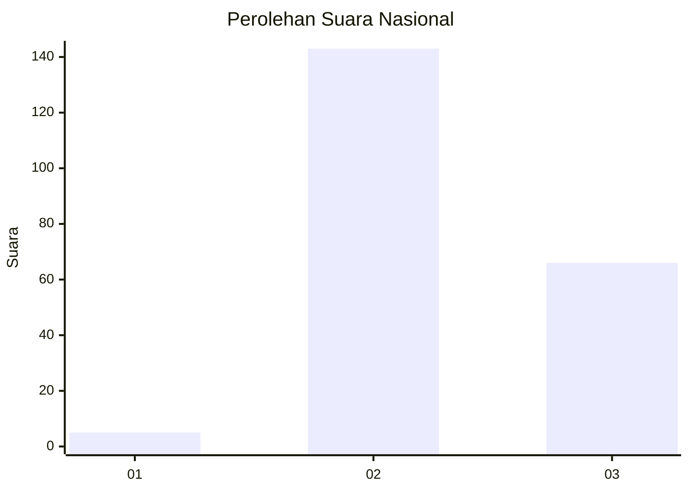
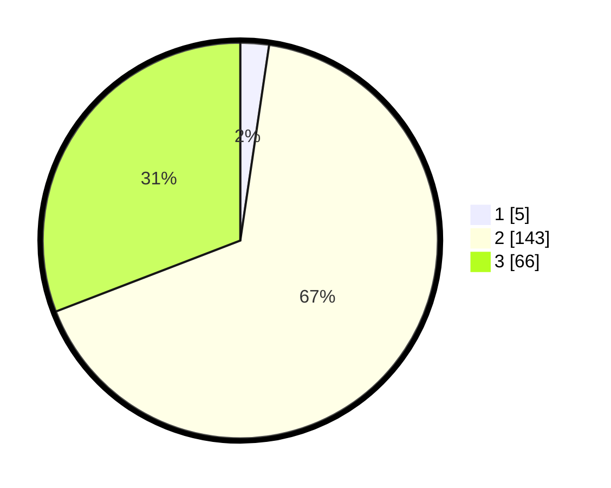

# Hasil

## Grafik

## Tabel

| No. | Nama Paslon    | Suara | Suara (raw) | Persentase |
|:--- |:-------------- | -----:| -----------:| ----------:|
| 1   | ANIES MUHAIMIN | 5     | [5][p-1]    | 2,34       |
| 2   | PRABOWO GIBRAN | 143   | [143][p-2]  | 66,82      |
| 3   | GANJAR MAHFUD  | 66    | [66][p-3]   | 30,84      |

[p-1]: https://github.com/gigit-pemilu/pemilu-2024/blob/main/pilpres/hitung-suara/sub/71-sulawesi-utara/sub/05-minahasa-selatan/sub/15-kumelembuai/sub/2002-kumelembuai/sub/001-tps/sub/paslon-1.txt
[p-2]: https://github.com/gigit-pemilu/pemilu-2024/blob/main/pilpres/hitung-suara/sub/71-sulawesi-utara/sub/05-minahasa-selatan/sub/15-kumelembuai/sub/2002-kumelembuai/sub/001-tps/sub/paslon-2.txt
[p-3]: https://github.com/gigit-pemilu/pemilu-2024/blob/main/pilpres/hitung-suara/sub/71-sulawesi-utara/sub/05-minahasa-selatan/sub/15-kumelembuai/sub/2002-kumelembuai/sub/001-tps/sub/paslon-3.txt

## Foto C Plano

https://sirekap-obj-formc.kpu.go.id/803c/pemilu/ppwp/71/05/15/20/02/7105152002001-20240225-195316--068b2372-38d1-41ad-b1b8-86f65ff175cc.jpg

https://sirekap-obj-formc.kpu.go.id/803c/pemilu/ppwp/71/05/15/20/02/7105152002001-20240225-195411--4a665ba2-245d-4e69-aba6-f82b24cdd4f5.jpg

https://sirekap-obj-formc.kpu.go.id/803c/pemilu/ppwp/71/05/15/20/02/7105152002001-20240225-195459--02010fc7-488a-4a00-be71-e163a68f13df.jpg

## Metadata

| Key        | Value               |
| ---------- | ------------------- |
| Time Stamp | 2024-02-26 04:00:00 |

