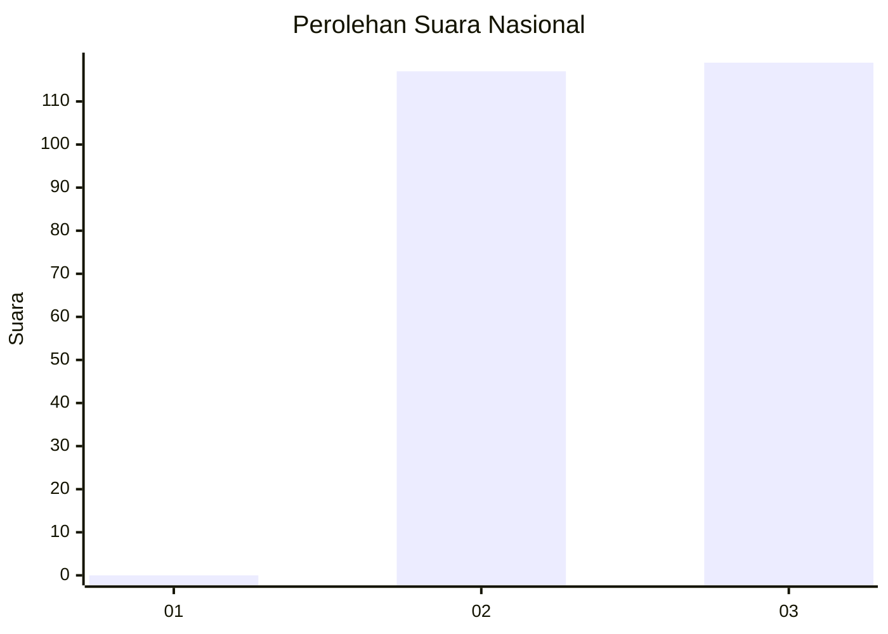
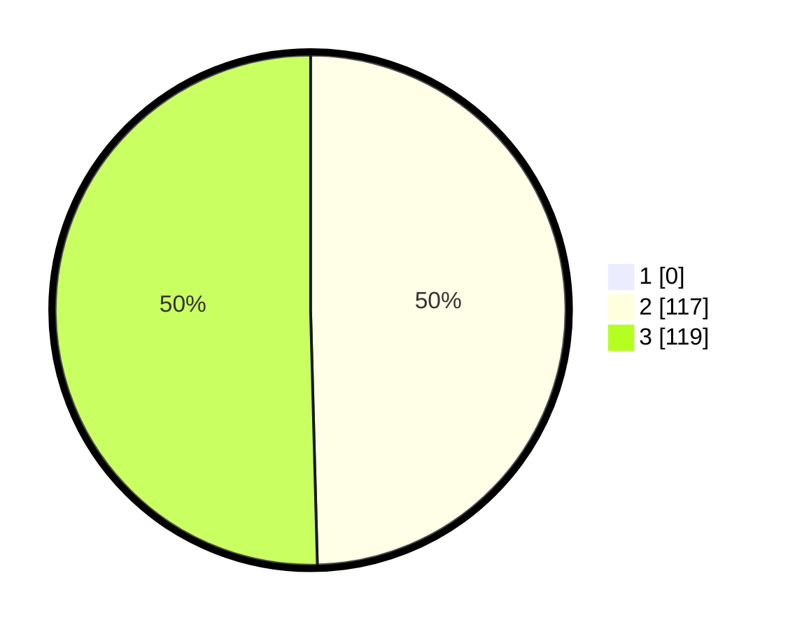

# Hasil

## Grafik

## Tabel

| No. | Nama Paslon    | Suara | Suara (raw) | Persentase |
|:--- |:-------------- | -----:| -----------:| ----------:|
| 1   | ANIES MUHAIMIN | 0     | [0][p-1]    | 0,00       |
| 2   | PRABOWO GIBRAN | 117   | [117][p-2]  | 49,58      |
| 3   | GANJAR MAHFUD  | 119   | [119][p-3]  | 50,42      |

[p-1]: https://github.com/gigit-pemilu/pemilu-2024/blob/main/pilpres/hitung-suara/sub/71-sulawesi-utara/sub/05-minahasa-selatan/sub/15-kumelembuai/sub/2011-kumelembuai-dua/sub/001-tps/sub/paslon-1.txt
[p-2]: https://github.com/gigit-pemilu/pemilu-2024/blob/main/pilpres/hitung-suara/sub/71-sulawesi-utara/sub/05-minahasa-selatan/sub/15-kumelembuai/sub/2011-kumelembuai-dua/sub/001-tps/sub/paslon-2.txt
[p-3]: https://github.com/gigit-pemilu/pemilu-2024/blob/main/pilpres/hitung-suara/sub/71-sulawesi-utara/sub/05-minahasa-selatan/sub/15-kumelembuai/sub/2011-kumelembuai-dua/sub/001-tps/sub/paslon-3.txt

## Foto C Plano

https://sirekap-obj-formc.kpu.go.id/76d0/pemilu/ppwp/71/05/15/20/11/7105152011001-20240218-170533--7a7c2506-6b72-44cb-9e28-3355a84b4098.jpg

https://sirekap-obj-formc.kpu.go.id/76d0/pemilu/ppwp/71/05/15/20/11/7105152011001-20240218-170558--422813e5-475f-47e8-92ad-4c0ccb9a59c7.jpg

https://sirekap-obj-formc.kpu.go.id/76d0/pemilu/ppwp/71/05/15/20/11/7105152011001-20240218-170627--048eecad-3799-4007-962b-3a7aae2b31ed.jpg

## Metadata

| Key        | Value               |
| ---------- | ------------------- |
| Time Stamp | 2024-02-19 06:16:00 |

## DATA PEMILIH TETAP

Jumlah pemilih dalam DPT: **252**.
 * L: **128**.
 * P: **124**.

## DATA PENGGUNA HAK PILIH

Jumlah pengguna hak pilih dalam DPT: **233**.
 * L: **425**.
 * P: **888**.

Jumlah pengguna hak pilih dalam DPTb: **804**.
 * L: **888**.
 * P: **88**.

Jumlah pengguna hak pilih dalam DPK: **800**.
 * L: **8**.
 * P: **880**.

Jumlah pengguna hak pilih: **353**.
 * L: **429**.
 * P: **548**.

## JUMLAH SUARA SAH DAN TIDAK SAH

JUMLAH SELURUH SUARA SAH: **236**.

JUMLAH SUARA TIDAK SAH: **2**.

JUMLAH SELURUH SUARA SAH DAN SUARA TIDAK SAH: **238**.

