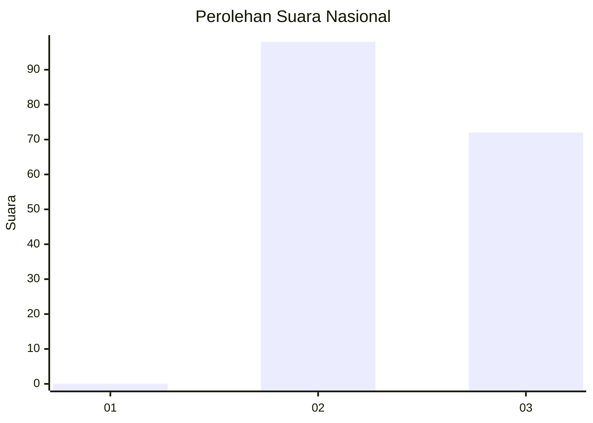
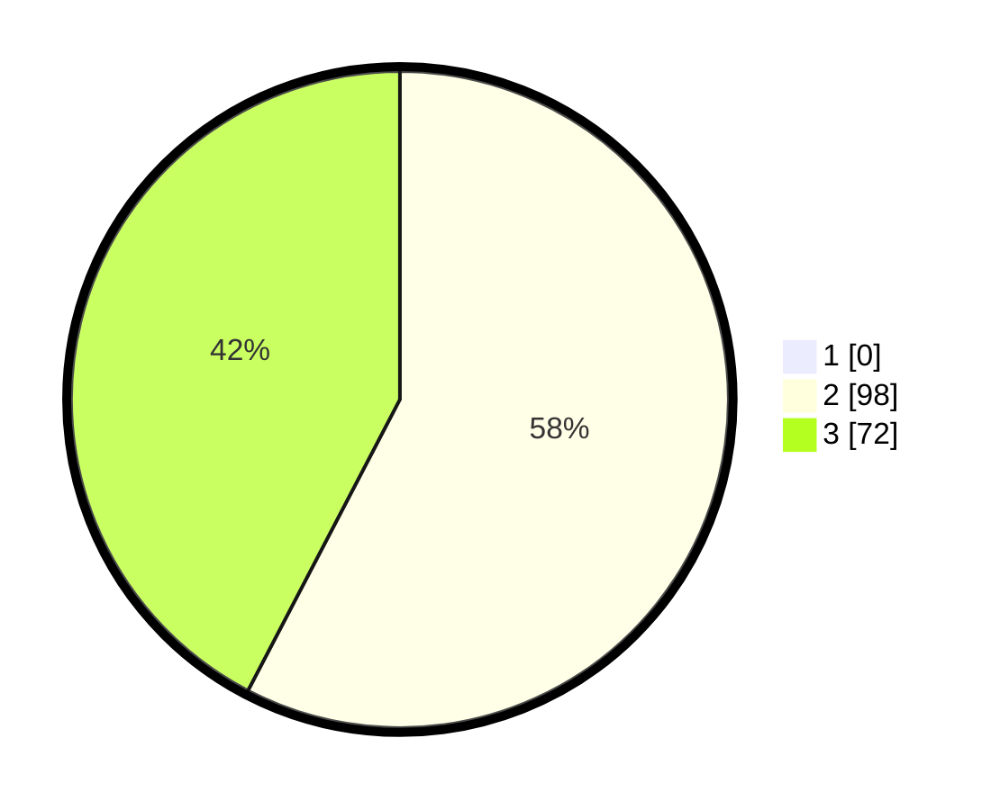

# Hasil

## Grafik

## Tabel

| No. | Nama Paslon    | Suara | Suara (raw) | Persentase |
|:--- |:-------------- | -----:| -----------:| ----------:|
| 1   | ANIES MUHAIMIN | 0     | [0][p-1]    | 0,00       |
| 2   | PRABOWO GIBRAN | 98    | [98][p-2]   | 57,65      |
| 3   | GANJAR MAHFUD  | 72    | [72][p-3]   | 42,35      |

[p-1]: https://github.com/gigit-pemilu/pemilu-2024/blob/main/pilpres/hitung-suara/sub/71-sulawesi-utara/sub/05-minahasa-selatan/sub/16-maesaan/sub/2001-tumani/sub/002-tps/sub/paslon-1.txt
[p-2]: https://github.com/gigit-pemilu/pemilu-2024/blob/main/pilpres/hitung-suara/sub/71-sulawesi-utara/sub/05-minahasa-selatan/sub/16-maesaan/sub/2001-tumani/sub/002-tps/sub/paslon-2.txt
[p-3]: https://github.com/gigit-pemilu/pemilu-2024/blob/main/pilpres/hitung-suara/sub/71-sulawesi-utara/sub/05-minahasa-selatan/sub/16-maesaan/sub/2001-tumani/sub/002-tps/sub/paslon-3.txt

## Foto C Plano

https://sirekap-obj-formc.kpu.go.id/f08e/pemilu/ppwp/71/05/16/20/01/7105162001002-20240218-153740--48ffd20f-6e49-44a1-877b-3aab973eeb73.jpg

https://sirekap-obj-formc.kpu.go.id/f08e/pemilu/ppwp/71/05/16/20/01/7105162001002-20240218-153821--66e3cc7f-87e5-4eee-b95e-5d8dd0d33548.jpg

https://sirekap-obj-formc.kpu.go.id/f08e/pemilu/ppwp/71/05/16/20/01/7105162001002-20240218-153856--34e5851a-8ebc-4d6d-91a2-ecb620c0ae58.jpg

## Metadata

| Key        | Value               |
| ---------- | ------------------- |
| Time Stamp | 2024-02-19 06:16:00 |

