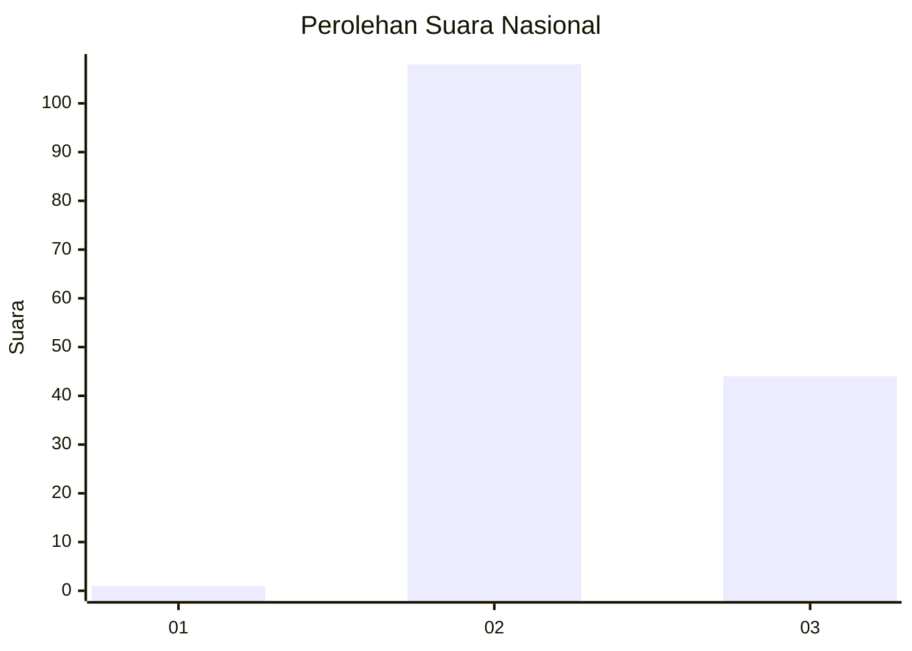
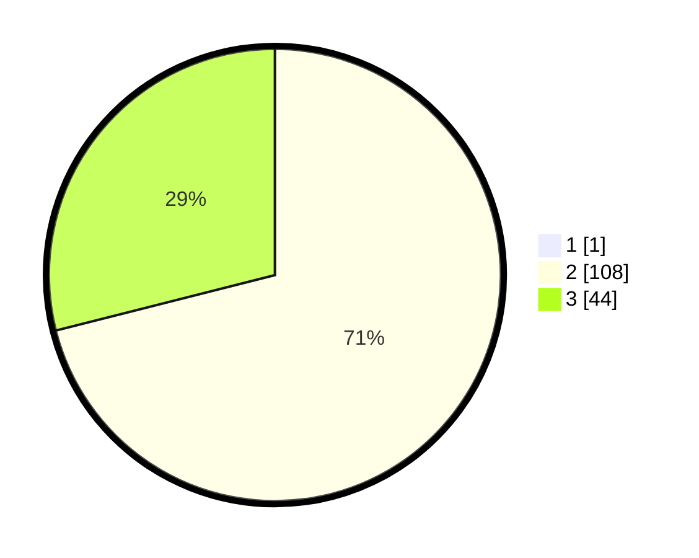

# Hasil

## Grafik

## Tabel

| No. | Nama Paslon    | Suara | Suara (raw) | Persentase |
|:--- |:-------------- | -----:| -----------:| ----------:|
| 1   | ANIES MUHAIMIN | 1     | [1][p-1]    | 0,65       |
| 2   | PRABOWO GIBRAN | 108   | [108][p-2]  | 70,59      |
| 3   | GANJAR MAHFUD  | 44    | [44][p-3]   | 28,76      |

[p-1]: https://github.com/gigit-pemilu/pemilu-2024/blob/main/pilpres/hitung-suara/sub/71-sulawesi-utara/sub/05-minahasa-selatan/sub/16-maesaan/sub/2002-lowian/sub/001-tps/sub/paslon-1.txt
[p-2]: https://github.com/gigit-pemilu/pemilu-2024/blob/main/pilpres/hitung-suara/sub/71-sulawesi-utara/sub/05-minahasa-selatan/sub/16-maesaan/sub/2002-lowian/sub/001-tps/sub/paslon-2.txt
[p-3]: https://github.com/gigit-pemilu/pemilu-2024/blob/main/pilpres/hitung-suara/sub/71-sulawesi-utara/sub/05-minahasa-selatan/sub/16-maesaan/sub/2002-lowian/sub/001-tps/sub/paslon-3.txt

## Foto C Plano

https://sirekap-obj-formc.kpu.go.id/ceac/pemilu/ppwp/71/05/16/20/02/7105162002001-20240217-004903--c26331ff-649b-460e-b986-e2fe156853bd.jpg

https://sirekap-obj-formc.kpu.go.id/ceac/pemilu/ppwp/71/05/16/20/02/7105162002001-20240217-005034--bd8e98e8-c8e3-409e-b02b-ef8f76eca811.jpg

https://sirekap-obj-formc.kpu.go.id/ceac/pemilu/ppwp/71/05/16/20/02/7105162002001-20240217-005102--b5127c49-fe2a-437d-9ba0-3762890ace08.jpg

## Metadata

| Key        | Value               |
| ---------- | ------------------- |
| Time Stamp | 2024-02-17 04:42:04 |

