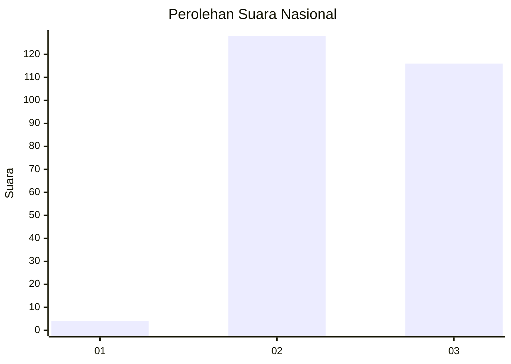
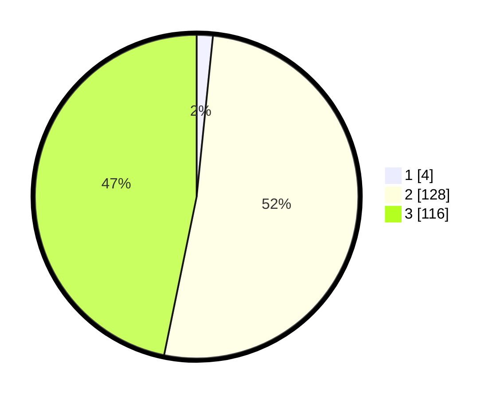

# Hasil

## Grafik

## Tabel

| No. | Nama Paslon    | Suara | Suara (raw) | Persentase |
|:--- |:-------------- | -----:| -----------:| ----------:|
| 1   | ANIES MUHAIMIN | 4     | [4][p-1]    | 1,61       |
| 2   | PRABOWO GIBRAN | 128   | [128][p-2]  | 51,61      |
| 3   | GANJAR MAHFUD  | 116   | [116][p-3]  | 46,77      |

[p-1]: https://github.com/gigit-pemilu/pemilu-2024/blob/main/pilpres/hitung-suara/sub/71-sulawesi-utara/sub/05-minahasa-selatan/sub/17-amurang-barat/sub/1002-kawangkoan-bawah/sub/002-tps/sub/paslon-1.txt
[p-2]: https://github.com/gigit-pemilu/pemilu-2024/blob/main/pilpres/hitung-suara/sub/71-sulawesi-utara/sub/05-minahasa-selatan/sub/17-amurang-barat/sub/1002-kawangkoan-bawah/sub/002-tps/sub/paslon-2.txt
[p-3]: https://github.com/gigit-pemilu/pemilu-2024/blob/main/pilpres/hitung-suara/sub/71-sulawesi-utara/sub/05-minahasa-selatan/sub/17-amurang-barat/sub/1002-kawangkoan-bawah/sub/002-tps/sub/paslon-3.txt

## Foto C Plano

https://sirekap-obj-formc.kpu.go.id/7b3e/pemilu/ppwp/71/05/17/10/02/7105171002002-20240218-234122--bc636ab2-59af-4c65-b263-4166f7964996.jpg

https://sirekap-obj-formc.kpu.go.id/7b3e/pemilu/ppwp/71/05/17/10/02/7105171002002-20240218-234203--e262452c-a515-4a69-819b-e3d2676365c8.jpg

https://sirekap-obj-formc.kpu.go.id/7b3e/pemilu/ppwp/71/05/17/10/02/7105171002002-20240218-234227--93fc51a9-b809-421e-87b1-4fc64b04595f.jpg

## Metadata

| Key        | Value               |
| ---------- | ------------------- |
| Time Stamp | 2024-02-19 06:16:00 |

