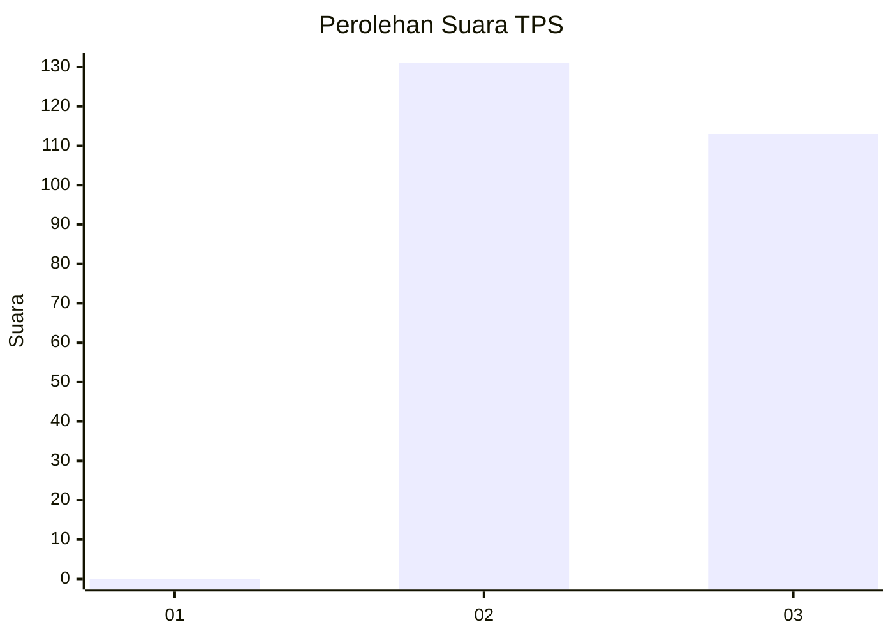
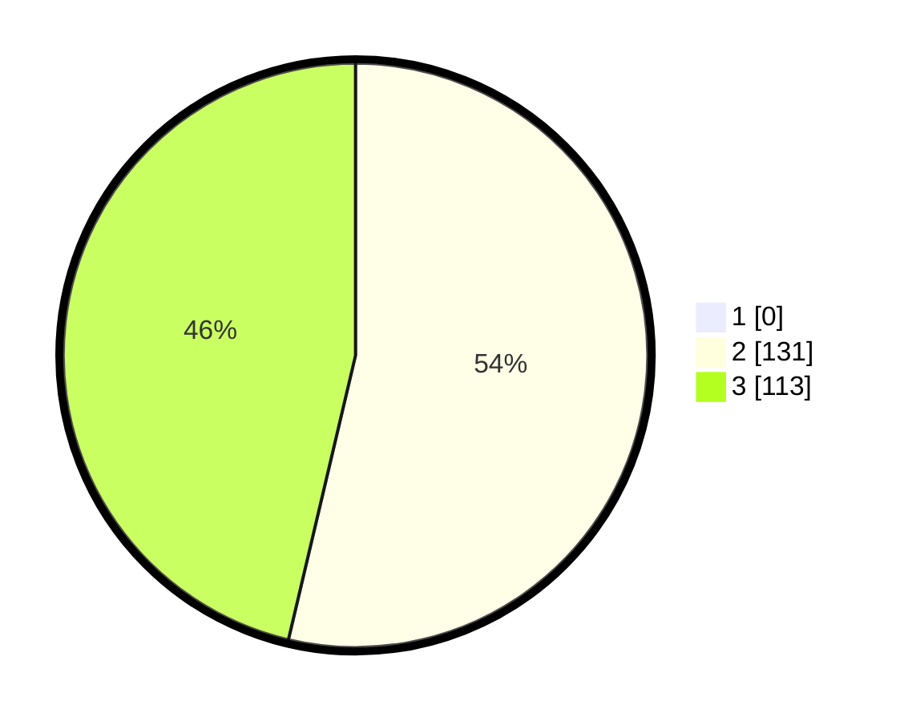

# Hasil

## Grafik

## Tabel

| No. | Nama Paslon    | Suara | Suara (raw) | Persentase |
|:--- |:-------------- | -----:| -----------:| ----------:|
| 1   | ANIES MUHAIMIN | 0     | [0][p-1]    | 0,00       |
| 2   | PRABOWO GIBRAN | 131   | [131][p-2]  | 53,69      |
| 3   | GANJAR MAHFUD  | 113   | [113][p-3]  | 46,31      |

[p-1]: https://github.com/gigit-pemilu/pemilu-2024-71-sulawesi-utara/blob/main/pilpres/hitung-suara/sub/71-sulawesi-utara/sub/05-minahasa-selatan/sub/17-amurang-barat/sub/1002-kawangkoan-bawah/sub/004-tps/sub/paslon-1.txt
[p-2]: https://github.com/gigit-pemilu/pemilu-2024-71-sulawesi-utara/blob/main/pilpres/hitung-suara/sub/71-sulawesi-utara/sub/05-minahasa-selatan/sub/17-amurang-barat/sub/1002-kawangkoan-bawah/sub/004-tps/sub/paslon-2.txt
[p-3]: https://github.com/gigit-pemilu/pemilu-2024-71-sulawesi-utara/blob/main/pilpres/hitung-suara/sub/71-sulawesi-utara/sub/05-minahasa-selatan/sub/17-amurang-barat/sub/1002-kawangkoan-bawah/sub/004-tps/sub/paslon-3.txt

## Foto C Plano

https://sirekap-obj-formc.kpu.go.id/8286/pemilu/ppwp/71/05/17/10/02/7105171002004-20240218-235552--536933c9-97fa-4681-9109-a71c210b64a5.jpg

https://sirekap-obj-formc.kpu.go.id/8286/pemilu/ppwp/71/05/17/10/02/7105171002004-20240218-235503--af5daddb-c5a5-4f49-be10-aaa3156437ef.jpg

https://sirekap-obj-formc.kpu.go.id/8286/pemilu/ppwp/71/05/17/10/02/7105171002004-20240218-235459--d4055ba9-80ca-425b-a65e-05a84c7cd5c7.jpg

## Metadata

| Key        | Value               |
| ---------- | ------------------- |
| Time Stamp | 2024-02-19 06:16:00 |

