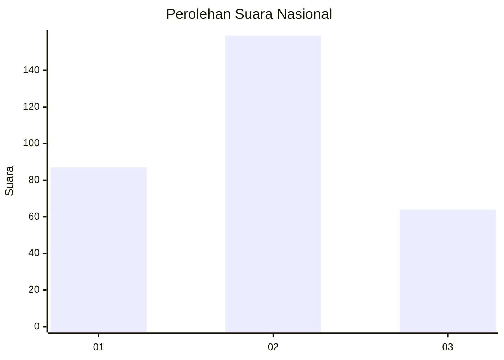
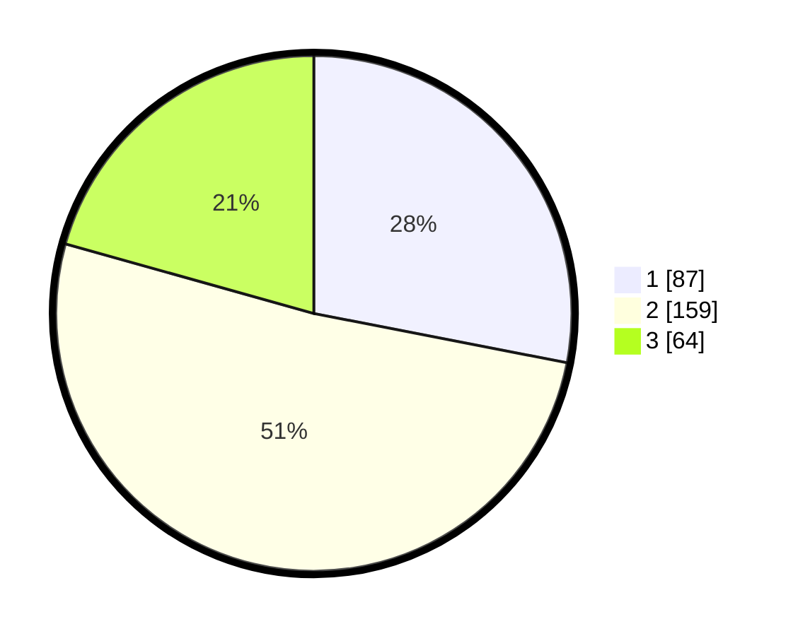

# Hasil

## Grafik

## Tabel

| No. | Nama Paslon    | Suara | Suara (raw) | Persentase |
|:--- |:-------------- | -----:| -----------:| ----------:|
| 1   | ANIES MUHAIMIN | 87    | [87][p-1]   | 28,06      |
| 2   | PRABOWO GIBRAN | 159   | [159][p-2]  | 51,29      |
| 3   | GANJAR MAHFUD  | 64    | [64][p-3]   | 20,65      |

[p-1]: https://github.com/gigit-pemilu/pemilu-2024/blob/main/pilpres/hitung-suara/sub/71-sulawesi-utara/sub/05-minahasa-selatan/sub/17-amurang-barat/sub/1002-kawangkoan-bawah/sub/010-tps/sub/paslon-1.txt
[p-2]: https://github.com/gigit-pemilu/pemilu-2024/blob/main/pilpres/hitung-suara/sub/71-sulawesi-utara/sub/05-minahasa-selatan/sub/17-amurang-barat/sub/1002-kawangkoan-bawah/sub/010-tps/sub/paslon-2.txt
[p-3]: https://github.com/gigit-pemilu/pemilu-2024/blob/main/pilpres/hitung-suara/sub/71-sulawesi-utara/sub/05-minahasa-selatan/sub/17-amurang-barat/sub/1002-kawangkoan-bawah/sub/010-tps/sub/paslon-3.txt

## Foto C Plano

https://sirekap-obj-formc.kpu.go.id/7104/pemilu/ppwp/71/05/17/10/02/7105171002010-20240215-105213--bbda5af3-ee3b-4f2f-a2bd-2db2fcd07091.jpg

https://sirekap-obj-formc.kpu.go.id/7104/pemilu/ppwp/71/05/17/10/02/7105171002010-20240215-022742--48ed1b12-7e1f-4366-b263-f8de86877112.jpg

https://sirekap-obj-formc.kpu.go.id/7104/pemilu/ppwp/71/05/17/10/02/7105171002010-20240215-022857--e106ab65-04e3-4fd3-804c-944c622f8ae1.jpg

## Metadata

| Key        | Value               |
| ---------- | ------------------- |
| Time Stamp | 2024-02-15 15:00:29 |

