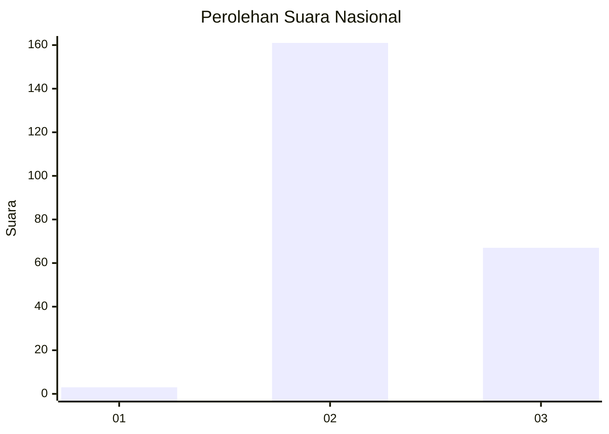

# Hasil

## Grafik

## Tabel

| No. | Nama Paslon    | Suara | Suara (raw) | Persentase |
|:--- |:-------------- | -----:| -----------:| ----------:|
| 1   | ANIES MUHAIMIN | 3     | [3][p-1]    | 1,30       |
| 2   | PRABOWO GIBRAN | 161   | [161][p-2]  | 69,70      |
| 3   | GANJAR MAHFUD  | 67    | [67][p-3]   | 29,00      |

[p-1]: https://github.com/gigit-pemilu/pemilu-2024/blob/main/pilpres/hitung-suara/sub/71-sulawesi-utara/sub/05-minahasa-selatan/sub/18-amurang-timur/sub/1002-pondang/sub/001-tps/sub/paslon-1.txt
[p-2]: https://github.com/gigit-pemilu/pemilu-2024/blob/main/pilpres/hitung-suara/sub/71-sulawesi-utara/sub/05-minahasa-selatan/sub/18-amurang-timur/sub/1002-pondang/sub/001-tps/sub/paslon-2.txt
[p-3]: https://github.com/gigit-pemilu/pemilu-2024/blob/main/pilpres/hitung-suara/sub/71-sulawesi-utara/sub/05-minahasa-selatan/sub/18-amurang-timur/sub/1002-pondang/sub/001-tps/sub/paslon-3.txt

## Foto C Plano

https://sirekap-obj-formc.kpu.go.id/7041/pemilu/ppwp/71/05/18/10/02/7105181002001-20240215-003139--79b9a35c-1d75-443f-acf0-c8eec33ada0b.jpg

https://sirekap-obj-formc.kpu.go.id/7041/pemilu/ppwp/71/05/18/10/02/7105181002001-20240215-003223--2b57b1bb-08d3-4fdf-b934-28f7c748d52d.jpg

https://sirekap-obj-formc.kpu.go.id/7041/pemilu/ppwp/71/05/18/10/02/7105181002001-20240215-003419--446106c5-778a-4a23-b128-24efae984e8f.jpg

## Metadata

| Key        | Value               |
| ---------- | ------------------- |
| Time Stamp | 2024-02-15 15:00:29 |

