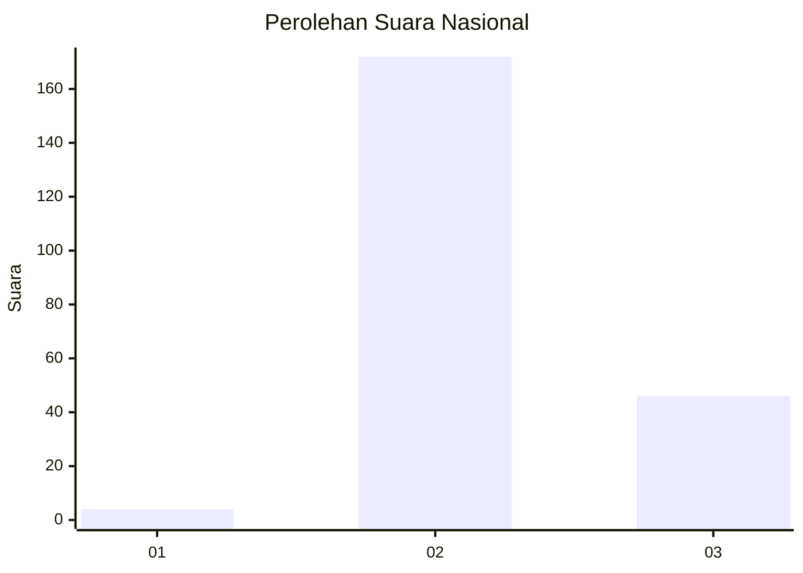

# Hasil

## Grafik

## Tabel

| No. | Nama Paslon    | Suara | Suara (raw) | Persentase |
|:--- |:-------------- | -----:| -----------:| ----------:|
| 1   | ANIES MUHAIMIN | 4     | [4][p-1]    | 1,80       |
| 2   | PRABOWO GIBRAN | 172   | [172][p-2]  | 77,48      |
| 3   | GANJAR MAHFUD  | 46    | [46][p-3]   | 20,72      |

[p-1]: https://github.com/gigit-pemilu/pemilu-2024/blob/main/pilpres/hitung-suara/sub/71-sulawesi-utara/sub/05-minahasa-selatan/sub/18-amurang-timur/sub/1002-pondang/sub/005-tps/sub/paslon-1.txt
[p-2]: https://github.com/gigit-pemilu/pemilu-2024/blob/main/pilpres/hitung-suara/sub/71-sulawesi-utara/sub/05-minahasa-selatan/sub/18-amurang-timur/sub/1002-pondang/sub/005-tps/sub/paslon-2.txt
[p-3]: https://github.com/gigit-pemilu/pemilu-2024/blob/main/pilpres/hitung-suara/sub/71-sulawesi-utara/sub/05-minahasa-selatan/sub/18-amurang-timur/sub/1002-pondang/sub/005-tps/sub/paslon-3.txt

## Foto C Plano

https://sirekap-obj-formc.kpu.go.id/7dd1/pemilu/ppwp/71/05/18/10/02/7105181002005-20240217-081030--66244923-5bab-48aa-a3ab-4eb60e5db918.jpg

https://sirekap-obj-formc.kpu.go.id/7dd1/pemilu/ppwp/71/05/18/10/02/7105181002005-20240217-081107--4d87eec6-827f-4745-8cc7-f11b08cc9530.jpg

https://sirekap-obj-formc.kpu.go.id/7dd1/pemilu/ppwp/71/05/18/10/02/7105181002005-20240217-081338--f61de75b-8d40-45f1-ae05-4f33f5574e17.jpg

## Metadata

| Key        | Value               |
| ---------- | ------------------- |
| Time Stamp | 2024-02-17 09:00:02 |

