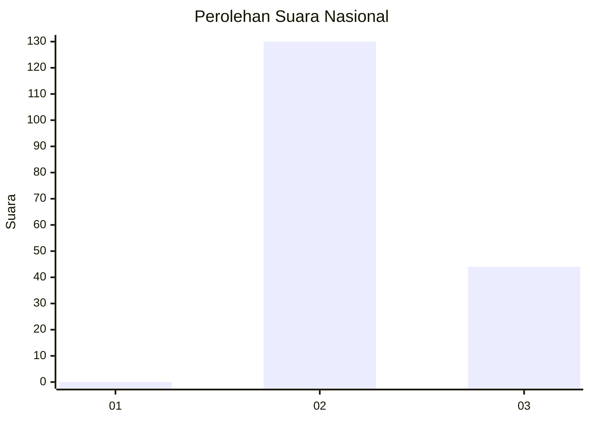
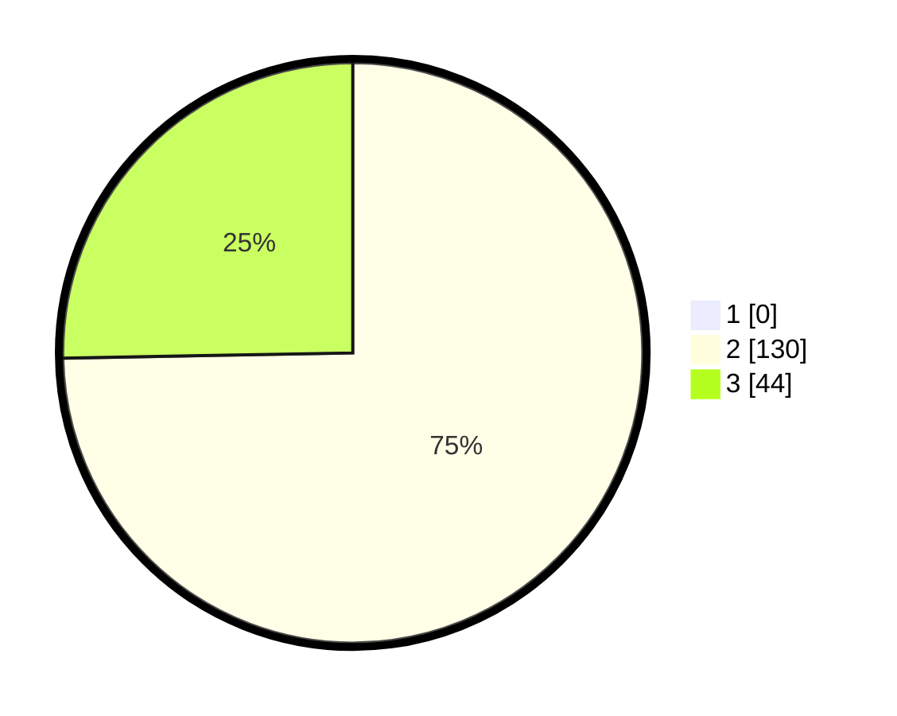

# Hasil

## Grafik

## Tabel

| No. | Nama Paslon    | Suara | Suara (raw) | Persentase |
|:--- |:-------------- | -----:| -----------:| ----------:|
| 1   | ANIES MUHAIMIN | 0     | [0][p-1]    | 0,00       |
| 2   | PRABOWO GIBRAN | 130   | [130][p-2]  | 74,71      |
| 3   | GANJAR MAHFUD  | 44    | [44][p-3]   | 25,29      |

[p-1]: https://github.com/gigit-pemilu/pemilu-2024/blob/main/pilpres/hitung-suara/sub/71-sulawesi-utara/sub/05-minahasa-selatan/sub/19-tatapaan/sub/2001-paslaten/sub/001-tps/sub/paslon-1.txt
[p-2]: https://github.com/gigit-pemilu/pemilu-2024/blob/main/pilpres/hitung-suara/sub/71-sulawesi-utara/sub/05-minahasa-selatan/sub/19-tatapaan/sub/2001-paslaten/sub/001-tps/sub/paslon-2.txt
[p-3]: https://github.com/gigit-pemilu/pemilu-2024/blob/main/pilpres/hitung-suara/sub/71-sulawesi-utara/sub/05-minahasa-selatan/sub/19-tatapaan/sub/2001-paslaten/sub/001-tps/sub/paslon-3.txt

## Foto C Plano

https://sirekap-obj-formc.kpu.go.id/2599/pemilu/ppwp/71/05/19/20/01/7105192001001-20240222-183005--f184aca7-665d-4159-be3f-16b67532bed8.jpg

https://sirekap-obj-formc.kpu.go.id/2599/pemilu/ppwp/71/05/19/20/01/7105192001001-20240222-182951--6eb97905-7d2a-4aaf-baa3-2e29b882e153.jpg

https://sirekap-obj-formc.kpu.go.id/2599/pemilu/ppwp/71/05/19/20/01/7105192001001-20240222-183401--2f6e72b1-4421-4a0d-b1ca-c0d94bdaf95d.jpg

## Metadata

| Key        | Value               |
| ---------- | ------------------- |
| Time Stamp | 2024-02-22 22:00:00 |

