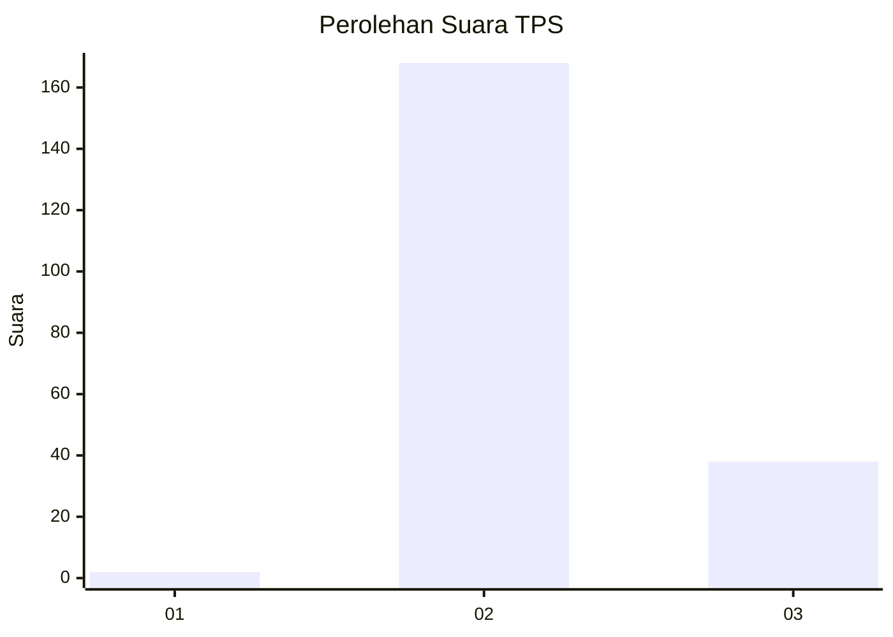
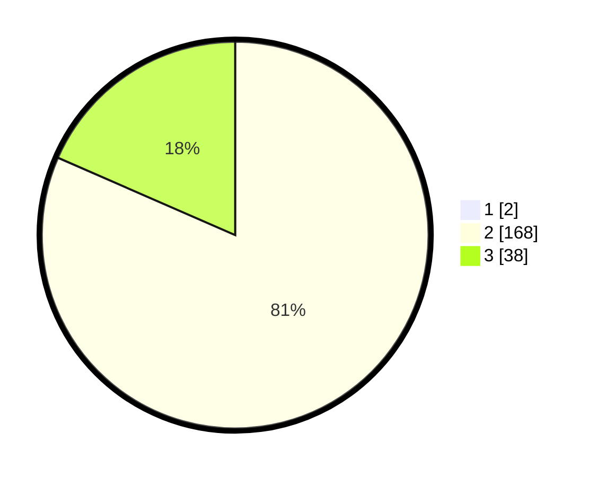

# Hasil

## Grafik

## Tabel

| No. | Nama Paslon    | Suara | Suara (raw) | Persentase |
|:--- |:-------------- | -----:| -----------:| ----------:|
| 1   | ANIES MUHAIMIN | 2     | [2][p-1]    | 0,96       |
| 2   | PRABOWO GIBRAN | 168   | [168][p-2]  | 80,77      |
| 3   | GANJAR MAHFUD  | 38    | [38][p-3]   | 18,27      |

[p-1]: https://github.com/gigit-pemilu/pemilu-2024-71-sulawesi-utara/blob/main/pilpres/hitung-suara/sub/71-sulawesi-utara/sub/05-minahasa-selatan/sub/21-motoling-barat/sub/2001-tondei/sub/001-tps/sub/paslon-1.txt
[p-2]: https://github.com/gigit-pemilu/pemilu-2024-71-sulawesi-utara/blob/main/pilpres/hitung-suara/sub/71-sulawesi-utara/sub/05-minahasa-selatan/sub/21-motoling-barat/sub/2001-tondei/sub/001-tps/sub/paslon-2.txt
[p-3]: https://github.com/gigit-pemilu/pemilu-2024-71-sulawesi-utara/blob/main/pilpres/hitung-suara/sub/71-sulawesi-utara/sub/05-minahasa-selatan/sub/21-motoling-barat/sub/2001-tondei/sub/001-tps/sub/paslon-3.txt

## Foto C Plano

https://sirekap-obj-formc.kpu.go.id/c7ff/pemilu/ppwp/71/05/21/20/01/7105212001001-20240218-161343--9eebce0e-b832-4b25-9b74-2543202f7c6e.jpg

https://sirekap-obj-formc.kpu.go.id/c7ff/pemilu/ppwp/71/05/21/20/01/7105212001001-20240218-161419--6b12a12b-8b1f-429a-a703-0d3abe1edefa.jpg

https://sirekap-obj-formc.kpu.go.id/c7ff/pemilu/ppwp/71/05/21/20/01/7105212001001-20240218-161450--75c1b3c7-6be9-479f-9857-45c71e1b01a2.jpg

## Metadata

| Key        | Value               |
| ---------- | ------------------- |
| Time Stamp | 2024-02-19 06:16:00 |

## DATA PEMILIH TETAP

Jumlah pemilih dalam DPT: **231**.
 * L: **124**.
 * P: **107**.

## DATA PENGGUNA HAK PILIH

Jumlah pengguna hak pilih dalam DPT: **223**.
 * L: **558**.
 * P: **833**.

Jumlah pengguna hak pilih dalam DPTb: **888**.
 * L: **888**.
 * P: **842**.

Jumlah pengguna hak pilih dalam DPK: **725**.
 * L: **885**.
 * P: **883**.

Jumlah pengguna hak pilih: **285**.
 * L: **413**.
 * P: **449**.

## JUMLAH SUARA SAH DAN TIDAK SAH

JUMLAH SELURUH SUARA SAH: **208**.

JUMLAH SUARA TIDAK SAH: **3**.

JUMLAH SELURUH SUARA SAH DAN SUARA TIDAK SAH: **211**.

