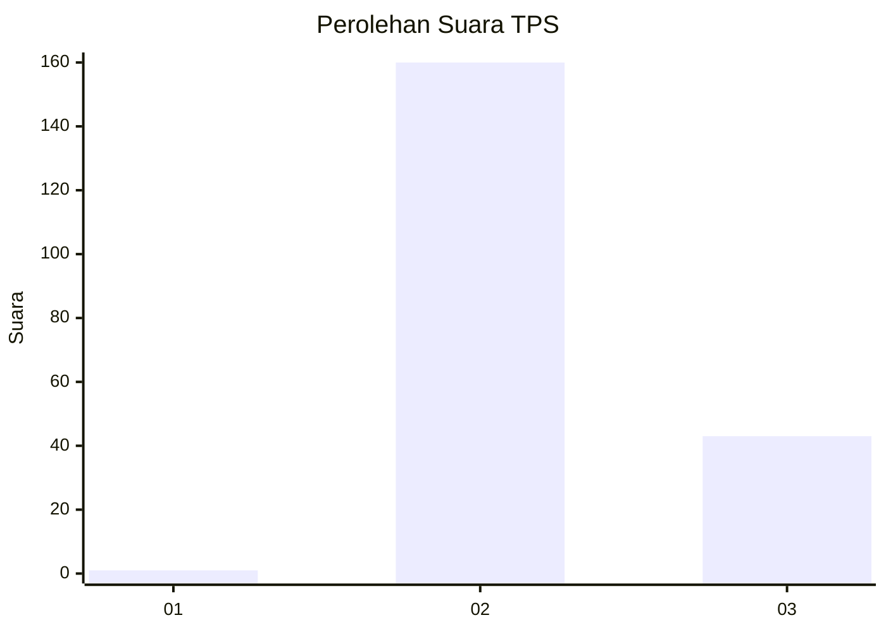
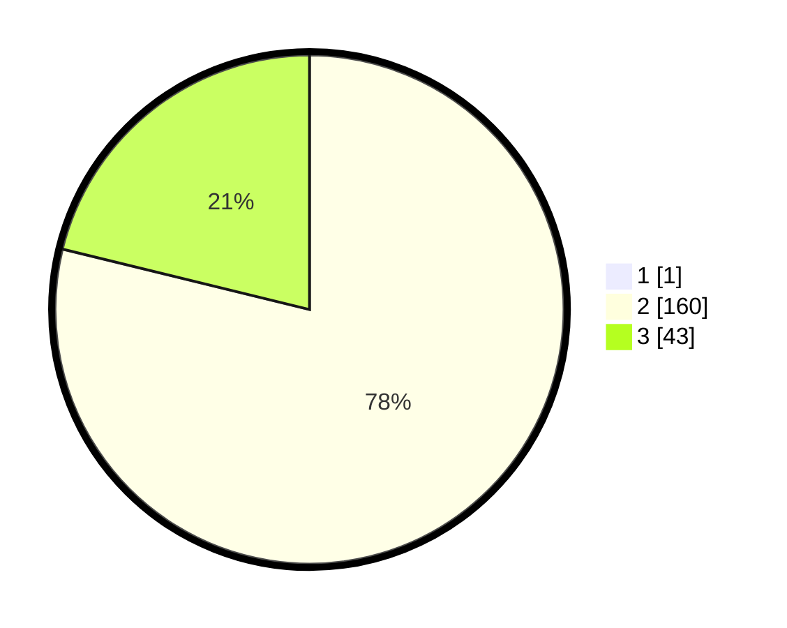

# Hasil

## Grafik

## Tabel

| No. | Nama Paslon    | Suara | Suara (raw) | Persentase |
|:--- |:-------------- | -----:| -----------:| ----------:|
| 1   | ANIES MUHAIMIN | 1     | [1][p-1]    | 0,49       |
| 2   | PRABOWO GIBRAN | 160   | [160][p-2]  | 78,43      |
| 3   | GANJAR MAHFUD  | 43    | [43][p-3]   | 21,08      |

[p-1]: https://github.com/gigit-pemilu/pemilu-2024-71-sulawesi-utara/blob/main/pilpres/hitung-suara/sub/71-sulawesi-utara/sub/05-minahasa-selatan/sub/21-motoling-barat/sub/2002-tondei-satu/sub/001-tps/sub/paslon-1.txt
[p-2]: https://github.com/gigit-pemilu/pemilu-2024-71-sulawesi-utara/blob/main/pilpres/hitung-suara/sub/71-sulawesi-utara/sub/05-minahasa-selatan/sub/21-motoling-barat/sub/2002-tondei-satu/sub/001-tps/sub/paslon-2.txt
[p-3]: https://github.com/gigit-pemilu/pemilu-2024-71-sulawesi-utara/blob/main/pilpres/hitung-suara/sub/71-sulawesi-utara/sub/05-minahasa-selatan/sub/21-motoling-barat/sub/2002-tondei-satu/sub/001-tps/sub/paslon-3.txt

## Foto C Plano

https://sirekap-obj-formc.kpu.go.id/2465/pemilu/ppwp/71/05/21/20/02/7105212002001-20240218-154153--35384478-3434-4c26-8599-2de8c707b592.jpg

https://sirekap-obj-formc.kpu.go.id/2465/pemilu/ppwp/71/05/21/20/02/7105212002001-20240218-154235--afc08ae6-3f48-4795-a4eb-29607985c9bf.jpg

https://sirekap-obj-formc.kpu.go.id/2465/pemilu/ppwp/71/05/21/20/02/7105212002001-20240218-154309--ae04e644-668e-4f2e-8d2d-ac751c217569.jpg

## Metadata

| Key        | Value               |
| ---------- | ------------------- |
| Time Stamp | 2024-02-19 06:16:00 |

