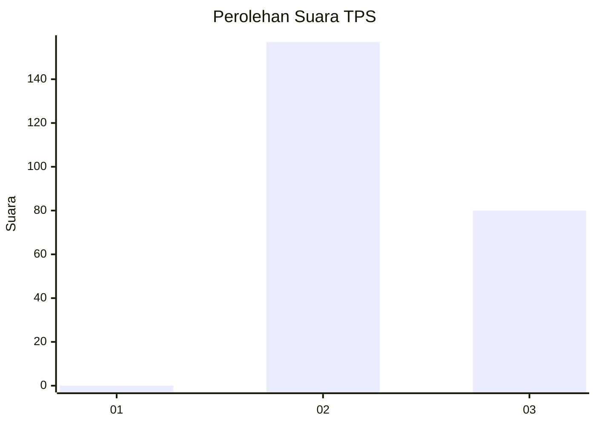
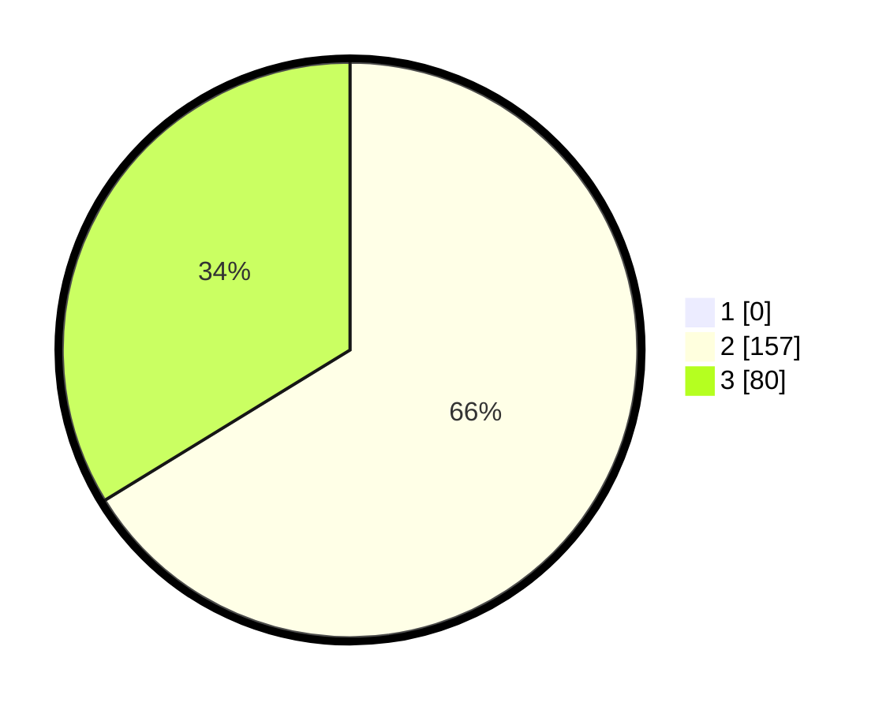

# Hasil

## Grafik

## Tabel

| No. | Nama Paslon    | Suara | Suara (raw) | Persentase |
|:--- |:-------------- | -----:| -----------:| ----------:|
| 1   | ANIES MUHAIMIN | 0     | [0][p-1]    | 0,00       |
| 2   | PRABOWO GIBRAN | 157   | [157][p-2]  | 66,24      |
| 3   | GANJAR MAHFUD  | 80    | [80][p-3]   | 33,76      |

[p-1]: https://github.com/gigit-pemilu/pemilu-2024-71-sulawesi-utara/blob/main/pilpres/hitung-suara/sub/71-sulawesi-utara/sub/05-minahasa-selatan/sub/22-motoling-timur/sub/2001-karimbow/sub/003-tps/sub/paslon-1.txt
[p-2]: https://github.com/gigit-pemilu/pemilu-2024-71-sulawesi-utara/blob/main/pilpres/hitung-suara/sub/71-sulawesi-utara/sub/05-minahasa-selatan/sub/22-motoling-timur/sub/2001-karimbow/sub/003-tps/sub/paslon-2.txt
[p-3]: https://github.com/gigit-pemilu/pemilu-2024-71-sulawesi-utara/blob/main/pilpres/hitung-suara/sub/71-sulawesi-utara/sub/05-minahasa-selatan/sub/22-motoling-timur/sub/2001-karimbow/sub/003-tps/sub/paslon-3.txt

## Foto C Plano

https://sirekap-obj-formc.kpu.go.id/442e/pemilu/ppwp/71/05/22/20/01/7105222001003-20240214-213038--da5f80ed-7a9c-40a4-b122-c9b6e821e94b.jpg

https://sirekap-obj-formc.kpu.go.id/442e/pemilu/ppwp/71/05/22/20/01/7105222001003-20240215-011703--fa9be0fd-0474-44c9-94a1-adb104cf5901.jpg

https://sirekap-obj-formc.kpu.go.id/442e/pemilu/ppwp/71/05/22/20/01/7105222001003-20240215-011446--7c0f61d8-ea0b-4309-b955-0d98ecc9b5bd.jpg

## Metadata

| Key        | Value               |
| ---------- | ------------------- |
| Time Stamp | 2024-02-25 20:00:00 |

