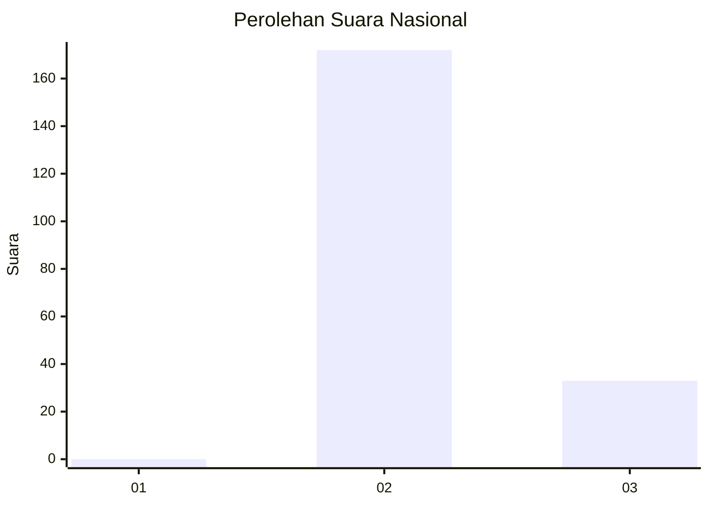
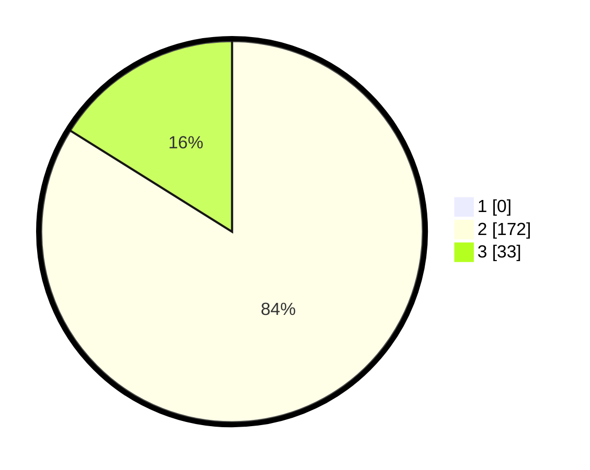

# Hasil

## Grafik

## Tabel

| No. | Nama Paslon    | Suara | Suara (raw) | Persentase |
|:--- |:-------------- | -----:| -----------:| ----------:|
| 1   | ANIES MUHAIMIN | 0     | [0][p-1]    | 0,00       |
| 2   | PRABOWO GIBRAN | 172   | [172][p-2]  | 83,90      |
| 3   | GANJAR MAHFUD  | 33    | [33][p-3]   | 16,10      |

[p-1]: https://github.com/gigit-pemilu/pemilu-2024/blob/main/pilpres/hitung-suara/sub/71-sulawesi-utara/sub/05-minahasa-selatan/sub/23-suluun-tareran/sub/2002-suluun-satu/sub/002-tps/sub/paslon-1.txt
[p-2]: https://github.com/gigit-pemilu/pemilu-2024/blob/main/pilpres/hitung-suara/sub/71-sulawesi-utara/sub/05-minahasa-selatan/sub/23-suluun-tareran/sub/2002-suluun-satu/sub/002-tps/sub/paslon-2.txt
[p-3]: https://github.com/gigit-pemilu/pemilu-2024/blob/main/pilpres/hitung-suara/sub/71-sulawesi-utara/sub/05-minahasa-selatan/sub/23-suluun-tareran/sub/2002-suluun-satu/sub/002-tps/sub/paslon-3.txt

## Foto C Plano

https://sirekap-obj-formc.kpu.go.id/ab71/pemilu/ppwp/71/05/23/20/02/7105232002002-20240215-025911--d396ec1d-34a0-459b-abd5-eb3f0012fba4.jpg

https://sirekap-obj-formc.kpu.go.id/ab71/pemilu/ppwp/71/05/23/20/02/7105232002002-20240215-030003--fbd1da21-2b0d-4ca9-8a24-8ac102754d6c.jpg

https://sirekap-obj-formc.kpu.go.id/ab71/pemilu/ppwp/71/05/23/20/02/7105232002002-20240215-030121--01ca6b5d-f0f6-4b86-97a0-c8a44363ee8e.jpg

## Metadata

| Key        | Value               |
| ---------- | ------------------- |
| Time Stamp | 2024-02-16 21:01:00 |

