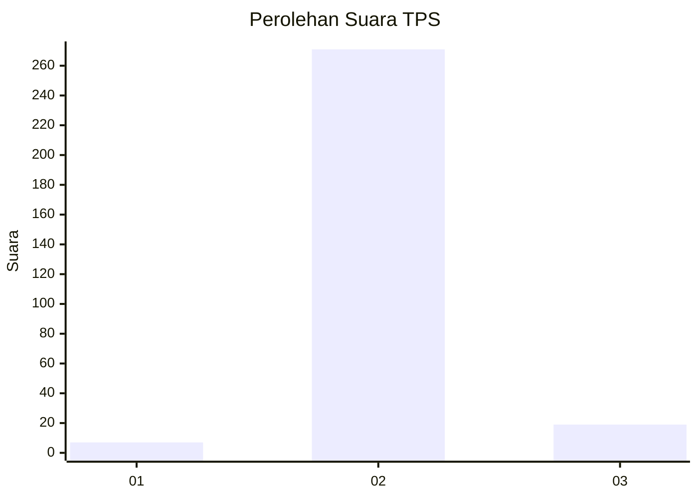
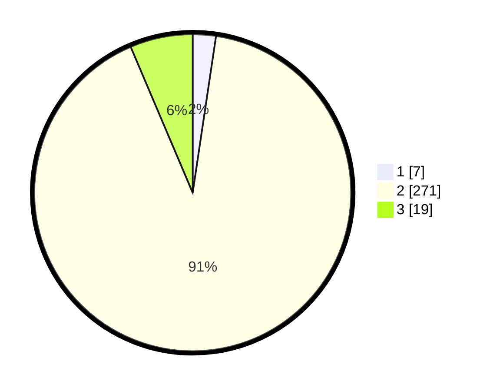

# Hasil

## Grafik

## Tabel

| No. | Nama Paslon    | Suara | Suara (raw) | Persentase |
|:--- |:-------------- | -----:| -----------:| ----------:|
| 1   | ANIES MUHAIMIN | 7     | [7][p-1]    | 2,36       |
| 2   | PRABOWO GIBRAN | 271   | [271][p-2]  | 91,25      |
| 3   | GANJAR MAHFUD  | 19    | [19][p-3]   | 6,40       |

[p-1]: https://github.com/gigit-pemilu/pemilu-2024-71-sulawesi-utara/blob/main/pilpres/hitung-suara/sub/71-sulawesi-utara/sub/06-minahasa-utara/sub/03-airmadidi/sub/1007-saronsong-i/sub/005-tps/sub/paslon-1.txt
[p-2]: https://github.com/gigit-pemilu/pemilu-2024-71-sulawesi-utara/blob/main/pilpres/hitung-suara/sub/71-sulawesi-utara/sub/06-minahasa-utara/sub/03-airmadidi/sub/1007-saronsong-i/sub/005-tps/sub/paslon-2.txt
[p-3]: https://github.com/gigit-pemilu/pemilu-2024-71-sulawesi-utara/blob/main/pilpres/hitung-suara/sub/71-sulawesi-utara/sub/06-minahasa-utara/sub/03-airmadidi/sub/1007-saronsong-i/sub/005-tps/sub/paslon-3.txt

## Foto C Plano

https://sirekap-obj-formc.kpu.go.id/0f2d/pemilu/ppwp/71/06/03/10/07/7106031007005-20240214-155014--47b3c80a-6715-4e94-8147-a1ddc911c1c7.jpg

https://sirekap-obj-formc.kpu.go.id/0f2d/pemilu/ppwp/71/06/03/10/07/7106031007005-20240214-155123--d1a9080a-95a1-4471-8640-f2c3014e9b2a.jpg

https://sirekap-obj-formc.kpu.go.id/0f2d/pemilu/ppwp/71/06/03/10/07/7106031007005-20240214-231902--2b7dd007-11dd-4d86-a7d0-31195cc882d6.jpg

## Metadata

| Key        | Value               |
| ---------- | ------------------- |
| Time Stamp | 2024-02-15 06:00:23 |

