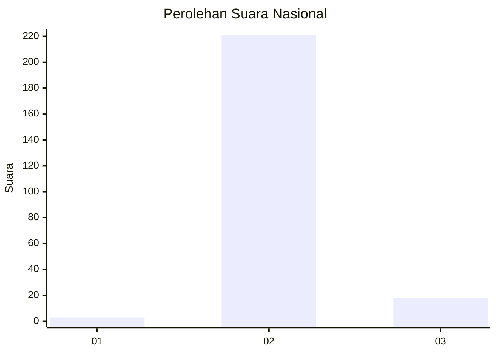
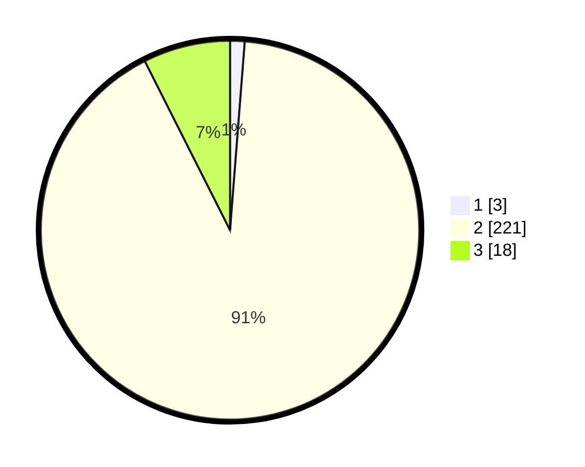

# Hasil

## Grafik

## Tabel

| No. | Nama Paslon    | Suara | Suara (raw) | Persentase |
|:--- |:-------------- | -----:| -----------:| ----------:|
| 1   | ANIES MUHAIMIN | 3     | [3][p-1]    | 1,24       |
| 2   | PRABOWO GIBRAN | 221   | [221][p-2]  | 91,32      |
| 3   | GANJAR MAHFUD  | 18    | [18][p-3]   | 7,44       |

[p-1]: https://github.com/gigit-pemilu/pemilu-2024/blob/main/pilpres/hitung-suara/sub/71-sulawesi-utara/sub/06-minahasa-utara/sub/05-dimembe/sub/2003-matungkas/sub/003-tps/sub/paslon-1.txt
[p-2]: https://github.com/gigit-pemilu/pemilu-2024/blob/main/pilpres/hitung-suara/sub/71-sulawesi-utara/sub/06-minahasa-utara/sub/05-dimembe/sub/2003-matungkas/sub/003-tps/sub/paslon-2.txt
[p-3]: https://github.com/gigit-pemilu/pemilu-2024/blob/main/pilpres/hitung-suara/sub/71-sulawesi-utara/sub/06-minahasa-utara/sub/05-dimembe/sub/2003-matungkas/sub/003-tps/sub/paslon-3.txt

## Foto C Plano

https://sirekap-obj-formc.kpu.go.id/d38a/pemilu/ppwp/71/06/05/20/03/7106052003003-20240223-214551--02df903c-0c86-43b1-9e5e-7786e56c5c2f.jpg

https://sirekap-obj-formc.kpu.go.id/d38a/pemilu/ppwp/71/06/05/20/03/7106052003003-20240223-214650--55d68f53-b9de-4201-a958-48e507b1b7e8.jpg

https://sirekap-obj-formc.kpu.go.id/d38a/pemilu/ppwp/71/06/05/20/03/7106052003003-20240223-214736--ebe3911a-da56-46bf-9ade-4b7b56a28e1d.jpg

## Metadata

| Key        | Value               |
| ---------- | ------------------- |
| Time Stamp | 2024-02-25 12:00:00 |

