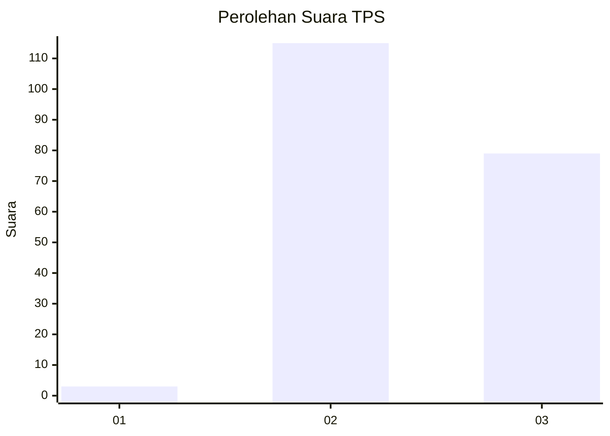
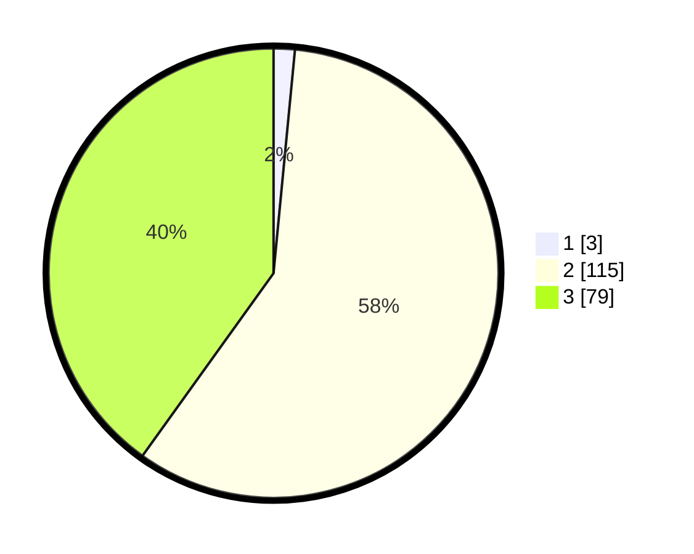

# Hasil

## Grafik

## Tabel

| No. | Nama Paslon    | Suara | Suara (raw) | Persentase |
|:--- |:-------------- | -----:| -----------:| ----------:|
| 1   | ANIES MUHAIMIN | 3     | [3][p-1]    | 1,52       |
| 2   | PRABOWO GIBRAN | 115   | [115][p-2]  | 58,38      |
| 3   | GANJAR MAHFUD  | 79    | [79][p-3]   | 40,10      |

[p-1]: https://github.com/gigit-pemilu/pemilu-2024-71-sulawesi-utara/blob/main/pilpres/hitung-suara/sub/71-sulawesi-utara/sub/06-minahasa-utara/sub/08-kalawat/sub/2001-suwaan/sub/005-tps/sub/paslon-1.txt
[p-2]: https://github.com/gigit-pemilu/pemilu-2024-71-sulawesi-utara/blob/main/pilpres/hitung-suara/sub/71-sulawesi-utara/sub/06-minahasa-utara/sub/08-kalawat/sub/2001-suwaan/sub/005-tps/sub/paslon-2.txt
[p-3]: https://github.com/gigit-pemilu/pemilu-2024-71-sulawesi-utara/blob/main/pilpres/hitung-suara/sub/71-sulawesi-utara/sub/06-minahasa-utara/sub/08-kalawat/sub/2001-suwaan/sub/005-tps/sub/paslon-3.txt

## Foto C Plano

https://sirekap-obj-formc.kpu.go.id/2879/pemilu/ppwp/71/06/08/20/01/7106082001005-20240223-173928--6a3c9faf-b1c2-4d94-95b0-573a86d7153e.jpg

https://sirekap-obj-formc.kpu.go.id/2879/pemilu/ppwp/71/06/08/20/01/7106082001005-20240223-173956--c2f1f098-cae2-4fd6-bc2a-514b9073503f.jpg

https://sirekap-obj-formc.kpu.go.id/2879/pemilu/ppwp/71/06/08/20/01/7106082001005-20240223-174041--33ae6d6e-2540-4d74-9468-165a9e51aac0.jpg

## Metadata

| Key        | Value               |
| ---------- | ------------------- |
| Time Stamp | 2024-02-24 22:31:28 |

