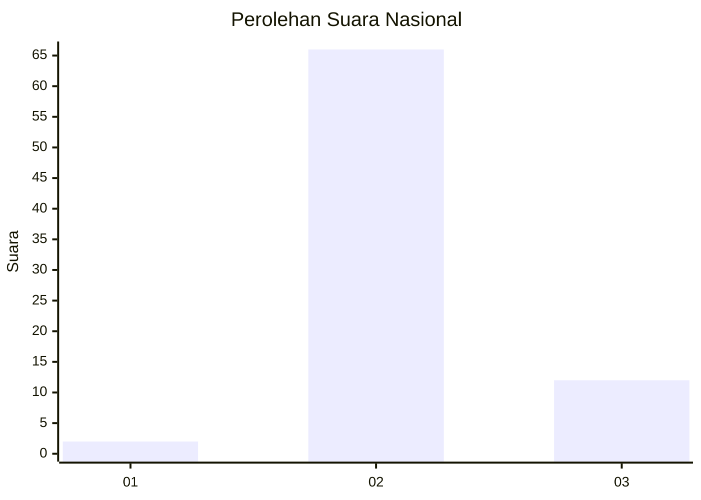
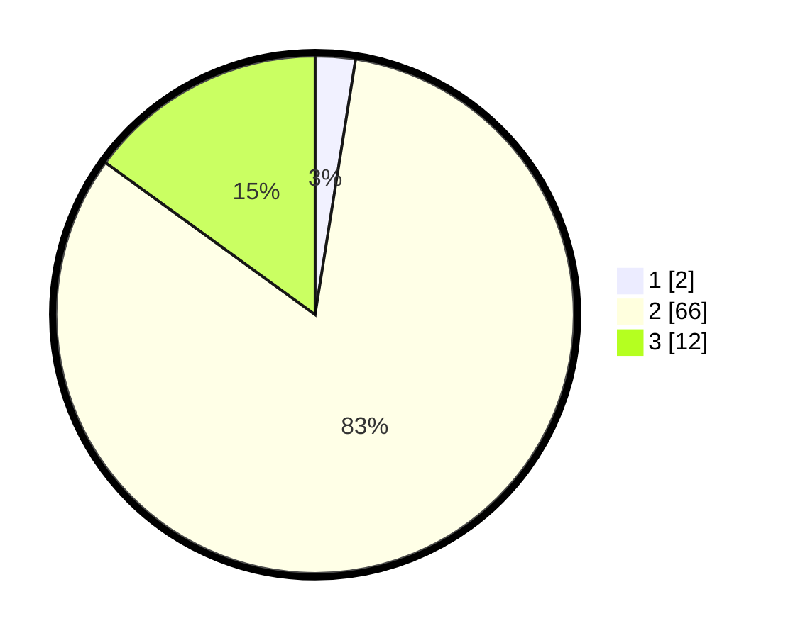

# Hasil

## Grafik

## Tabel

| No. | Nama Paslon    | Suara | Suara (raw) | Persentase |
|:--- |:-------------- | -----:| -----------:| ----------:|
| 1   | ANIES MUHAIMIN | 2     | [2][p-1]    | 2,50       |
| 2   | PRABOWO GIBRAN | 66    | [66][p-2]   | 82,50      |
| 3   | GANJAR MAHFUD  | 12    | [12][p-3]   | 15,00      |

[p-1]: https://github.com/gigit-pemilu/pemilu-2024/blob/main/pilpres/hitung-suara/sub/71-sulawesi-utara/sub/06-minahasa-utara/sub/08-kalawat/sub/2010-kalawat/sub/008-tps/sub/paslon-1.txt
[p-2]: https://github.com/gigit-pemilu/pemilu-2024/blob/main/pilpres/hitung-suara/sub/71-sulawesi-utara/sub/06-minahasa-utara/sub/08-kalawat/sub/2010-kalawat/sub/008-tps/sub/paslon-2.txt
[p-3]: https://github.com/gigit-pemilu/pemilu-2024/blob/main/pilpres/hitung-suara/sub/71-sulawesi-utara/sub/06-minahasa-utara/sub/08-kalawat/sub/2010-kalawat/sub/008-tps/sub/paslon-3.txt

## Foto C Plano

https://sirekap-obj-formc.kpu.go.id/dacc/pemilu/ppwp/71/06/08/20/10/7106082010008-20240214-210506--912c2f04-ad9d-48ea-8448-4891bc35473e.jpg

https://sirekap-obj-formc.kpu.go.id/dacc/pemilu/ppwp/71/06/08/20/10/7106082010008-20240214-210732--fab23fa0-f079-4657-b5ae-288666dfbeb8.jpg

https://sirekap-obj-formc.kpu.go.id/dacc/pemilu/ppwp/71/06/08/20/10/7106082010008-20240215-015720--5fe6cdbf-3466-42fe-89b4-bb219f0aae6d.jpg

## Metadata

| Key        | Value               |
| ---------- | ------------------- |
| Time Stamp | 2024-02-15 02:10:27 |

