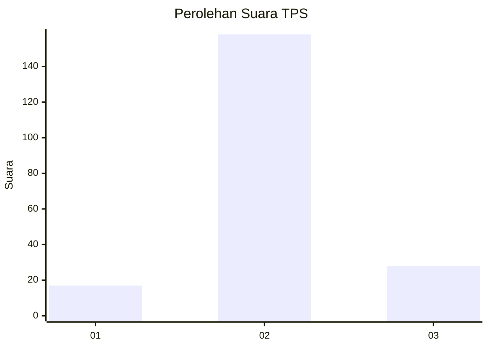
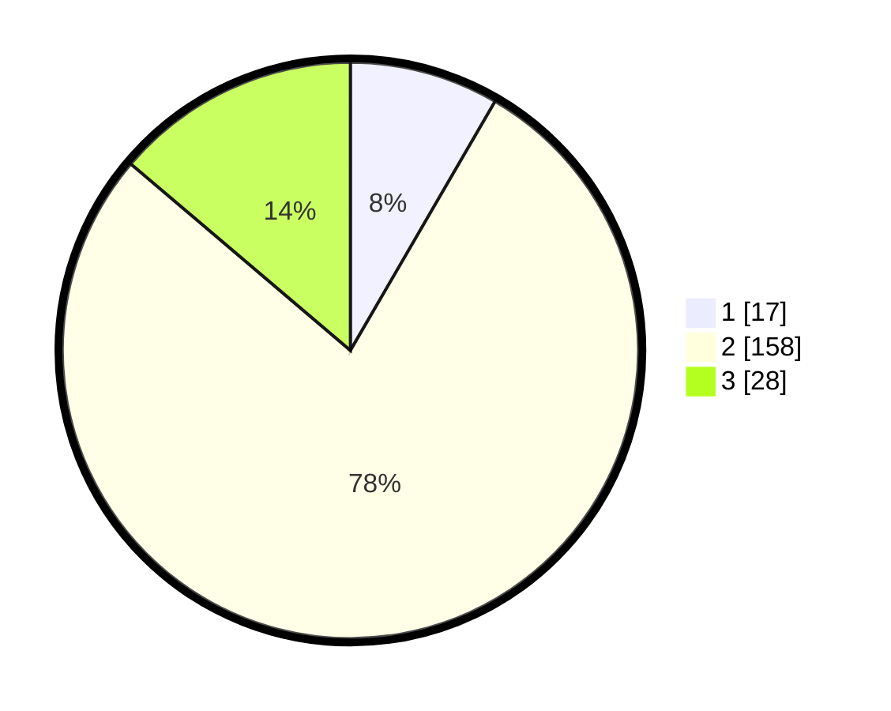

# Hasil

## Grafik

## Tabel

| No. | Nama Paslon    | Suara | Suara (raw) | Persentase |
|:--- |:-------------- | -----:| -----------:| ----------:|
| 1   | ANIES MUHAIMIN | 17    | [17][p-1]   | 8,37       |
| 2   | PRABOWO GIBRAN | 158   | [158][p-2]  | 77,83      |
| 3   | GANJAR MAHFUD  | 28    | [28][p-3]   | 13,79      |

[p-1]: https://github.com/gigit-pemilu/pemilu-2024-71-sulawesi-utara/blob/main/pilpres/hitung-suara/sub/71-sulawesi-utara/sub/06-minahasa-utara/sub/09-talawaan/sub/2001-paniki-atas/sub/007-tps/sub/paslon-1.txt
[p-2]: https://github.com/gigit-pemilu/pemilu-2024-71-sulawesi-utara/blob/main/pilpres/hitung-suara/sub/71-sulawesi-utara/sub/06-minahasa-utara/sub/09-talawaan/sub/2001-paniki-atas/sub/007-tps/sub/paslon-2.txt
[p-3]: https://github.com/gigit-pemilu/pemilu-2024-71-sulawesi-utara/blob/main/pilpres/hitung-suara/sub/71-sulawesi-utara/sub/06-minahasa-utara/sub/09-talawaan/sub/2001-paniki-atas/sub/007-tps/sub/paslon-3.txt

## Foto C Plano

https://sirekap-obj-formc.kpu.go.id/57de/pemilu/ppwp/71/06/09/20/01/7106092001007-20240224-192635--ace56b5c-876f-44f2-94a9-c767b7911004.jpg

https://sirekap-obj-formc.kpu.go.id/57de/pemilu/ppwp/71/06/09/20/01/7106092001007-20240224-192959--dc2d035f-92cb-4782-9d55-765d6ff89eaa.jpg

https://sirekap-obj-formc.kpu.go.id/57de/pemilu/ppwp/71/06/09/20/01/7106092001007-20240224-193425--a0257db9-4dd7-4a6b-9b0c-048779f428bd.jpg

## Metadata

| Key        | Value               |
| ---------- | ------------------- |
| Time Stamp | 2024-02-24 22:31:28 |

